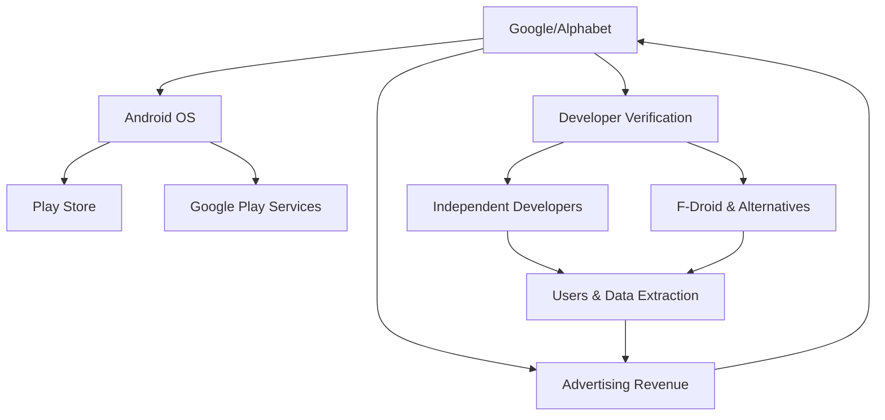

# El Cerrojo de Google: Cómo la Verificación de Desarrolladores Amenaza el Ecosistema Libre

El 1 de julio de 2026, F-Droid —el repositorio histórico de software libre para Android— publicó una advertencia que ha sacudido a la comunidad del software abierto. Bajo el título *"Android Developer Verification: Threat masquerading as protection"*, alertan sobre un nuevo mecanismo implementado por Google que, so pretexto de combatir el malware, podría convertirse en la herramienta de control más efectiva jamás desplegada sobre el ecosistema Android. Analicemos este fenómeno desde las coordenadas del materialismo histórico.

## La captura delCommons digital

Para comprender la magnitud de lo que ocurre, es necesario situar Android en su trayectoria histórica. En 2005, Google adquirió una pequeña empresa llamada Android Inc. por apenas 50 millones de dólares. Aquel fue un movimiento típicamente capitalista: la adquisición de un medio de producción estratégico para integrarlo en una estructura de acumulación más amplia. Lo que entonces era un sistema operativo móvil basado en Linux —y por tanto heredero de la tradición del software libre— se convirtió gradualmente en el campo de batalla por el control del bolsillo de miles de millones de personas.

El proyecto Android Open Source Project (AOSP) siempre fue, en palabras del propio GNU, *"libre como en libertad, no como en cerveza gratis"*. La libertad formal del código no eliminó la asimetría material: la inmensa mayoría de los dispositivos dependen de Google Play Services, del ciclo de actualizaciones controlado por Google, y de las APIs propietarias que Google mantiene bajo licencias restrictivas. La forma jurídica del software libre coexistía con la estructura económica del monopolio.

## La verificación como relación de producción

El nuevo sistema de Android Developer Verification introduce un paso que parece técnico pero que es profundamente político: para distribuir aplicaciones, todo desarrollador deberá identificarse ante Google. Las tiendas alternativas —como F-Droid— deberán verificar a cada desarrollador o enfrentarse a la inoperabilidad efectiva.

Marx escribió en *El Capital* que la relación capitalista se caracteriza por la separación formal entre productor y medios de producción. En el capitalismo de plataforma, esta separación adquiere una forma nueva: el desarrollador —fuerza de trabajo inmaterial, frecuentemente no remunerada o precarizada— produce valor que circula por infraestructura controlada por el capital monopólico. El código del desarrollador no se ejecuta sin el permiso del propietario de la plataforma. La verificación de identidad no es solo un requisito técnico; es la formalización de un contrato de vasallaje digital.

## Concentración y centralización del capital

El sociólogo marxista Christian Fuchs ha documentado cómo las Big Tech reproducen las tendencias clásicas del capitalismo hacia la concentración y centralización. Alphabet —matriz de Google— cerró 2024 con ingresos superiores a 350.000 millones de dólares, una capitalización bursátil que supera el PIB de la mayoría de países del mundo. Android, con más de 3.000 millones de dispositivos activos, es la infraestructura a través de la cual se capturan datos, se venden espacios publicitarios, y se disputa la hegemonía cultural con Apple, Microsoft y Meta.

La verificación obligatoria es un movimiento de cerco: elimina la posibilidad de desarrollar al margen de la infraestructura de Google, lo que conocemos como la subsunción real del trabajo del desarrollador bajo el capital. Quien quiera producir software para Android —el sistema operativo mayoritario del planeta— deberá, en la práctica, negociar con Google.

## La plusvalía del desarrollador y la del usuario

Dos clases trabajadoras son explotadas en este esquema. Por un lado, los millones de desarrolladores independientes, muchos de ellos trabajando gratis o por comisiones mínimas, que ven cómo una nueva barrera administrativa amenaza sus proyectos. Por otro, los usuarios finales, cuyo dato —la materia prima del siglo XXI— se extrae constantemente a través de servicios gratuitos cuyo precio real es la vigilancia permanente.

Shoshana Zuboff denominó a esto *"capitalismo de la vigilancia"*, pero el marco marxista permite observar algo más profundo: la verificación de desarrolladores es la condición de posibilidad para garantizar la continuidad de la extracción. Si cualquier persona pudiera distribuir software anónimamente, la captura de datos a través del ecosistema de aplicaciones se vería amenazada. La "seguridad" prometida es, en realidad, la seguridad del extractor.

## Las contradicciones se agudizan

La reacción de F-Droid no es un capricho ideológico. Es la respuesta material de un proyecto que, durante más de 15 años, ha demostrado que es posible distribuir software sin vigilancia, sin ánimo de lucro, sin extracción de datos. La existencia misma de F-Droid es una negación viva de la inevitabilidad del modelo capitalista de plataforma. Y como ocurre con toda negación que pone en cuestión la reproducción del capital, debe ser contenida o destruida.

Lenin, en *El imperialismo, fase superior del capitalismo*, describió cómo los monopolios buscan controlar no solo los mercados, sino también los marcos regulatorios y las infraestructuras compartidas. Lo que hoy vemos con Android Developer Verification es la actualización tecnológica de una tendencia centenaria: la conversión de un bien común —el software libre— en un enclave del capital monopolista.

## Reflexión final: ¿espejismo o emancipación?

La pregunta que debemos hacernos no es técnica, sino política: ¿a quién beneficia que solo Google pueda decidir quién programa para tres mil millones de dispositivos? La respuesta, como en toda formación social, no se encuentra en la conciencia de los individuos —incluso si esos individuos son ingenieros bienintencionados en Mountain View—, sino en la estructura material que esos individuos habitan.

El software libre fue, en su origen, una promesa de emancipación: medios de producción inmateriales al alcance de cualquiera que quisiera transformarlos. Cuarenta años después, esa promesa choca con la realidad de un capitalismo que ha aprendido a capturar y regimentar incluso aquello que se diseñó para ser libre. La lucha por Android no es una disputa de geeks: es un frente más en la contradicción histórica entre las fuerzas productivas —la capacidad técnica de producir software cooperativo— y las relaciones de producción que las aprisionan.

Que F-Droid siga existiendo, que existan desarrolladores capaces de organizar resistencia, que existan usuarios que cuestionen la inevitabilidad del control: todo ello demuestra que la historia no ha terminado. Solo ha cambiado de canal.

---

