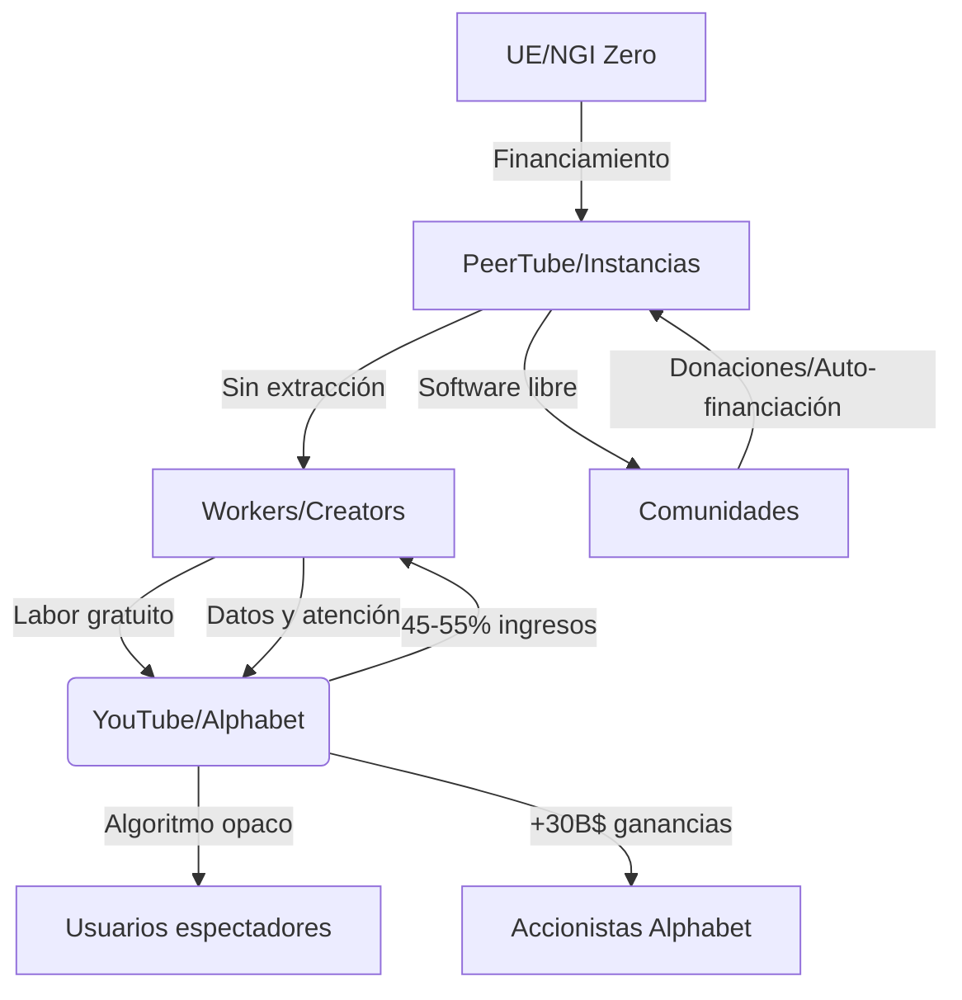

# PeerTube: ¿Puede el Video Federado Desafiar el Monopolio Digital de YouTube?

## Introducción: La contradicción central del video digital

En 2024, más de 2.500 millones de usuarios consumen video a través de YouTube, propiedad de Alphabet, generando ingresos publicitarios que superan los 30.000 millones de dólares anuales. Esta cifra no es un dato neutral: representa la consolidación de uno de los monopolios más efectivos del siglo XXI sobre la producción, distribución y monetización del contenido audiovisual. La aparición de **PeerTube**, una plataforma gratuita, descentralizada y federada construida sobre el protocolo ActivityPub, nos obliga a interrogarnos sobre si las alternativas tecnológicas pueden subvertir las relaciones de producción digitales o si terminan siendo absorbidas por la lógica del capital.

## YouTube como expresión del capitalismo monopólico

Para comprender la relevancia de PeerTube, debemos analizar qué es YouTube en términos marxistas. YouTube no es simplemente una plataforma tecnológica: es un **medio de producción** que controla la infraestructura mediante la cual millones de creadores proletarizados transforman su tiempo de vida, creatividad y conocimiento en mercancía. 

El modelo extractivo funciona así: los creadores —que en muchos casos deben ser considerados como un proletariado cognitivo, tal como lo describieron Yann Moulier-Boutang y Carlo Vercellone— aportan trabajo no remunerado o subremunerado a cambio de una participación en los ingresos publicitarios que oscila entre el 45% y el 55%. Google/Alphabet retiene el resto, además de:

- Controlar los algoritmos de recomendación que determinan la visibilidad
- Poseer los datos de comportamiento de los usuarios
- Imponer condiciones de monetización que pueden ser modificadas unilateralmente
- Apropiarse del valor generado por las comunidades de creadores

Esta es la plusvalía digital que describe Christian Fuchs aplicada al ecosistema audiovisual: el trabajo creativo gratuito o barato se convierte en ganancia privada.

## La centralización como tendencia histórica del capitalismo

La concentración de YouTube no es un accidente, sino una manifestación de la tendencia histórica del capitalismo hacia la **centralización del capital** que Marx identificó en *El Capital*. Google adquirió YouTube en 2006 por 1.650 millones de dólares, una cifra que hoy parece ridícula considerando su valor actual. Pero lo fundamental no fue el precio: fue la eliminación de un competidor que mantenía cierta independencia.

El ecosistema de video está dominado por unas pocas corporaciones: YouTube (Google), TikTok (ByteDance), Twitch (Amazon), Instagram Reels (Meta). Cada una opera como un **feudo digital** donde las reglas del intercambio, la moderación de contenido y la distribución de beneficios las establece exclusivamente el señor feudal algorítmico.

## PeerTube como respuesta tecnológica: ¿contrahegemonía o utopía?

PeerTube propone un modelo radicalmente diferente basado en la **federación**: miles de instancias independientes se interconectan mediante el protocolo ActivityPub (el mismo que usa Mastodon), creando una red distribuida donde ninguna entidad central controla el flujo. Cada instancia es administrada por su propia comunidad, con sus reglas de moderación, su financiamiento y su gobernanza.

Desde una perspectiva gramsciana, podríamos preguntarnos si esto constituye una forma de **contrahegemonía cultural**. La hegemonía, recordemos, no se impone solo por la fuerza, sino por el consenso que las clases dominantes construyen alrededor de sus valores e instituciones. YouTube ha logrado que millones de personas naturalicen la idea de que el video en internet *debe* ser centralizado, vigilado y monetizado por una corporación.

PeerTube subvierte esta premisa. Sin embargo,，我们必须 ser honestos con las contradicciones: la tecnología por sí sola no transforma las relaciones de producción. La pregunta clave es quién sostiene materialmente las instancias de PeerTube, quién las financia y bajo qué condiciones laborales operan sus administradores.

## Las contradicciones del modelo federado

Un análisis materialista no puede idealizar las alternativas tecnológicas. PeerTube enfrenta limitaciones estructurales serias:

1. **Dependencia energética y de infraestructura**: aunque el software sea libre, los servidores requieren electricidad, ancho de banda y hardware. Quien controla estos recursos físicos controla, en última instancia, las condiciones de posibilidad del proyecto.

2. **Sostenibilidad económica**: la financiación colectiva mediante donaciones (como Liberapay o OpenCollective) sigue dependiendo, en gran medida, de la buena voluntad de individuos, muchos de los cuales son trabajadores asalariados. El proyecto recibe apoyo de la Unión Europea a través de programas como NGI Zero, lo cual plantea interrogantes sobre la **cooptación institucional** y la posibilidad de que el proyecto sea neutralizado mediante financiamiento condicionado.

3. **Reproducción de relaciones laborales**: los administradores de instancias de PeerTube realizan trabajo impago o mal remunerado de moderación, mantenimiento técnico y curación de contenido. Reproducimos, sin querer, formas de explotación similares a las de las grandes plataformas.

## Lecciones históricas: la larga lucha por los comunes digitales

PeerTube no surge en el vacío. Es heredero de una tradición que incluye proyectos como **Open Video Alliance**, el **Internet Archive**, la **Wikipedia**, y antes de la web, las radios libres y los video comunitarios de los años setenta. Marx nos enseñó que toda innovación en las fuerzas productivas choca con las relaciones de producción existentes. La imprenta democratizó el acceso al conocimiento, pero el capitalismo editorial convirtió los libros en mercancía. Internet prometió la abolición de las jerarquías comunicativas, pero el capitalismo de plataformas reconstituyó nuevas formas de control.

## Conclusión: la tecnología como campo de batalla

PeerTube demuestra que es técnicamente posible construir infraestructura digital fuera del control corporativo. Pero la pregunta decisiva no es tecnológica, sino política y económica: **¿qué clase social controlará los medios de producción digitales del futuro?**

El futuro del video federado depende de si logramos construir **relaciones de producción no capitalistas** que lo sostengan: cooperativas de medios, financiamiento público para infraestructura digital, y un marco legal que proteja los comunes digitales como lo que son: patrimonio colectivo de la humanidad, no materia prima para la acumulación privada.

La existencia misma de PeerTube es un acto político. Pero un acto político insuficiente si no va acompañado de una transformación más profunda de las estructuras materiales que hoy permiten que Alphabet, ByteDance y Meta controlen lo que vemos, cómo lo vemos y cuánto nos pagan por crearlo.

Como escribió el teórico Nick Srnicek, "el capitalismo de plataformas no caerá por sí solo". Su superación requiere tanto la imaginación tecnológica como la organización política. En esa tarea, proyectos como PeerTube son valiosos no como soluciones finales, sino como **prefiguraciones** de un futuro digital donde los medios de producción estén en manos de quienes los habitan y los construyen.

---