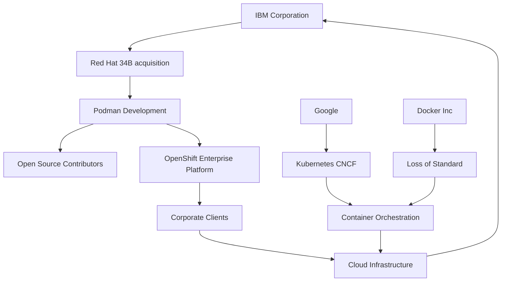

## Podman v6.0.0: Cuando el software libre se convierte en trincheras del capital monopólico

El reciente lanzamiento de Podman v6.0.0 no es un evento técnico neutral. Cada nueva versión de un motor de contenedores es, en realidad, un capítulo más de la lucha de clases que se libra en la infraestructura digital del capitalismo tardío. Para comprender qué hay realmente detrás de este release, debemos abandonar la fetichización del código y observar las relaciones sociales de producción que lo hacen posible.

### El mito del software "libre" en la era de los monopolios

Podman se presenta a sí mismo como una alternativa comunitaria y open source a Docker, eliminando la dependencia del daemon central y prometiendo mayor seguridad y compatibilidad con los estándares OCI. Sin embargo, su desarrollo está hegemonizado por **Red Hat**, una subsidiaria de **IBM** desde la histórica adquisición de 34.000 millones de dólares en 2019. Esta fusión no fue una anomalía: fue la expresión concreta de la tendencia irresistible del capitalismo hacia la concentración del capital que Marx ya identificó en *El Capital*.

Red Hat no es una cooperativa de desarrolladores. Es una empresa cuyo modelo de negocio consiste precisamente en capturar el trabajo colectivo no remunerado de miles de贡献者们 (contribuidores) y convertirlo en productos empresariales de alto margen. La "comunidad open source" funciona, en el análisis materialista, como un mecanismo de subsunción del trabajo vivo bajo el capital: los贡献者们 producen valor de uso (código funcional) cuyo valor es apropiado por la corporación que vende suscripciones, soporte y certificaciones.

### La división del trabajo digital: ingenieros proletarios y plusvalía cognitiva

Detrás de cada release de Podman hay un ejército de ingenieros asalariados, principalmente en Estados Unidos, Europa Oriental e India, cuya jornada laboral produce las funcionalidades que luego se distribuyen gratuitamente. La contradicción es palpable: mientras IBM reporta márgenes operativos superiores al 20% gracias a sus negocios de nube híbrida y OpenShift (la plataforma empresarial que comercializa Podman), los贡献者们 individuales de la comunidad reciben, en el mejor de los casos, reconocimiento simbólico y camisetas.

Esta dinámica reproduce, en el terreno del software, lo que Marx denominó la "subsunción formal" del trabajo bajo el capital. El desarrollador贡献 código al proyecto porque carece de los medios de producción independientes para construir una alternativa desde cero, porque su empleabilidad depende de su visibilidad en proyectos open source, o porque cree ingenuamente en la narrativa del "commons digital" mientras construye, sin saberlo, los cimientos de la nueva acumulación originaria del siglo XXI.

### La guerra de los contenedores: Docker, Kubernetes y la ley del valor

No podemos entender Podman sin situarlo en la constelación de fuerzas del ecosistema de contenedores. Docker Inc., la empresa que originalmente democratizó los contenedores, fue víctima de su propia subestimación de las tendencias monopólicas: tras perder el control de facto del estándar ante Kubernetes (proyecto incubado por **Google** y luego donado a la Cloud Native Computing Foundation), vio cómo su valor de mercado se desplomaba y不得不 venderse a Mirantis por una fracción de su估值 previa.

Google, por su parte, donó Kubernetes a la CNCF con un gesto que parecía filantrópico pero que consolidó su dominio sobre la capa de orquestación. Como señaló el teórico italiano Franco "Bifo" Berardi, las grandes plataformas donan los protocolos y conservan las infraestructuras. Es la misma lógica por la cual el sistema operativo GNU/Linux, desarrollado colectivamente, sostiene los servicios de Amazon Web Services, Microsoft Azure y Google Cloud, que concentran aproximadamente el 65% del mercado mundial de infraestructura cloud.

### Reseña técnica de Podman v6.0.0: las mejoras concretas

Más allá del análisis estructural, conviene señalar que Podman v6.0.0 introduce mejoras técnicas relevantes: compatibilidad ampliada con pods de Kubernetes, mejor integración con Quadlet para despliegues declarativos en systemd, optimización del consumo de memoria en entornos de alta densidad, y nuevas APIs para gestión remota. Estas mejoras no son insignificantes: representan incrementos de productividad del trabajo que, en una economía capitalista, se traducen en mayor plusvalía relativa para los data centers que despliegan estas herramientas a escala industrial.

### Tendencias históricas: de Stallman al capital cognitivo

La trayectoria de Podman ilustra una tendencia histórica que atraviesa todo el software libre: la transición del proyecto contracultural de Richard Stallman —inspirado en la ética hacker y el conocimiento compartido— hacia su integración funcional en la cadena de valor global. Linux诞生 (nació) en 1991 como un proyecto casi personal; hoy es la columna vertebral de la economía digital. Cada capa de abstracción técnica —de los kernels a los contenedores, de los contenedores a los orquestadores, de los orquestadores a las plataformas de IA— ha sido subsumida por el capital monopolista.

### ¿Hacia dónde vamos? La contradicción principal

La contradicción fundamental que revela Podman v6.0.0 no es técnica sino social: mientras las herramientas de producción se vuelven más开放 (abiertas) y协作 (colaborativas) en su superficie, las relaciones de propiedad que las rodean se vuelven más concentradas y opacas. Tres o cuatro conglomerados controlan la infraestructura sobre la que corre la mayor parte del software del planeta. Los trabajadores贡献 al software libre venden, paradójicamente, los medios para su propia superexplotación.

Como marxistas del siglo XXI, no basta con celebrar las bondades del código abierto. Es necesario revelar las condiciones materiales de su producción, las relaciones de clase que lo atraviesan, y preguntarnos: ¿quién posee los servidores donde corre Podman? ¿Quién vende el soporte? ¿Quién se apropia del valor generado por los datos que procesan los contenedores? Solo entonces el software libre dejará de ser un instrumento del capital para convertirse en lo que podría ser: uncommon (un bien común) verdaderamente común.

---

