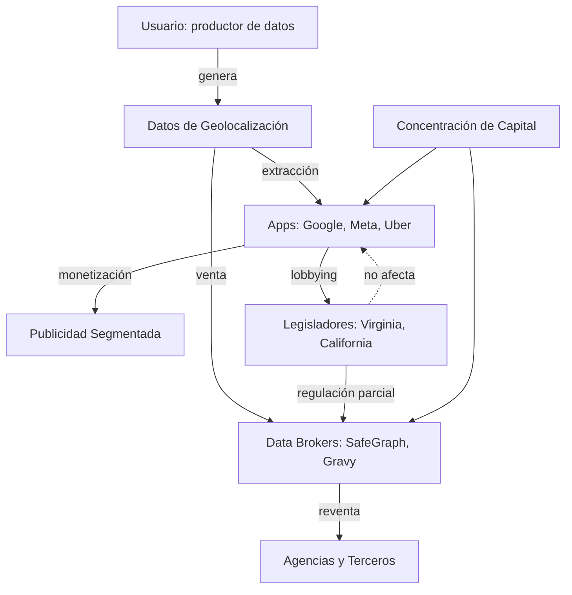

# Virginia prohíbe la venta de datos de geolocalización: una grieta en la máquina del capital de vigilancia

En las últimas semanas, Virginia se convirtió en el segundo estado de Estados Unidos —después de California— en prohibir la venta de datos brutos de geolocalización. La ley, que entrará en vigor en 2026, prohíbe a los "data brokers" comerciales transferir información de ubicación a terceros sin consentimiento explícito. A primera vista, parece una victoria de los derechos civiles. Pero si aplicamos las lentes del materialismo histórico, lo que aflora es una fotografía mucho más compleja sobre las contradicciones del capitalismo de vigilancia.

## El dato como materia prima del siglo XXI

Karl Marx describió en *El Capital* cómo la burguesía, para producir plusvalía, necesitaba transformar la fuerza de trabajo en mercancía. Hoy, esa lógica se ha extendido: el proletariado digital produce, casi sin saberlo, una mercancía aún más valiosa: **datos de comportamiento**. Cada movimiento que un teléfono inteligente registra —la cafetería que visitamos, la clínica a la que acudimos, la manifestación a la que asistimos— se convierte en insumo para un proceso de valorización que no tiene contraprestación salarial directa.

Google, Meta (Facebook), Apple y Amazon han construido imperios no tanto vendiendo productos, sino capturando, refinando y revendiendo las huellas digitales de cientos de millones de personas. La geolocalización es quizás la más íntima de esas huellas: revela hábitos, enfermedades, orientación política, situación económica. Su valor en el mercado publicitario es proporcional a su intrusión.

## ¿A quién protege realmente esta ley?

Virginia no prohíbe la **recopilación** de datos de geolocalización, sino únicamente su **venta bruta** por parte de intermediarios. Esta distinción no es menor: revela que el objetivo de la legislación no es cuestionar la estructura de producción de datos, sino reorganizar quién se queda con la renta.

Las grandes plataformas —Google, Meta, Uber, DoorDash— poseen sus propios datos de geolocalización de primera mano. La ley las afecta poco porque su modelo de negocio no depende de vender bases de datos a terceros, sino de utilizarlos internamente para entrenar modelos publicitarios, optimizar servicios y vender audiencias segmentadas dentro de sus propios ecosistemas cerrados. Los verdaderos afectados son los pequeños y medianos *data brokers* —empresas como Gravy Analytics, Datastream Group, o SafeGraph— que prosperan en la intermediación.

Marx escribió que "la burguesía ha despojado de su halo a toda actividad hasta hoy venerable y venerable práctica". La ley de Virginia, en este sentido, no cuestiona la estructura de clases del ecosistema digital; simplemente **reacomoda la competencia entre fracciones del capital**. Es el equivalente digital de las leyes laborales del siglo XIX: concesiones arrancadas por la lucha social que no eliminan la explotación, pero regulan su expresión más escandalosa.

## El cercamiento del nuevo commons

Históricamente, el capitalismo necesitó dos grandes cercamientos (*enclosures*) para acumular capital originario: la expropiación de las tierras comunales en la Inglaterra del siglo XVI y la esclavización de poblaciones colonizadas. Hoy presenciamos un tercer cercamiento: la conversión de la experiencia humana cotidiana en propiedad privada abstracta.

Nuestros movimientos en el espacio público —algo que en la modernidad temprana se concebía como bien común, como el aire o la luz— se han convertido en propiedad de empresas que nunca pisaron esa calle con nosotras. La geolocalización es, en este sentido, una **reapropiación privada del espacio público**: lo que transitamos colectivamente se individualiza, se cuantifica y se vende.

La ley de Virginia no devuelve ese espacio a la ciudadanía. Simplemente establece un *copyright* social sobre una parte de la mercancía-dato, exigiendo un consentimiento que, en la práctica, se obtiene mediante interfaces opacas de "términos y condiciones" diseñados para ser ignorados. Como señaló Joseph Stiglitz, en mercados de información asimétrica, el "consentimiento informado" es una ficción jurídica.

## Concentración de capital y asimetría de poder

El mercado de datos de ubicación está altamente concentrado. Según la industria, más del 80% de los ingresos por datos de geolocalización en EE.UU. provienen de menos de 20 empresas. Google controla aproximadamente el 36% del mercado de publicidad móvil, y Meta cerca del 20%. Esta oligopolización no es un accidente: las economías de escala, los efectos de red y la necesidad de enormes inversiones en infraestructura (centros de datos, satélites, fibra óptica) hacen que la producción de datos siga la misma lógica de concentración que Marx identificó en la industria pesada del siglo XIX.

La ley de Virginia asume que existe una "competencia justa" en este mercado y que la intervención estatal basta para corregir abusos. Pero la historia demuestra que las regulaciones sin transformación de las relaciones de producción tienden a ser capturadas por los propios regulados. Las grandes tecnológicas no solo han sobrevivido al RGPD europeo; lo han convertido en un estándar global, redefinido a su favor mediante lobbyists en Bruselas y Washington.

## ¿Hay alternativa?

Una perspectiva materialista no se limita a denunciar; también busca las tendencias emancipadoras contenidas en las contradicciones actuales. Tres elementos merecen atención:

1. **La creciente conflictividad**: trabajadores de Google, Meta y Amazon han formado sindicatos (Alphabet Workers Union, Communications Workers of America) que empiezan a politizar las condiciones internas de producción de datos.

2. **Cooperativas de datos**: experimentos como Salus Coop o la cooperativa MiData buscan que los usuarios sean propietarios colectivos de su información, revirtiendo la relación salarial en el campo digital.

3. **Legislación estructural**: la propuesta de ley *American Data Privacy and Protection Act* y los debates en la UE sobre inteligencia artificial apuntan a regular no solo la venta, sino la **inferencia** y el **entrenamiento algorítmico**, lo cual toca más de cerca las relaciones de producción.

Virginia ha abierto una grieta. Pero, como decía Rosa Luxemburgo, "entre la ilegalidad y la revolución, la sociedad burguesa solo conoce la legalidad como mecanismo de reproducción". La pregunta que debemos hacernos no es si la ley es suficiente, sino **qué organización social del dato estamos dispuestas a construir** más allá del capital.

## Reflexión final

La geolocalización es un recordatorio de que la privacidad, en el capitalismo tardío, no es un derecho abstracto sino una **relación de propiedad**. Protegerla requiere algo más que prohibiciones puntuales: exige cuestionar quién posee los medios de producción del siglo XXI —los servidores, los algoritmos, los satélites— y bajo qué relaciones sociales se organiza el trabajo que los alimenta. La ley de Virginia es un paso; la emancipación digital, un horizonte que aún está por escribirse.

    Reg -.->|no afecta| Apps

