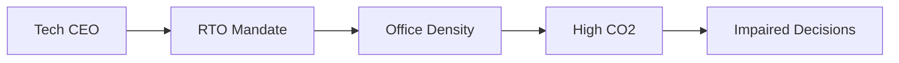

Hay algo casi poético en el último recordatorio del blog de Mike Bowler: tras décadas midiendo clics, conversiones y engagement con precisión obsesiva, la industria tecnológica ha estado ignorando una métrica mucho más fundamental: la concentración de dióxido de carbono en las salas donde sus trabajadores toman decisiones. El cuello de botella, resulta, podría ser literalmente el aire de la sala.

Bowler cita investigaciones que muestran que los niveles elevados de CO2 —comunes en oficinas modernas mal ventiladas y densamente pobladas— afectan de forma medible a la función cognitiva. Un reciente informe de Microsoft Work Trend Index aseguraba analizar la "capacidad de innovación" mediante IA, pero no mencionaba si el entorno físico podía sostener el tipo de pensamiento que decía medir. La brecha no es accidental. Revela cómo la industria elige qué medir y, sobre todo, qué ignorar.

### La oficina abierta como optimización de costes

Cuando empresas como Google, Meta y Amazon rediseñaron sus sedes en torno a plantas abiertas en la década de 2010, el marketing fue implacable: colaboración, creatividad, serendipia. La realidad era más prosaica. Como documentan análisis de CBRE y JLL, la oficina abierta es fundamentalmente una estrategia de optimización inmobiliaria. Empaquetar más trabajadores por metro cuadrado, reducir costes de construcción y vestir el resultado con puffs y snacks gratis. El coste cognitivo —distracciones, menor concentración y CO2 elevado— se trató como daño colateral.

El ecosistema de capital riesgo de Silicon Valley, que financia la mayoría de herramientas SaaS que "optimizan" los lugares de trabajo, tenía un incentivo estructural para ignorar estos efectos. WeWork convirtió el espacio físico de oficina en un producto financiero, con Adam Neumann vendiendo "conciencia elevada" junto a suscripciones de hot-desking. Cuando WeWork colapsó en 2019, dejando al descubierto la brecha entre narrativa y substancia, la industria siguió adelante sin revisar el supuesto de base: que el espacio físico es una variable a minimizar, no un input para la cognición.

### El retorno a la oficina como ejercicio de poder

Los mandatos de regreso a la oficina (RTO) post-2023 de Amazon, Apple y Disney se presentaron como necesidades culturales. Andy Jassy declaró que la cultura de Amazon era "más difícil de mantener" en remoto. Tim Cook dijo a sus empleados que la "colaboración presencial" era esencial. Sin embargo, ninguno de estos ejecutivos, rodeados de ejércitos de analistas y equipos de facilities, abordó de forma significativa las condiciones ambientales de las oficinas a las que exigía volver a sus trabajadores.

Esto no es un descuido. Es una dinámica de poder. Las decisiones sobre ventilación, calidad del aire e inversión en climatización se toman en el nivel de facilities —a menudo por proveedores externos y propietarios comerciales cuyos incentivos se alinean con la reducción de costes, no con el rendimiento cognitivo. Mientras tanto, los contribuidores individuales, la gente cuyas decisiones la investigación sobre CO2 sugiere que están siendo degradadas, no tienen palanca para exigir datos sobre calidad del aire. El trabajador se convierte en sujeto de prueba de un experimento al que no consintió.

La asimetría es estructural. Un alto ejecutivo de una Big Tech puede tener oficina privada con ventanas operables y circulación de aire dedicada. Un ingeniero junior, empaquetado en una fila de hot-desks en el mismo edificio, a menudo no tiene ni la información ni la posición para cuestionar lo que respira. El debate sobre RTO, presentado en los medios como un choque entre flexibilidad y disciplina, es en la práctica una redistribución de la incomodidad desde los dueños del capital hacia los vendedores de mano de obra.

### Continuidad histórica: del cronómetro de Taylor al sensor de CO2

El patrón no es nuevo. Los estudios de tiempos y movimientos de Frederick Taylor a principios del siglo XX afirmaban optimizar la productividad humana tratando a los trabajadores como componentes de una máquina. El equivalente moderno son las plataformas de "people analytics" vendidas por empresas como Humanyze (adquirida por Microsoft) y Workday, que monitorizan desde la densidad del calendario hasta los pases de tarjeta. Lo que evitan sistemáticamente son los datos ambientales que podrían complicar la narrativa de productividad.

Hay una razón estructural. Si una empresa admite que los niveles de CO2 por encima de 800-1000 ppm perjudican la toma de decisiones, debe invertir en mejor ventilación o admitir que sus anteriores afirmaciones de productividad estaban infladas. Ambas opciones son costosas. El camino más fácil es no medir, y enmarcar cualquier incomodidad como un problema de "soft skills" —un fallo de resiliencia más que de infraestructura.

### ¿Quién se beneficia del silencio?

El complejo inmobiliario comercial —CBRE, JLL, Cushman & Wakefield y los REIT que son dueños de los edificios— tiene todos los incentivos para mantener la densidad alta y los estándares de ventilación mínimos. Su modelo de ingresos depende de empaquetar inquilinos en metros cuadrados. Las propias tecnológicas, tras haber despedido a cientos de miles de trabajadores desde 2022 mientras exigían simultáneamente RTO, se benefician de una fuerza laboral más dócil y menos propensa a cuestionar las condiciones físicas, especialmente en un mercado laboral donde la palanca individual es baja.

Las herramientas para arreglar esto son triviales. Los sensores de CO2 cuestan menos de 50 dólares. La monitorización de calidad del aire en tiempo real es un problema de ingeniería ya resuelto. Empresas como Awair, AirGradient e incluso proveedores de HVAC ofrecen sistemas comerciales integrables en plataformas de gestión de edificios. El hecho de que estas herramientas no sean estándar en oficinas que albergan parte del trabajo cognitivo más valioso del mundo lo dice todo sobre dónde se toman realmente las decisiones y para beneficio de quién.

### Conclusión: lo que elegimos no medir

El punto de Mike Bowler es engañosamente simple. Antes de debatir sobre IA, marcos de productividad o el futuro del trabajo, quizás deberíamos mirar la sala —literalmente. La obsesión de la industria tecnológica con soluciones de software a problemas humanos ha ocultado durante mucho tiempo las restricciones físicas y materiales del rendimiento humano. El CO2 no es una metáfora. Es un input medible en cada decisión tomada en cada sala de reuniones de cada edificio propiedad de cada REIT y alquilado por cada gigante tecnológico.

La próxima vez que un CEO exija a los trabajadores volver a la oficina, la pregunta honesta no es sobre colaboración. Es sobre qué condiciones mantiene esa oficina, quién decidió esas condiciones y de quién es la cognición que se comercia contra el balance de quién. Hasta que la industria trate el aire como infraestructura y no como gasto, el cuello de botella seguirá exactamente donde siempre ha estado: en la sala, y en las estructuras de poder que deciden qué contiene la sala.

