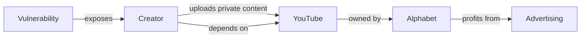

# La falsa privacidad de YouTube: cómo una vulnerabilidad expone a los creadores

## Una falla que revela mucho más que código

Un investigador de seguridad publicó recientemente un análisis detallado de una vulnerabilidad en YouTube que permite acceder a videos marcados como "privados" o "no listados" de otros creadores. El fallo reside en el manejo de identificadores de video y tokens de acceso, y expone contenido que muchos usuarios consideraban seguro: desde material en proceso de edición hasta videos personales compartidos con un círculo reducido.

## El monopolio silencioso del video en línea

YouTube no es una opción entre muchas: es prácticamente la única vía viable para creadores de video que aspiran a audiencias masivas. Alphabet, su empresa matriz, controla más del 80% del mercado de video en línea en buena parte del mundo, una posición cuasi monopólica que le permite dictar las reglas sin competencia efectiva.

Cuando un creador sube un video "privado" a YouTube, está depositando su contenido —y con él, su trabajo, su estrategia creativa, a veces material sensible— en la infraestructura de una empresa sobre la que tiene control prácticamente nulo. No existe portabilidad real, ni estándares abiertos, ni forma de migrar sin perder audiencia, monetización e historial.

## El valor oculto de lo "privado"

Para comprender la gravedad de esta vulnerabilidad conviene recordar qué hay detrás de un video marcado como privado en YouTube:

- **Contenido en proceso de edición** que, de filtrarse, arruinaría estrategias de lanzamiento
- **Videos para patrocinadores** enviados bajo acuerdos de confidencialidad
- **Material personal o familiar** que los creadores comparten con allegados
- **Investigaciones periodísticas** o contenido sensible que podría comprometer fuentes
- **Borradores de productos** que las marcas suben antes de anuncios oficiales

La filtración de este contenido no es solo una violación de privacidad: es potencialmente un daño económico directo, una pérdida de ventaja competitiva y, en algunos casos, un riesgo de seguridad personal para los involucrados.

## La historia se repite: la trampa de la dependencia

El patrón es consistente: las plataformas capturan a creadores y usuarios con inversiones iniciales masivas, construyen efectos de red que vuelven inviable la salida, y luego priorizan sus propios intereses —publicitarios y de accionista— sobre los de quienes generan el contenido que atrae a las audiencias.

## ¿Por qué no se soluciona más rápido?

Cuando un investigador publica una vulnerabilidad como esta, la respuesta esperada de una empresa responsable sería: parche inmediato, comunicación transparente, auditoría de casos afectados. La realidad suele ser distinta.

Alphabet tiene el tamaño, los recursos y el talento para abordar estos problemas con rapidez. Pero también tiene pocos incentivos para hacerlo. Los costos los pagan los creadores, no la plataforma. YouTube no pierde audiencia porque un video privado se filtre; lo pierde el creador, que probablemente migrará a otra plataforma... donde no hay audiencia a la que migrar.

Este desajuste entre quien origina el problema y quien asume las consecuencias es una característica definitoria del capitalismo de plataformas.

## El espejismo del "self-hosting" y las alternativas reales

Las alternativas descentralizadas como **PeerTube**, las instancias de **Mastodon** con capacidad de video, o los proyectos basados en **IPFS** ofrecen promesas técnicas interesantes, pero carecen del efecto de red que hace valioso a YouTube. Sin audiencia, una plataforma técnicamente superior resulta inservible para un creador profesional.

## La estructura del problema

El problema de fondo no es técnico, aunque la vulnerabilidad sea técnica. Es un problema de **gobernanza**: cuando una empresa privada controla la infraestructura crítica por la que circula la mayor parte del contenido audiovisual del mundo, las decisiones sobre privacidad, seguridad y acceso las toma un consejo de administración en Mountain View, no los creadores ni sus audiencias.

## Conclusión: repensar la propiedad del contenido

Mientras la infraestructura digital siga siendo propiedad de un puñado de empresas, vulnerabilidades como esta continuarán ocurriendo. No porque los ingenieros sean negligentes, sino porque el modelo de negocio no penaliza la negligencia: la pagan los usuarios.

La solución real pasa por repensar cómo se financia, se gobierna y se distribuye el contenido en línea. Protocolos abiertos, federaciones, cooperativas de creadores, modelos de suscripción directa: hay alternativas en distinta etapa de madurez. Pero mientras el efecto de red esté del lado de las plataformas centralizadas, la balanza de poder seguirá inclinándose hacia quienes controlan la infraestructura.

La privacidad en YouTube, como la de cualquier plataforma centralizada, es un servicio prestado, no un derecho garantizado. Y los servicios prestados pueden dejar de prestarse —o filtrarse— en cualquier momento. Para los creadores, la pregunta ya no es si ocurrirá otra vulnerabilidad, sino cuándo, y si para entonces tendrán alguna alternativa real.

