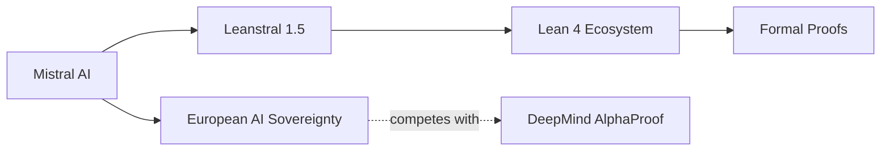

# Leanstral 1.5: la apuesta de Mistral por las pruebas formales y lo que revela sobre la geopolítica de la IA

Cuando Mistral AI publicó Leanstral 1.5, el comunicado apenas duró una tarde en la primera plana de Hacker News. Pero el movimiento importa más de lo que sugiere su modestia retórica. La empresa francesa —valorada en torno a los 11.800 millones de euros en su última ronda— acaba de profundizar en un terreno que hasta hace poco parecía reservado a los laboratorios con chequera ilimitada: la demostración automática de teoremas usando el asistente de pruebas Lean. Para entender por qué esto incomoda a más de un gigante, hay que mirar tres capas: la técnica, la económica y la geopolítica.

## Qué es Leanstral y por qué no es "solo otro modelo"

Leanstral es un modelo ajustado específicamente para producir pruebas formales verificables en Lean 4, el asistente de pruebas desarrollado originalmente por Leonardo de Moura en Microsoft Research y mantenido hoy por una comunidad académica amplia, con el apoyo de fundaciones como el Lean FRO. La diferencia respecto a un LLM de propósito general es crucial: no se trata de que el modelo "suene inteligente", sino de que cada paso de su razonamiento pueda ser verificado mecánicamente por un *type checker*. En otras palabras, no hay alucinación posible: si la prueba compila, es correcta.

Hasta hace un año, el estado del arte en esta disciplina lo marcaba AlphaProof de Google DeepMind, una hazaña técnica admirable pero opaca, sin acceso público y ejecutada sobre infraestructura de cálculo carísima. Leanstral 1.5, según los benchmarks publicados por Mistral, se acerca a ese rendimiento con un modelo que se puede descargar y ejecutar localmente en hardware razonable. Es la diferencia entre comprar un avión de combate o construir un kit de código abierto.

## La estructura de capital detrás del gesto

No es casualidad que esta sea una empresa francesa. Mistral AI nació en 2023 con un discurso fundacional explícitamente europeo: sus cofundadores —Arthur Mensch, Guillaume Lample y Timothée Lacroix— proceden de DeepMind y Meta, y su primer pitch destacaba que Europa necesitaba un "campeón soberano" de IA. Las cifras cuentan una historia matizada: la compañía ha levantado más de 2.000 millones de euros en varias rondas, con inversores como Andreessen Horowitz, General Catalyst y, en una operación polémica, BNP Paribas y la aseguradora AXA. Su reciente asociación con Microsoft —incluyendo un modelo distribuido en Azure— fue leída por el regulador francés como un compromiso con la infraestructura estadounidense que el gobierno de Macron no esperaba.

Lo que Leanstral revela no es tanto un giro técnico como un movimiento estratégico. Mistral necesita diferenciarse de OpenAI, Anthropic y Google en un mercado donde la escala de cómputo dicta la frontera. Donde no puede competir en billones de parámetros, puede competir en nichos verticales con alto valor simbólico: las pruebas formales son uno de esos nichos porque representan el santo grial de la fiabilidad en IA.

## La larga historia de las pruebas automáticas

La demostración automática de teoremas no nació con los LLM. Tiene casi un siglo de tradición, desde los trabajos de Herbrand en los años 30 hasta sistemas como Automath, Mizar, Coq, Isabelle y, finalmente, Lean. Durante décadas fue un dominio académico con financiamiento público y pocas aplicaciones industriales visibles. Eso cambió en 2021, cuando OpenAI, DeepMind y otros empezaron a mostrar que los grandes modelos de lenguaje podían esbozar pruebas que, posteriormente, los asistentes formales verificaban.

Aquí conviene recordar quién construyó las bases. Lean 4 es, en su origen, software de Microsoft. La comunidad que lo mantiene es abierta, pero la dependencia histórica con un gigante estadounidense es real. Cuando Mistral libera un modelo afinado sobre este ecosistema, está haciendo algo más que lanzar un producto: está posicionando a Europa como usuaria crítica de una infraestructura formal que, de lo contrario, queda bajo influencia casi exclusiva de California.

## Las dinámicas de poder detrás del "open source"

Mistral se presenta como abanderada del código abierto. La realidad es más compleja. Sus primeras licencias, especialmente la famosa "Mistral Research License" de 2023, restringían el uso comercial real, y solo la presión de la comunidad y la competencia con Meta (con Llama) empujó a la empresa hacia licencias más permisivas. Leanstral, según la documentación oficial, se distribuye bajo una licencia que permite uso comercial con ciertas restricciones de redistribución. No es el "open source" puro del software académico de los años 90; es el open source de 2025, un instrumento de posicionamiento competitivo tan útil para Mistral como sus GPU alquiladas en centros de datos nórdicos.

Mientras tanto, DeepMind guarda AlphaProof bajo llave. Anthropic no tiene un equivalente público. OpenAI, que fichó a algunos de los mejores especialistas en pruebas formales, los mantiene en modo "stealth". El contraste es evidente: la única gran empresa que pone esta tecnología en manos de la comunidad es una europea con un discurso explícitamente geopolítico.

## Lo que está en juego realmente

La demostración de teoremas no es un lujo intelectual. Es la infraestructura sobre la que se construirán, eventualmente, sistemas críticos: software de aviación, contratos financieros, protocolos criptográficos, código médico. Que estas pruebas las produzca un sistema verificable por una comunidad abierta, o un modelo opaco propiedad de Alphabet, no es una cuestión menor. Es una decisión sobre quién audita la lógica que sostiene la economía digital.

La pregunta incómoda que deja Leanstral 1.5 no es técnica, sino política: ¿cuánto tiempo podrá Mistral mantener esta agenda soberanista sin terminar absorbida por la misma infraestructura de capital que dice desafiar? Su consejo asesor incluye veteranos de Washington; sus inversores son fondos estadounidenses; su infraestructura depende en parte de Azure. La empresa es europea por sede, pero crecientemente transatlántica por balance. Leanstral es, en este sentido, un producto brillante que también es un espejo: refleja tanto la promesa de una IA distribuida como las contradicciones del capitalismo tecnológico contemporáneo, donde las fronteras entre soberanía y dependencia se negocian ronda a ronda de inversión.

Quizás la verdadera pregunta no sea si Leanstral puede competir con AlphaProof, sino si Europa está dispuesta a financiar —de verdad, durante décadas, sin exigir retorno trimestral— la infraestructura pública sobre la que estas herramientas se sostienen. Porque los modelos van y vienen; las comunidades de matemáticos, las bibliotecas formales y los proyectos de código abierto sostenido, esos son los que deciden quién entiende el mundo y quién solo lo calcula.

