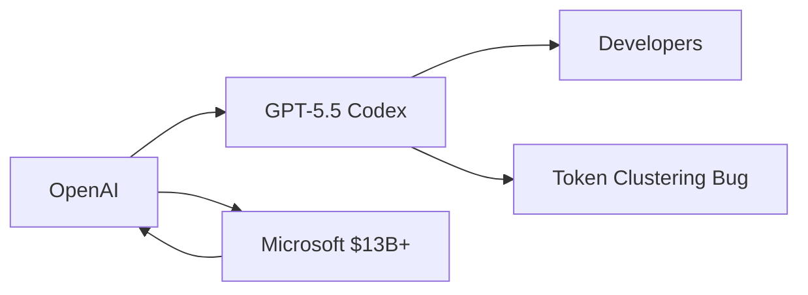

# El clustering de tokens en GPT-5.5 Codex: síntoma de la presión comercial sobre OpenAI

Cuando un gigante como OpenAI lanza una nueva versión de su modelo insignia, el mundo tecnológico contiene la respiración. Pero cuando los problemas aparecen a las pocas semanas, como parece estar ocurriendo con GPT-5.5 Codex y su polémico "clustering de tokens de razonamiento", la conversación cambia. Ya no se trata de hype: se trata de preguntarnos qué modelo de negocio está empujando a estas empresas a desplegar productos que aún no están listos.

## ¿Qué está pasando realmente con Codex?

Según el issue abierto en el repositorio oficial de OpenAI en GitHub (#[30364](https://github.com/openai/codex/issues/30364)), múltiples desarrolladores han detectado un comportamiento anómalo en las sesiones de razonamiento extendido de GPT-5.5 Codex. El patrón sugiere que el modelo está "agrupando" o colapsando sus tokens de razonamiento en bloques repetitivos o redundantes, lo que provoca un consumo ineficiente del presupuesto de cómputo y, lo que es peor, respuestas menos precisas.

En términos simples: cuando un modelo "piensa" antes de responder, dedica tokens internos a planificar. Si esos tokens se desperdician en bucles, el resultado final es peor, aunque la métrica de "tokens gastados" siga subiendo. Es como si un chef dedicara más tiempo a reorganizar la cocina que a cocinar.

## La presión de una empresa valuada en miles de millones

Codex, en particular, es un punto estratégico crítico. Compite directamente con GitHub Copilot (propiedad de Microsoft, su principal inversor, lo cual añade una capa de ironía corporativa), con Claude Code de Anthropic, con Cursor, y con una miríada de asistentes de programación que prometen transformar el trabajo de los desarrolladores. En este mercado, cada semana de retraso en una actualización se traduce en cuotas de mercado perdidas.

La pregunta incómoda es inevitable: ¿está OpenAI lanzando versiones que sabe que tienen fallos porque el costo de oportunidad de esperar es demasiado alto? El clustering de tokens de razonamiento no parece un bug menor; parece el tipo de problema que se descubre con pruebas de carga extensivas, del tipo que una empresa con procesos de QA maduros detectaría antes del lanzamiento.

## Concentración de capital, concentración de riesgos

Este episodio ilustra una dinámica que la industria tecnológica repite con insistencia desde hace dos décadas: la concentración de capital produce concentración de riesgos. Cuando un solo proveedor (OpenAI) domina el segmento de modelos de razonamiento avanzados, y cuando herramientas como Codex se vuelven pieza central del flujo de trabajo de millones de desarrolladores, un bug no es un problema técnico aislado: es un riesgo sistémico para el ecosistema.

Los desarrolladores que han integrado Codex en sus pipelines de CI/CD, que han apostado por su API, que han reescrito su arquitectura de software en torno a sus capacidades, descubren ahora que la calidad de la herramienta fluctúa. Y no tienen a quién quejarse más que al monopolio de facto que la sustenta.

## El factor Microsoft y la extraña alianza

Para Microsoft, los problemas de calidad de Codex pueden ser doblemente problemáticos: por un lado, perjudican a su socio; por otro, abren espacio para sus propios productos. Esta dinámica, que los economistas llamamos "coopetencia", no siempre produce los mejores resultados para el usuario final.

## ¿Qué pueden hacer los desarrolladores?

Mientras tanto, los desarrolladores profesionales tienen tres opciones realistas. La primera es diversificar: mantener Codex como una herramienta más dentro de un stack que incluya Claude, modelos open source como los de Mistral o DeepSeek, e incluso alternativas locales con Ollama. La segunda es contribuir activamente al repositorio de issues de OpenAI, haciendo presión colectiva para que se priorice la estabilidad sobre la novedad. La tercera, y quizás la más importante, es recordar que cualquier herramienta de IA en producción requiere un sistema de evaluación continuo, porque confiar ciegamente en las promesas de un proveedor es una apuesta que rara vez sale bien.

## Una reflexión sobre el modelo

Mientras la IA siga siendo financiada con la lógica de las startups —crecer rápido, capturar mercado, monetizar después— seguiremos viendo este tipo de episodios. La pregunta de fondo es si el ecosistema tecnológico está dispuesto a construir la infraestructura crítica del siglo XXI sobre proveedores cuyo incentivo principal no es la calidad, sino el siguiente trimestre fiscal.

Quizás el verdadero bug no esté en el código de Codex, sino en la arquitectura económica que lo sustenta.

