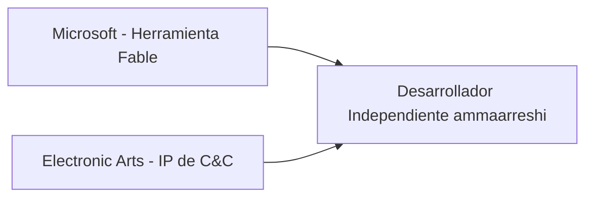

# Cómo el Fable de Microsoft Permitió a un Desarrollador Solo Portar el C&C Generals de EA a Mac y iPad

El repositorio, mantenido por ammaarreshi, ofrece una compilación nativa funcional de *Command & Conquer Generals* — un juego de estrategia en tiempo real de 2003 originalmente desarrollado por Westwood Studios de EA — que se ejecuta en macOS, iPhone y iPad. El motor detrás del truco es **Fable**, un pipeline de transpilación de código abierto creado dentro de Microsoft que convierte código .NET a otros lenguajes y runtimes. En otras palabras, una herramienta de Microsoft, aplicada a una propiedad de EA, implementada en hardware de Apple, por un tercero que no tiene relación comercial con ninguno de ellos.

## El Port que Nadie Quiso Hacer

Para entender por qué esto importa, hay que recordar lo que le pasó a Westwood Studios. Fundada en 1985, Westwood fue el estudio que definió el género de estrategia en tiempo real con *Dune II* y la serie original *Command & Conquer*. EA adquirió Westwood en 1998 por aproximadamente 122 millones de dólares, un acuerdo que se cerró cuando el estudio ya estaba produciendo *C&C: Tiberian Sun*. Para 2003, EA había absorbido la marca y cerrado la oficina original de Las Vegas. El equipo se dispersó. El conocimiento institucional de esos motores, en su mayor parte, se fue por la puerta.

Lo que quedó es exactamente lo que cabría esperar de un editor que cotiza en bolsa y optimiza para retornos trimestrales: una franquicia en modo mantenimiento, ocasionalmente desempolvada para un remaster. La *Command & Conquer Remastered Collection* de 2020, subcontratada a Petroglyph Games (fundada por exempleados de Westwood) y Lemon Sky Studios, fue el último gesto significativo. Desde entonces, EA ha mostrado poco apetito por la IP, y desde luego ninguno para llevarla al ecosistema de Apple, que representa una porción menor del mercado de estrategia de PC y consolas que EA realmente monetiza.

## El Regalo Accidental de Microsoft a la Competencia

La existencia de Fable es en sí misma un pequeño caso de estudio de ambivalencia corporativa. Nacido originalmente dentro de Microsoft como un transpilador de F# a JavaScript, Fable evolucionó hasta convertirse en una herramienta de propósito general para mover codebases .NET a otras plataformas. Microsoft la mantiene abiertamente en GitHub. La compañía la ha utilizado internamente durante años, incluso para experimentos relacionados con juegos en sus propias plataformas.

La parte incómoda: una herramienta que Microsoft construyó para extender el alcance de su propio ecosistema de software ahora está siendo utilizada, por desarrolladores externos, para entregar software en la plataforma de su mayor competidor. Apple, la plataforma de hardware de consumo más agresivamente cerrada de la industria, con sus requisitos de notarización, sus reglas de sandboxing y su hostilidad política hacia la emulación de juegos retro, es ahora el destino de un transpilador construido por Microsoft que reempaqueta un juego propiedad de EA. Ninguna de estas tres compañías sancionó la combinación. Las tres se benefician o se perjudican de formas que no planearon.

Esto es lo que sucede cuando la infraestructura escapa al control de la entidad que la construyó.

## El Impuesto de Apple sobre la Historia de los Videojuegos

## Concentración de Capital y el Problema de la Preservación

Si ampliamos la vista, emerge un patrón. Las compañías que poseen los catálogos de software históricamente más importantes — Microsoft, EA, Activision Blizzard (ahora bajo Microsoft), Sony, Take-Two — son también las compañías menos incentivadas a preservarlos. El problema del software de estantería no es un error. Es una característica de una industria cuyos ingresos están abrumadoramente ligados al gasto recurrente en servicios en vivo, no a mantener jugables los juegos antiguos. Un RTS de 2003 genera esencialmente nada en comparación con *Fortnite* o *EA Sports FC*, y el costo marginal de mantenerlo no es cero.

## La Lección Silenciosa del Port de Fable

Un desarrollador solo lo hizo, en un fin de semana, por amor al arte.

La próxima vez que un editor gigante afirme que llevar un clásico a una nueva plataforma no es económicamente viable, recuerda: una cuenta de GitHub, un transpilador de Microsoft y un laptop con Apple silicon fueron todo lo que se necesitó para hacer el trabajo que nadie quería.

