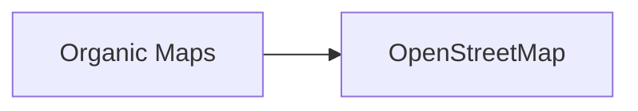

# Organic Maps y la ilusión de los mapas libres: ¿puede la comunidad vencer a Google?

Cuando Organic Maps apareció en HackerNews, muchos lo celebraron como la prueba de que todavía existen alternativas éticas al ecosistema de Google. Un mapa offline, sin anuncios, sin rastreo, financiado por donaciones. La idea suena casi demasiado limpia. Y precisamente por eso merece un análisis más profundo sobre las fuerzas económicas y políticas que hacen que un proyecto así sea, al mismo tiempo, admirable y estructuralmente frágil.

## El linaje turbio de un proyecto "puro"

En 2021, tras las sanciones occidentales a Rusia y la presión de la comunidad open source, el proyecto fue bifurcado (forkeado) por antiguos colaboradores, dando lugar a Organic Maps, ahora mantenido por una fundación sin fines de lucro y sostenido por donaciones individuales. Este contexto importa: incluso un proyecto que se presenta como comunitario y apolítico nace de una disputa geopolítica. Los mapas no son solo utilidades; son infraestructura estratégica.

## La concentración del negocio cartográfico

Lo que estos actores comparten es un modelo económico basado en **datos como materia prima**. Cada búsqueda, cada ruta, cada consulta enviada desde un dispositivo alimenta modelos de tráfico, patrones de movilidad y publicidad hiperlocalizada. Google no cobra por Google Maps directamente: lo monetiza a través de la capa publicitaria y, sobre todo, mediante el valor estratégico que genera para su negocio de publicidad local, que en 2023 superó los 30.000 millones de dólares solo en Estados Unidos, según eMarketer.

## ¿Puede una comunidad sostener infraestructura crítica?

Mantener un mapa del mundo utilizable es extraordinariamente costoso. **OpenStreetMap (OSM)**, la base de datos cartográfica abierta sobre la que se construye Organic Maps, cuenta con más de 9 millones de colaboradores registrados, pero depende de un trabajo voluntario distribuido y de donaciones. Editores como **Mapbox** y **Meta** (Facebook) son contribuyentes masivos a OSM, pero también han sido acusados de extraer valor comunitario sin reciprocidad proporcional, especialmente Meta, que ha utilizado datos de OSM mientras reducía su compromiso con el proyecto.

Organic Maps ha sido descargado más de 8 millones de veces según sus propias métricas, pero su modelo de financiación —donaciones puntuales a través de OpenCollective— genera ingresos en el orden de los cientos de miles de dólares anuales. Para ponerlo en perspectiva: Google invierte miles de millones cada año en su infraestructura cartográfica, vehículos de Street View, y equipos de datos. La asimetría no es del 10 a 1; es del 1 a varios miles.

## El valor geopolítico de los mapas

Organic Maps, al depender de OpenStreetMap y de una comunidad distribuida, ofrece una resiliencia diferente: no responde a un gobierno ni a un accionista. Pero su escala es tan reducida que, en un escenario de crisis, su utilidad práctica es limitada frente a la cobertura global en tiempo real que ofrece Google.

## El dilema filosófico del software libre

Hay una pregunta incómoda que la comunidad del open source rara vez se plantea: **¿es la libertad del software sostenible sin capital?** Proyectos como Organic Maps, Signal o Wikipedia demuestran que es posible, pero también exponen una verdad: dependen de la buena voluntad de individuos y, a veces, de donaciones de fundaciones como la Open Technology Fund, que a su vez recibe dinero público de gobiernos como el de Estados Unidos.

## Conclusión: mapas como campo de batalla

Organic Maps es, en muchos sentidos, un éxito improbable: una aplicación útil, respetuosa con la privacidad, mantenida por una comunidad activa. Pero también es un recordatorio de que **la infraestructura digital del siglo XXI sigue concentrada en unas pocas manos**, y que construir alternativas reales no es un problema técnico, sino económico y político.

La próxima vez que abras Google Maps para buscar una cafetería, recuerda que la gratuidad de esa aplicación es la otra cara de un modelo que extrae valor masivo de tus movimientos, tus búsquedas y tus datos. Organic Maps no va a reemplazar a Google mañana, pero su existencia demuestra que el monopolio cartográfico no es inevitable. La pregunta es si estamos dispuestos a sostener —con dinero, tiempo o difusión— las pocas alternativas que aún nos quedan. Porque un mundo donde solo unos pocos deciden cómo vemos el espacio que habitamos es, en sí mismo, una forma de poder.

