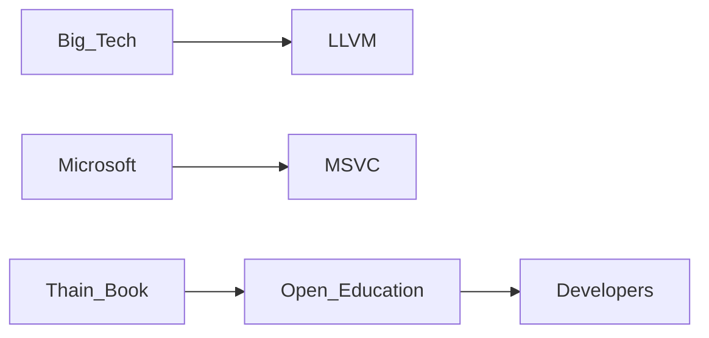

# Un manual abierto sobre compiladores desafía la privatización del saber tecnológico

En una época donde aprender a programar suele significar suscribirse a plataformas como Coursera, pagar certificaciones de AWS o Google Cloud, o matricularse en bootcamps que cuestan miles de dólares, la decisión del profesor Douglas Thain de la Universidad de Notre Dame de publicar gratuitamente su libro *Introduction to Compilers and Language Design* parece casi un acto de resistencia pedagógica. El manual, disponible en abierto desde 2021 y recientemente comentado en Hacker News, no es solo un recurso educativo: es una declaración implícita sobre quién debe controlar el conocimiento técnico fundamental.

## Por qué los compiladores importan más de lo que crees

El libro de Thain cubre el ciclo completo: análisis léxico, sintáctico, semántico, generación de código, optimización y diseño de lenguajes. Es el tipo de conocimiento que solía ser dominio público de los departamentos de informática universitarios y que ahora, gradualmente, ha sido absorbido por la lógica corporativa de las grandes tecnológicas.

## El oligopolio silencioso de los compiladores

Para entender la relevancia de un manual abierto, hay que observar el paisaje actual. La infraestructura de compilación está dominada por un puñado de proyectos estrechamente vinculados a gigantes corporativos:

- **LLVM/Clang**: nacido en la Universidad de Illinois, ahora profundamente integrado con Apple, Google, AMD, ARM y Sony. Apple lo adoptó como base de su pila de desarrollo (reemplazando GCC) y hoy financia gran parte de su desarrollo.
- **GCC (GNU Compiler Collection)**: mantenido por la Free Software Foundation con contribuciones significativas de Red Hat (propiedad de IBM desde 2019), Intel y Oracle.
- **MSVC (Microsoft Visual C++)**: propiedad exclusiva de Microsoft, integrado con Visual Studio y la plataforma .NET.
- **Swift Compiler**: desarrollado por Apple para su ecosistema cerrado.
- **rustc**: el compilador de Rust, con patrocinio significativo de Amazon Web Services, Mozilla (ahora en declive tras los despidos), Google y Huawei.

Lo que vemos no es solo un mercado de software, sino una cartografía de poder. Cada compilador refleja las prioridades estratégicas de quien lo financia. El compilador de Swift optimiza para los chips de Apple. MSVC prioriza la integración con el ecosistema Windows. Y el soporte de Rust en AWS responde directamente a la decisión de Amazon de adoptarlo en componentes críticos de su infraestructura en la nube.

## Educación como mercancía

En este entorno, un manual universitario gratuito sobre un tema tan fundamental como los compiladores es una rareza. Y lo es precisamente porque los compiladores son un tema "duro": no es tan popular como Python para análisis de datos o JavaScript para desarrollo web, dos áreas donde la demanda del mercado ha generado una explosión de cursos pagos. La complejidad del tema lo ha protegido, paradójicamente, de la comodificación masiva, pero también lo ha dejado fuera del alcance de muchos estudiantes que no pueden pagar una carrera universitaria tradicional.

## La historia se repite: del Unix abierto al código capturado

La ironía es que Linux, nacido como alternativa al Unix privatizado, es hoy el sistema operativo sobre el que descansa la mayor parte de la infraestructura de internet, y por extensión, la mayor parte de la acumulación de capital tecnológico del siglo XXI. Google, Amazon, Meta y Microsoft construyen sus imperios sobre Linux, pero también han encontrado formas de capturar capas superiores de valor: Kubernetes, Node.js, React, TensorFlow, PyTorch. El código abierto se mantiene abierto; el valor se extrae en otra parte.

El libro de Thain sigue la tradición del saber académico abierto, esa corriente que va desde los manuales de Kernighan y Ritchie sobre C en los 70, hasta el *Structure and Interpretation of Computer Programs* del MIT en los 80 y 90. Sin embargo, esta tradición está hoy en peligro: las universidades dependen cada vez más de financiamiento corporativo, los investigadores publican en conferencias patrocinadas por las mismas empresas que regulan la industria, y los estudiantes consumen conocimiento a través de canales cada vez más mediados por intereses comerciales.

## ¿A quién beneficia un compilador bien entendido?

Hay una pregunta de fondo que este tipo de recursos abiertos plantea: ¿a quién beneficia que solo unas pocas personas entiendan cómo funciona realmente el software que ejecuta el mundo? Los ingenieros senior de Google, Apple y Microsoft toman decisiones de diseño de lenguajes que afectan a millones de desarrolladores, pero ese conocimiento rara vez se democratiza de manera rigurosa. Los comités de estandarización de C++, Rust o Swift están dominados por ingenieros de estas empresas, y sus decisiones rara vez se discuten fuera de los círculos corporativos.

Cuando un programador entiende cómo funciona un compilador, entiende también por qué ciertos lenguajes son más rápidos que otros, por qué la gestión de memoria es un problema político tanto como técnico, y por qué las decisiones de diseño tomadas en los años 60 y 70 siguen condicionando el software que escribimos hoy. Ese conocimiento es poder, en el sentido más literal.

## Conclusión: el código abierto como práctica política

La pregunta que deja abierta este libro no es técnica, sino política: ¿seguiremos permitiendo que el conocimiento fundamental de la informática sea propiedad efectiva de media docena de empresas cotizadas en bolsa, o apostaremos por mantener viva la tradición del saber compartido? Los compiladores seguirán traduciéndose a instrucciones de máquina independientemente de quién los estudie. La diferencia está en quién decide cómo se diseña ese proceso, y para quién. En un momento donde la inteligencia artificial generativa amenaza con convertir la programación misma en una caja negra opaca, entender cómo funciona un compilador es, quizás, el primer acto de soberanía técnica.