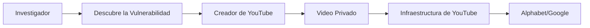

## La Vulnerabilidad de Videos Privados de YouTube Expone el Desequilibrio de Poder de los Creadores

Cuando el investigador de ciberseguridad Javoriuski publicó sus hallazgos sobre un método para filtrar videos privados de creadores de YouTube, la comunidad tecnológica prestó atención. Pero más allá de los detalles técnicos se esconde una verdad más incómoda: este incidente revela la fragilidad estructural de una economía de creadores construida sobre la infraestructura de una sola plataforma, y la peligrosa asimetría de poder entre quienes crean contenido y quienes lo distribuyen.

### El Problema Técnico, en Breve

La vulnerabilidad involucra la forma en que YouTube maneja los identificadores de video, específicamente la capacidad de enumerar IDs de videos no listados y privados a través de patrones predecibles o referencias filtradas. Una vez que un atacante tiene un ID de video válido, ciertos casos extremos en los mecanismos de compartición de YouTube pueden exponer contenido que los creadores creían protegido detrás de la autenticación. Aunque Google aparentemente ha abordado algunos de estos vectores, la arquitectura subyacente—miles de millones de videos, permisos de compartición complejos y décadas de código legado acumulado—hace que la remediación integral sea extraordinariamente difícil.

### El Problema del Monopolio que Nadie Quiere Discutir

YouTube no es meramente una plataforma de video; es, para millones de creadores, la totalidad de su infraestructura profesional. La empresa matriz, Alphabet, ha utilizado esta posición para consolidar el poder a través de varios mecanismos: curación algorítmica opaca, cambios unilaterales de políticas y la eliminación gradual de alternativas.

### La Economía de la Dependencia

La economía de los creadores, valorada en más de 250 mil millones de dólares a nivel mundial, funciona sobre infraestructura controlada por un puñado de empresas. Cuando emerge una vulnerabilidad de YouTube, no es meramente un inconveniente técnico; representa un riesgo sistémico para los ingresos de creadores que pueden haber almacenado contenido no publicado, materiales de asociaciones con marcas o videos familiares en la plataforma.

### Patrones Históricos en la Gobernanza de Plataformas

La enfermedad, en este caso, es el modelo de negocio en sí mismo. El capitalismo de vigilancia, como lo ha denominado Shoshana Zuboff, trata los datos de los usuarios como materia prima para ser extraída y refinada. Las protecciones de privacidad existen principalmente para mantener la confianza del usuario, necesaria para la extracción continua de datos, no como un derecho fundamental a ser respetado en sí mismo.

### La Cuestión Laboral

Hay otra dimensión frecuentemente pasada por alto en estas discusiones: la relación laboral entre las plataformas y los creadores. A pesar de generar miles de millones en ingresos publicitarios para Google, los creadores de YouTube están clasificados como contratistas independientes, no como empleados. Ellos asumen los costos de equipo, software y producción de contenido sin tener garantía contractual de acceso a la plataforma o estabilidad de ingresos.

El resultado es un sistema donde los trabajadores más vulnerables son los más expuestos, y donde la única rendición de cuentas significativa proviene de investigadores externos dispuestos a publicar sus hallazgos, a menudo a riesgo personal y profesional.

### Hacia una Arquitectura Diferente

