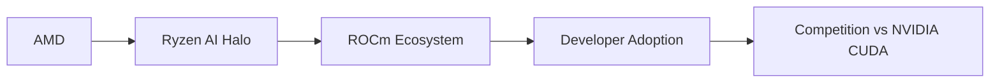

# AMD Ryzen AI Halo a $4,000: ¿Desafío real a NVIDIA o estrategia defensiva de un gigante acorralado?

La semana pasada, AMD presentó su Ryzen AI Halo, un kit de desarrollo para inteligencia artificial con un precio de entrada de $4,000 dólares. La cifra no es menor: posiciona a la compañía de Lisa Su en un segmento donde hasta hace poco solo NVIDIA reinaba con holgura. Pero detrás del anuncio y las especificaciones técnicas —memoria unificada de alto ancho de banda, NPU dedicada, compatibilidad con ROCm— se esconde una pregunta incómoda: ¿puede AMD realmente disputarle el trono a Jensen Huang, o esto es más bien un movimiento defensivo para no quedar completamente marginada del negocio más lucrativo de la década?

## El contexto: una industria con un solo ganador visible

Para entender la magnitud del desafío, conviene revisar los números. NVIDIA controla aproximadamente entre el 80% y el 90% del mercado de GPUs para centros de datos, el segmento que sostiene la mayor parte del entrenamiento e inferencia de modelos de inteligencia artificial a nivel global. Esta posición no surgió por accidente: durante más de una década, NVIDIA cultivó CUDA, su plataforma de software propietario, que creó un foso de switching costs (costos de cambio) casi inexpugnable para los desarrolladores.

AMD, por su parte, ha intentado durante años construir una alternativa con ROCm, su propio stack de software. Los resultados han sido, cuanto menos, irregulares. Aunque la empresa ha logrado avances técnicos genuinos con sus aceleradores Instinct, la adopción empresarial sigue siendo una fracción de lo que NVIDIA consigue trimestre tras trimestre. El Ryzen AI Halo parece ser un intento de atacar el problema desde otro ángulo: el desarrollador individual o de pequeños equipos, no el hyperscaler.

## La lógica económica detrás de los $4,000

Entonces, $4,000 por un kit optimizado para IA suena, en superficie, como una opción razonable. Pero aquí está el truco: AMD no está compitiendo solo con NVIDIA en precio. Está compitiendo con todo un ecosistema. Cuando un desarrollador compra una H100, no compra solo hardware: compra acceso a documentación pulida, a bibliotecas optimizadas, a una comunidad masiva de pares, a herramientas de profiling maduras, y a la certeza de que cualquier paper reciente de IA funcionará en su máquina.

ROCm, por su parte, todavía lidia con fricciones de compatibilidad que obligan a los desarrolladores a reescribir código o esperar parches. Es la clásica trampa del incumbente versus el retador, y AMD lo sabe.

## TSMC, el verdadero poder detrás del trono

Hay un actor que rara vez aparece en los titulares pero que define las posibilidades de toda esta industria: Taiwan Semiconductor Manufacturing Company (TSMC). Tanto NVIDIA como AMD fabrican sus chips más avanzados en las fábricas de TSMC en Taiwán. Esto significa que, en la práctica, la guerra comercial entre AMD y NVIDIA se decide en gran medida en Taoyuan, no en Santa Clara ni en Austin.

La reciente tensión geopolítica en el Estrecho de Taiwán, las restricciones de exportación de Estados Unidos a China, y los subsidios del CHIPS Act han añadido una capa de complejidad que afecta a ambos competidores por igual. Ninguno de los dos puede permitirse una disrupción real en la cadena de suministro de TSMC, y eso coloca a la foundry taiwanesa en una posición de poder estructural que ninguna de las dos puede ignorar.

## La jugada estratégica: capturar a los developers antes que a los datacenters

El naming "Halo" no es casual. Microsoft utiliza el sufijo para sus productos estrella, y la marca evoca exclusividad. AMD está apuntando a un segmento específico: investigadores académicos, startups en etapa temprana, y desarrolladores independientes que necesitan capacidad de inferencia local sin depender exclusivamente de la nube. Es una estrategia inteligente porque ataca el embudo de adopción desde la base.

Si AMD logra que miles de desarrolladores escriban código optimizado para ROCm durante los próximos dos años, habrá construido algo que el dinero no puede comprar de la noche a la mañana: una comunidad. Pero la historia reciente sugiere que este camino es largo y costoso. Intel intentó algo similar con su ecosistema oneAPI y los resultados han sido tibios. La pregunta es si AMD tiene la paciencia financiera y la disciplina estratégica para sostener la inversión durante una década, como hizo NVIDIA con CUDA.

## ¿Burbuja o consolidación legítima?

No podemos hablar de $4,000 en hardware de IA sin mencionar la pregunta que ronda a los analistas: ¿estamos en una burbuja? Las valuaciones de NVIDIA han fluctuado enormemente, los hyperscalers están gastando cientos de miles de millones en infraestructura de IA, y los retornos tangibles para muchas empresas siguen siendo especulativos.

El Ryzen AI Halo, en este contexto, es un termómetro interesante. Si AMD logra vender estos kits en volúmenes significativos, será una señal de que el mercado de desarrollo de IA se está diversificando y profesionalizando. Si las ventas son anémicas, será evidencia adicional de que el mercado real está concentrado en unas pocas empresas que compran al por mayor directamente a NVIDIA.

## Conclusión: una partida que se juega en software, no en silicio

Al final del día, el Ryzen AI Halo nos recuerda algo fundamental sobre la industria tecnológica: las guerras de hardware se ganan o se pierden en el software. AMD puede fabricar chips competitivos —y de hecho lo hace—, pero el verdadero campo de batalla es la mente del desarrollador. Y ahí, NVIDIA lleva una década de ventaja que no se borra con un lanzamiento, por muy bien ejecutado que esté.