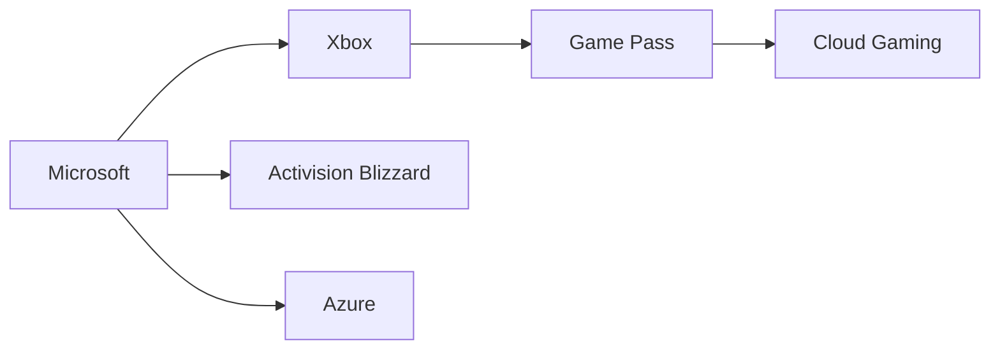

# Xbox se reinicia otra vez: ¿el fin de una era o el comienzo del monopolio absoluto?

Cuando Microsoft publicó su comunicado titulado "Resetting Xbox" el pasado julio de 2026, muchos entusiastas del videojuego lo interpretaron como una promesa de renovación creativa. Sin embargo, leído con las gafas del analista económico, el texto revela algo mucho más profundo: una nueva fase de consolidación silenciosa dentro de una industria que ya apenas tolera competidores medianos.

## El contexto: un gigante que no termina de arrancar

El "reset" no es, por tanto, una declaración de intenciones frescas. Es una admisión implícita de que el modelo anterior no estaba funcionando como preveían los analistas de Wall Street. Y cuando un actor del tamaño de Microsoft gira el timón, la pregunta no es solo qué cambia para Xbox, sino qué ocurre con todo el ecosistema.

## La lógica del capital concentrado

La industria del videojuego es, hoy más que nunca, un oligopolio. Activision, Blizzard, Bethesda, id Software, ZeniMax, Mojang, Rare, Playground Games: todos viven bajo el mismo techo corporativo. Sony, mientras tanto, ha consolidado PlayStation Studios con inversiones masivas y adquisiciones selectivas. Y en Asia, Tencent opera como un Estado dentro del Estado, con participaciones en Riot, Epic Games, Supercell, Ubisoft y decenas de publishers medianos.

Lo que "Resetting Xbox" pone sobre la mesa es la siguiente fase de un proceso que se repite desde los años 2000: cuando una plataforma no puede ganar en creatividad ni en cuota de mercado, intenta ganar en **escala**. Reducir costes operativos, centralizar decisiones, monetizar más agresivamente a los usuarios existentes y exprimir las franquicias adquiridas se convierte en la estrategia por defecto.

Históricamente, este patrón tiene precedentes claros. Cuando Electronic Arts consolidó su posición a finales de los 90, lo hizo mediante adquisiciones agresivas y optimización de costes que, a la larga, erosionaron la diversidad creativa. Cuando Activision-Bethesda se fusionó en 2008, vimos un patrón similar: recortes, despidos, proyectos cancelados. Microsoft no está inventando nada nuevo; está siguiendo la hoja de ruta que el capital financiero exige a cualquier gran corporativo cotizado.

## Las víctimas predecibles: los trabajadores y la diversidad

Cualquier proceso de "reset" en una compañía de este tamaño tiene un coste humano inmediato. Los primeros en sentirlo son los estudios de desarrollo de segundo nivel, los equipos de soporte, los proyectos experimentales sin retorno claro. Lo vimos con el cierre de Tango Gameworks, Arkane Austin y otros tras la integración de Activision. Lo volveremos a ver.

Pero hay un segundo nivel de víctimas menos visible: la **diversidad de mercado**. Cuando un actor con acceso a franquicias como Call of Duty, Diablo, Elder Scrolls, Halo, Forza o Minecraft decide unilateralmente qué hacer con cada una, está decidiendo también qué no verá la luz. En una economía de la atención, el catálogo no es solo un inventario: es el menú cultural de toda una generación de jugadores.

La pregunta incómoda es: ¿quién regula esta dinámica? La FTC intentó frenar la compra de Activision, pero perdió. La CMA británica cedió tras negociaciones. La Unión Europea aprobó con condiciones tibias. El resultado es que Microsoft opera hoy con un poder de mercado que habría sido inconcebible hace quince años.

## El juego de las plataformas: la nube como nuevo campo de batalla

Un aspecto clave del "reset" parece ser la apuesta renovada por el cloud gaming y la integración con la inteligencia artificial. Aquí, Microsoft tiene una ventaja estructural: Azure es la columna vertebral de la mayoría de servicios de IA del mundo, y eso le permite experimentar con modelos de monetización que Sony o Nintendo difícilmente pueden igualar.

Pero cuidado: la promesa del "juego desde cualquier lugar" también es la promesa del **control total sobre la experiencia del usuario**. Si el gaming migra definitivamente a la nube, las condiciones de servicio reemplazan a las cajas físicas, y la propiedad real del software se diluye en una suscripción permanente. No es un futuro apocalíptico; es simplemente la continuación lógica de la tendencia que Netflix inició en el audiovisual y que Adobe ha perfeccionado en el software creativo.

## ¿Qué significa esto para el jugador?

El "Resetting Xbox" no es, en definitiva, una historia sobre Microsoft. Es una historia sobre cómo el capital financiero exige a las grandes plataformas un crecimiento perpetuo, y cómo ese crecimiento, cuando se agota la frontera geográfica, solo puede venir de la integración vertical, la concentración y la extracción.

La pregunta que debería hacerse la industria —y los reguladores, y los propios jugadores— no es si Xbox se va a reinventar. La pregunta es si queda espacio real para que alguien lo haga fuera de los tres o cuatro gigantes que ya lo controlan todo. Si la respuesta es no, el "reset" habrá sido, en realidad, el punto final de una era. Y el comienzo de otra mucho más estrecha.

---

