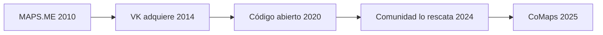

# CoMaps y la rebelión silenciosa: cómo construir mapas fuera del imperio de Google

Pocas infraestructuras digitales son tan invisibles y, al mismo tiempo, tan poderosas como los mapas. Cada vez que abrimos una aplicación para buscar una dirección, pedir un viaje o verificar una ruta, estamos alimentando un sistema de datos que define cómo nos movemos, cómo compramos y cómo pensamos el espacio. En este terreno, la dominación de Google Maps es prácticamente total. Pero un nuevo proyecto open source, CoMaps, busca abrir una grieta en ese monopolio de facto.

## La cartografía como poder

Para entender por qué este asunto importa, conviene mirar la historia. Durante el siglo XX, los mapas fueron considerados infraestructura estratégica de Estado. La CIA invirtió décadas en construir capacidades cartográficas propias porque saber dónde están las cosas —carreteras, ríos, fronteras— equivale a tener poder. Lo que cambió con la irrupción de internet no fue la naturaleza del recurso, sino quién lo controla.

Hoy, Google Maps procesa más de 20.000 millones de solicitudes diarias según estimaciones del sector. Apple Maps, Mapbox, HERE Technologies —propiedad de un consorcio de fabricantes de coches europeos— y TomTom completan un oligopolio de facto. OpenStreetMap, la base de datos geográfica colaborativa que alimenta proyectos como CoMaps, parece minúscula en comparación, pero su existencia es una anomalía histórica: el único mapa global del mundo construido por una comunidad de voluntarios.

## El dilema estructural del software libre

CoMaps no surge de la nada. La aplicación nació como MAPS.ME en 2010, fue adquirida por el grupo ruso VK en 2014 y liberada como código abierto en 2020. Cuando VK dejó de mantenerla, la comunidad asumió el relevo y renombró el proyecto como CoMaps. El recorrido ilustra un dilema conocido: los proyectos libres sobreviven mientras haya quien los sostenga, y se tambalean cuando una pieza —financiamiento, liderazgo, motivación— se rompe.

Mantener una base cartográfica global exige servidores, moderación, herramientas y, sobre todo, tiempo voluntario que compite con empleos, familias y otros compromisos. Sin financiamiento estable, marcos regulatorios favorables o alianzas con instituciones públicas, el modelo libre seguirá siendo admirable pero marginal frente a los gigantes comerciales.

## Concentración y dependencia tecnológica

Volviendo al problema de fondo: ¿por qué Google Maps sigue siendo prácticamente insustituible para la mayoría de usuarios? La respuesta no es técnica. Es económica. Google invierte miles de millones de dólares anuales en cartografía: vehículos de Street View recorriendo calles, acuerdos con proveedores locales, equipos humanos de datos, infraestructura de cómputo masivo. Cualquier competidor independiente tiene que correr esa carrera con una fracción de los recursos.

La dependencia cartográfica tiene además un ángulo poco discutido: la resiliencia. Cuando una empresa como Google decide modificar las condiciones de su API, retirar funciones gratuitas o cambiar los términos de uso, millones de aplicaciones y negocios se ven afectados de un día para otro. Esa concentración no sólo limita la competencia, sino que introduce un riesgo sistémico en capas enteras de la economía digital.

## Una reflexión sobre la infraestructura común

Quizás el verdadero legado de CoMaps no sea técnico, sino político: recordarnos que los mapas, como los buscadores, las redes sociales o los sistemas operativos, deberían ser infraestructura pública, no propiedad privada de unas pocas empresas. La pregunta es si la sociedad está dispuesta a invertir colectivamente —con dinero, tiempo o presión regulatoria— para que ese ideal se acerque un poco más a la realidad. En tiempos donde la autonomía digital vuelve a ser tema de Estado, la próxima década decidirá si los mapas libres son una curiosidad de activistas o, finalmente, una pieza central de un ecosistema tecnológico más equilibrado.