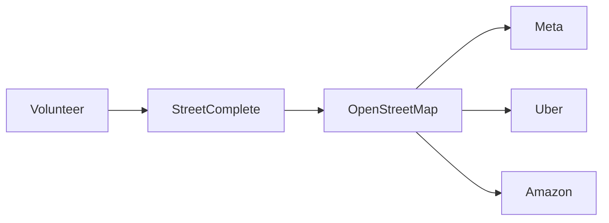

Y aquí está la paradoja capitalista más reveladora: empresas valoradas en cientos de miles de millones de dólares construyen productos rentables sobre un mapa que mantiene, literalmente, un jubilado en Sídney trazando un camino a las tres de la mañana porque sí, porque le apetece. La OpenStreetMap Foundation, una organización sin ánimo de lucro registrada en el Reino Unido, opera con un presupuesto anual que probablemente no cubre el catering de una junta directiva de Google. Sus servidores, donados por la University of Westminster y alojados parcialmente en infraestructura comunitaria, no admiten comparación con la infraestructura hyperscale de AWS o Google Cloud que sostiene Google Maps. Es David contra Goliat, pero con el mismo número de piedras.

