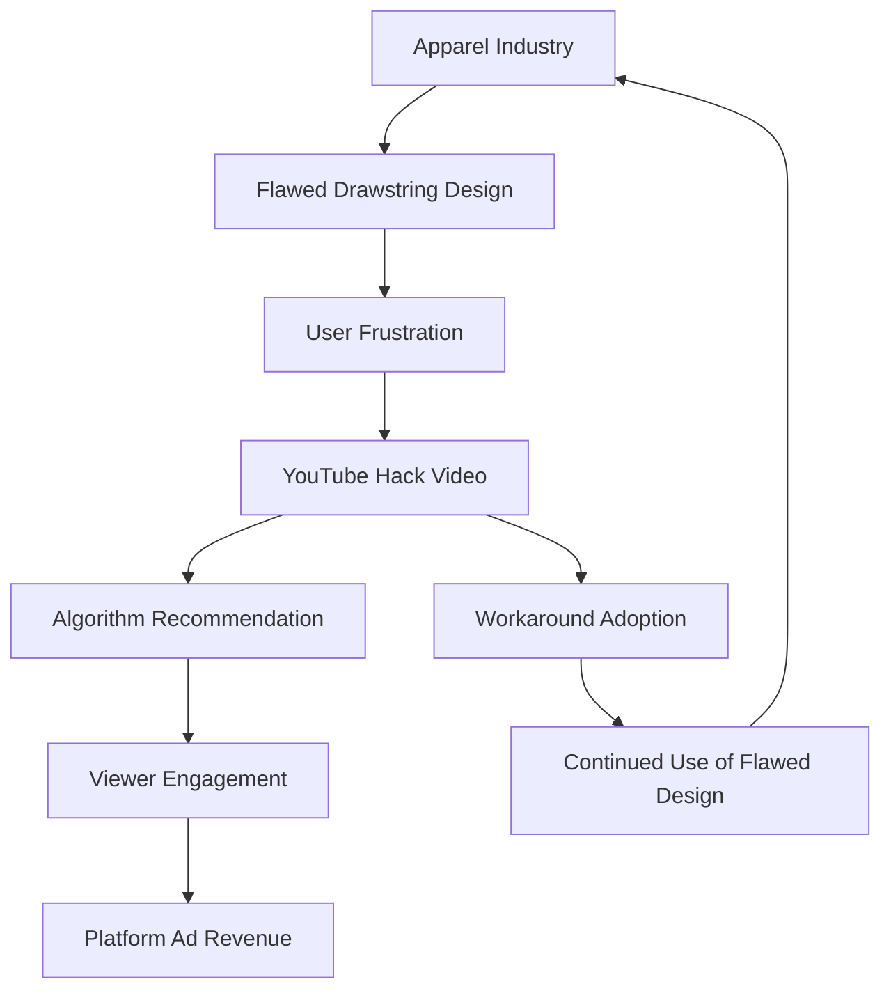

There's a video on YouTube that demonstrates a better way to tie gym shorts. It runs about four minutes. It has been watched millions of times. And, depending on your perspective, it's either a triumph of decentralized knowledge sharing or a damning indictment of an innovation economy that has lost its way.

The video, which surfaced on Hacker News this week and currently sits comfortably in YouTube's recommendation algorithm, presents a method for tying drawstrings so they don't slip, dangle, or come undone mid-workout. It's the kind of content that sounds absurdly trivial until you've tried to run in a pair of shorts with a string swinging against your thighs for the four hundredth time. The creator's solution is elegant: a simple mechanical adjustment that takes about ten seconds to learn and an hour to forget unless you rewatch the video three times.

What makes this particular video worth analyzing isn't the knot itself. It's the entire ecosystem surrounding it: the platforms that distribute it, the corporations that manufactured the problem it solves, and the cultural moment in which millions of people will spend a collective eternity watching a stranger demonstrate how to tie their pants.

## The Life Hack Industrial Complex

The term "life hack" was coined by tech journalist Danny O'Brien in 2003 and was later popularized by Lifehacker, the Gawker Media-owned blog that defined a generation of small internet optimizations. The conceit was charming: ordinary people, equipped with a little lateral thinking, could subvert the friction of daily life through clever shortcuts. Why struggle with a tangled cord when a ten-second technique exists?

But somewhere between 2003 and now, life hacks metastasized into something else. Today, the genre is an industrial-scale content vertical, optimized by recommendation algorithms that have learned that human curiosity has no floor. YouTube, TikTok, and Instagram Reels have turned the most mundane human activities — folding a shirt, peeling a banana, yes, tying a drawstring — into vehicles for engagement, watch time, and advertising revenue.

YouTube, owned by Alphabet, is the prime beneficiary. The platform's algorithm rewards time-on-site above nearly all else, and a four-minute video that solves a tiny, universal problem is, from an advertising perspective, close to ideal. It attracts viewers with specific intent, holds them for the duration, and then recommends three more videos on the same topic. The viewer feels productive. The platform collects the ad revenue. The cycle continues.

Meanwhile, the creator of the drawstring video — assuming they are not affiliated with any brand — likely earns a few hundred to a few thousand dollars for their trouble, depending on the CPM rates in their category. This is, by the standards of the creator economy, modest. But it raises an uncomfortable question: who actually benefits when a citizen becomes an unpaid R&D department for a multi-billion dollar apparel industry?

## The Drawstring Industrial Complex

The reason this video needs to exist is that Nike, Adidas, Under Armour, Lululemon, and the rest of the athletic apparel oligopoly have collectively decided that drawstrings are good enough. They are not. They have never been good enough. Anyone who has run, climbed, boxed, or done yoga in drawstring shorts knows this.

This is the same logic that gave us floppy disk save icons, dongles for headphones, and subscription software that was previously a one-time purchase. The apparel industry, like much of late-stage consumer capitalism, has externalized the cost of bad design onto the user. The user, lacking leverage with manufacturers who operate in factories halfway across the world, takes to YouTube to find a workaround.

It is, in a small way, the entire history of consumer technology in miniature. A corporation designs a flawed product. The market rewards the corporation anyway because there are no meaningful alternatives. The consumer invents a workaround. The workaround is shared for free on a platform that monetizes the consumer's attention. The corporation learns nothing, changes nothing, and continues to sell the same drawstring shorts for sixty-five dollars.

## A History of Small Solutions

There is, of course, a counter-tradition worth acknowledging. The appropriate technology movement of the 1970s, championed by figures like E.F. Schumacher in *Small Is Beautiful* and Buckminster Fuller, argued that the most important innovations are often the smallest: the village-level solution, the human-scaled design, the answer that fits the problem rather than the market.

The drawstring video lives in that tradition, even if its creator has never read Schumacher. The video is, fundamentally, a piece of applied engineering — an observation that a system is suboptimal, followed by a small intervention. Historically, this is how most human knowledge was transmitted: person to person, demonstration to demonstration, solution to solution.

## What the Algorithm Wants

The algorithm, of course, is not a neutral observer. It optimizes for engagement, which means it surfaces whatever keeps users watching — regardless of whether the content is useful, accurate, or meaningful.

This is the same logic that built the fast fashion industry: not what is best for the user, but what is most profitable in the short term. The drawstring stays bad because fixing it would cost money. The video exists because the drawstring stays bad. The viewer watches because the algorithm shows them the video. The advertiser pays because the viewer is watching.

It is a closed loop, and the only people with real power to break it — the apparel companies themselves — have no incentive to do so. The hack economy is, in this sense, a kind of folk infrastructure: a workaround built by users, for users, in the absence of corporate responsibility.

## Conclusion

The answer, more often than not, points back to the same handful of platforms and the same handful of corporations. The hack is not just a hack. It is a small window into the entire structure of contemporary technology — and a reminder that the most radical act in 2025 may simply be to learn, share, and use the knowledge that corporations have decided is not worth their time.

