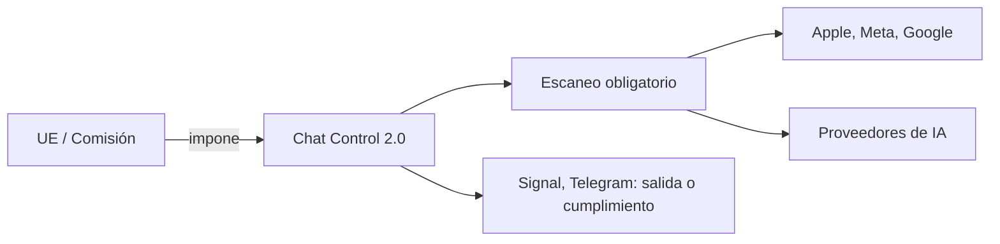

# Chat Control 1.0 y 2.0: la UE quiere leer tus mensajes y las tecnológicas ya están negociando

La Unión Europea lleva años trabajando en una de las piezas regulatorias más ambiciosas y controvertidas de la década: un sistema obligatorio de escaneo de comunicaciones privadas. Bautizada popularmente como **Chat Control**, esta propuesta no surgió de la nada ni de un consenso técnico. Es el resultado de una década de lobbying, miedo político y un giro sutil pero profundo en la forma en que la industria tecnológica entiende la relación entre seguridad, infancia y vigilancia.

## Qué es realmente Chat Control

**Chat Control 1.0**, aprobada provisionalmente en 2021, fue una regulación temporal que autorizó a proveedores de servicios de comunicación a escanear voluntariamente los mensajes de los usuarios en busca de material de abuso sexual infantil (CSAM). Era, en la práctica, una puerta de entrada regulatoria: legalizaba el escaneo client-side y creaba precedente.

**Chat Control 2.0** lleva la idea a su conclusión lógica. Propone que ese escaneo sea obligatorio para todas las aplicaciones de mensajería, incluidas las cifradas de extremo a extremo como **Signal**, **WhatsApp** y **Telegram**. El modelo exige que los mensajes sean analizados en el dispositivo del usuario *antes* de ser cifrados, lo que rompe arquitectónicamente la promesa del cifrado de extremo a extremo. En otras palabras: ya no se protege el contenido, se protege el sobre.

## Quién empuja y quién se opone

Detrás de Chat Control hay un ecosistema de incentivos que rara vez se discute en los titulares.

**Por un lado, los defensores.** La Comisión Europea, varios estados miembros (especialmente Alemania, que paradójicamente abandonó su propia postura crítica tras un cambio de gobierno) y un grupo heterogéneo de organizaciones de protección infantil. Estos últimos tienen un objetivo legítimo y emocionalmente inatacable: detener la distribución de material de abuso infantil. Difícil oponerse en público sin parecer un defensor del abuso.

**Por otro, los resistentes.** Signal, liderada por Meredith Whittaker, ha amenazado con abandonar Europa. La propia Whittaker ha sido explícita: no existe el "escaneo seguro", es una contradicción arquitectónica. WhatsApp, propiedad de **Meta**, ha sido más diplomática pero igualmente firme. Y un frente poco habitual: un grupo de criptógrafos de renombre mundial publicó en 2024 una carta abierta firmada por más de 600 expertos advirtiendo que la propuesta es técnicamente defectuosa.

Pero hay un tercer actor, mucho menos visible: **las empresas que venden la tecnología de escaneo**. Proveedores como **Thorn**, **PhotoDNA** (de Microsoft), o startups europeas como **Cogniware** e **Iputec** están perfectamente posicionadas para convertirse en proveedoras oficiales de la infraestructura. Chat Control no es solo una ley: es un mercado. Y los mercados crean ganadores.

## Las paradojas del poder corporativo

Aquí es donde el análisis se vuelve incómodo. **Apple** intentó exactamente esto en 2021 con su sistema de detección de CSAM en iCloud. La reacción fue inmediata: la Electronic Frontier Foundation, investigadores de seguridad, usuarios y hasta empleados de Apple se opusieron con argumentos técnicos y éticos. Apple dio marcha atrás en menos de un año, reconociendo que el "backdoor para buenos" no existe.

Y, sin embargo, la UE ha recogido exactamente esa idea, la ha pulido y la presenta ahora como política pública continental. ¿Qué cambió? No la tecnología, no los argumentos criptográficos. Cambió la **ventana política**: la protección infantil se ha convertido en el vehículo predilecto para justificar capacidades de vigilancia que nunca habrían sido aceptables en nombre de la "seguridad nacional" o el "antiterrorismo". Es el mismo truco narrativo de siempre, con distinto decorado.

Mientras tanto, **Meta** navega estas aguas con calculadora en mano. Mark Zuckerberg lleva años intentando que WhatsApp sea interoperable con Messenger e iMessage, precisamente para debilitar Signal y Telegram. Una regulación que erosione el cifrado fuerte beneficia directamente a quien ya no lo ofrece: Meta Messages, el mensajero de Meta con cifrado opt-in. No es conspiración, es alineación de incentivos. Y eso es más peligroso.

## Lecciones de historia que olvidamos

Cada generación tiene su propia versión de la misma pregunta: ¿quién vigila al vigilante? Chat Control la reformula con elegancia: *¿qué empresa europea te escaneará el WhatsApp a las tres de la mañana?* La respuesta importa menos que el hecho de que la pregunta se haya vuelto aceptable.

## El elefante en la sala: la concentración de capital

Detrás del debate técnico hay una realidad estructural: la industria tecnológica está más concentrada que nunca. Cuando la UE legisla sobre "aplicaciones de mensajería", en realidad legisla sobre cinco empresas: Meta, Apple, Google, Signal Foundation y Telegram. Cada una con modelos de negocio radicalmente distintos.

- **Meta** se beneficia de un cifrado erosionado porque Messenger es su alternativa preparada.
- **Apple** tiene un modelo de privacidad como marketing, pero también un negocio de cloud que podría requerir esta tecnología.
- **Google** depende de RCS y Android, y está atrapada entre su negocio publicitario y sus promesas de seguridad.
- **Signal** es una fundación sin ánimo de lucro financiada por donaciones: su única defensa es la ética de su criptografía.
- **Telegram** opera en una zona gris regulatoria que la UE lleva años intentando cerrar.

Chat Control, paradójicamente, podría fortalecer a las grandes plataformas a costa de las alternativas pequeñas. Cumplir con escaneo obligatorio, auditorías de IA, retención de datos y certificaciones cuesta dinero. Mucho dinero. Es una barrera de entrada regulatoria que solo las Big Tech pueden permitirse.

