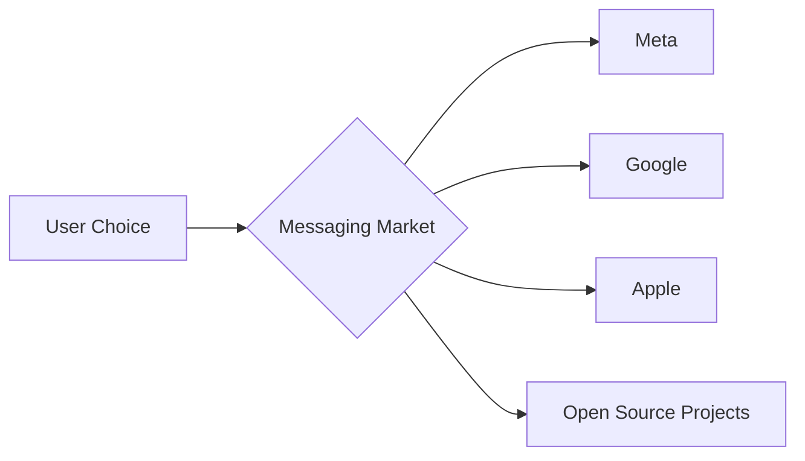

# Chatto Goes Open Source: What Indie Developers Reveal About Big Tech's Grip on Communication

This is the economic reality: messaging is a winner-take-most market. Network effects are brutal. The cost of switching is not financial — it's social. And that asymmetry is exactly what makes the existence of small, independent projects like Chatto politically interesting, even when they are technically trivial.

## The Open Source Reflex: Necessity, Not Altruism

There is a tendency in tech media to romanticize open source as a philosophical choice — developers giving back to the community, the cathedral and the bazaar, Stallman's legacy. The reality is often more pragmatic. Independent developers release code as open source because they cannot afford the distribution channels, marketing budgets, and server infrastructure that proprietary competitors treat as table stakes.

For someone like hmans, open source is not a statement. It is a distribution strategy. The code lives on, other developers contribute, and the project's value compounds even if the original creator walks away. This is the same dynamic that gave us **Redis**, **PostgreSQL**, **Linux**, and **Kubernetes** — projects that succeeded not because of idealism alone, but because their economic structure aligned incentives correctly.

## What Chatto Actually Means

Without diminishing the technical work, Chatto is a small project. It is not going to challenge WhatsApp. It is not going to displace Telegram. But its existence points to a real tension in the industry: **the gap between communication infrastructure and communication services**.

This is the same pattern we see in cloud computing. **Amazon Web Services** commoditized the underlying infrastructure (compute, storage, networking) while concentrating the abstraction layer (managed services, AI platforms) under corporate control. The result is a market that looks open at the bottom and closed at the top. Open source messaging projects reproduce this same shape at a smaller scale.

## Historical Echoes: The IRC Era and the WebSocket Renaissance

Twenty years ago, IRC dominated real-time text communication. It was an open protocol, federated, and run by volunteers. Then came AOL Instant Messenger, then MSN Messenger, then ICQ, then Facebook Chat, then WhatsApp, then Telegram, then Signal. Each generation centralized the previous one. The web itself was supposed to resist this — Tim Berners-Lee's original vision was a decentralized network of linked documents — but the economics of advertising, attention, and platform lock-in pulled everything back toward centralization.

What is interesting about the current moment is that the technical means of decentralization are arguably better than ever. **Matrix**, **XMPP**, **ActivityPub** (the protocol behind Mastodon and Threads' fediverse features), **Briar** — the tools exist. What is missing is a sustainable economic model that doesn't depend on either venture capital extraction or volunteer burnout. The history of open source is littered with projects that thrived for years and then collapsed when a single maintainer lost interest or a corporate sponsor changed priorities.

