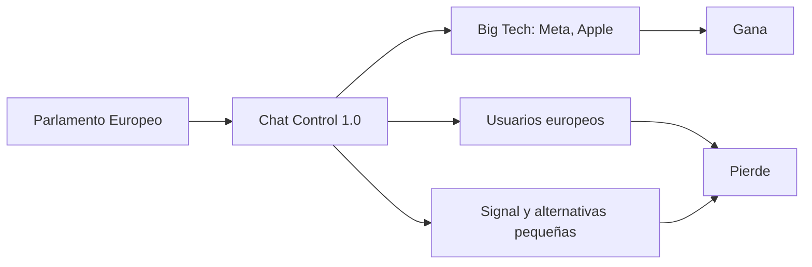

# Chat Control 1.0: la UE allana el camino a la vigilancia masiva bajo el pretexto de proteger menores

El Parlamento Europeo dio esta semana un paso que llevaba años cocinándose en los pasillos de Bruselas: la aprobación de lo que se conoce como **Chat Control 1.0**, un reglamento que obligaría a plataformas como WhatsApp, Signal, Telegram o iMessage a escanear el contenido de los mensajes privados de sus usuarios antes de que sean cifrados. La votación, celebrada el pasado martes, contó con el respaldo de una coalición heterogénea que incluyó a los grupos conservador, socialdemócrata y liberal, y solo encontró resistencia firme en los Verdes y la izquierda.

Patrick Breyer, eurodiputado del Partido Pirata y uno de los pocos políticos europeos que ha leído en detalle la propuesta técnica, lo resume sin ambages: "Nuestros hijos pierden con esta ley". Y tiene razón. Pero no solo los niños. **Todos perdemos**.

## Qué hay realmente detrás de Chat Control 1.0

La propuesta exige que las plataformas implementen **escaneo del lado del cliente** (client-side scanning): los mensajes se analizan en tu dispositivo, antes de cifrarse, buscando coincidencias con bases de datos de material de abuso infantil. En teoría, los proveedores de correo y mensajería deberían reportar cualquier coincidencia a una agencia europea de nueva creación.

Sobre el papel, el objetivo es loable. Combatir la explotación sexual infantil es una prioridad legítima de cualquier democracia. El problema, como suele ocurrir en la Unión Europea, está en los **mecanismos**, en quién los implementa y, sobre todo, en **a quién benefician realmente**.

## Por qué este reglamento es un regalo envenenado para las grandes tecnológicas

Aquí es donde conviene dejar la superficie del debate y mirar hacia las **dinámicas de poder e industria** que el texto revela.

**Meta, dueña de WhatsApp, Messenger e Instagram**, ha pasado años intentando justificar su modelo de negocio basado en la recolección masiva de datos. El cifrado de extremo a extremo fue durante mucho tiempo una de sus promesas estrella para diferenciarse de competidores más invasivos. Sin embargo, Meta nunca ha ocultado su incomodidad con el cifrado total: en 2019, Mark Zuckerberg ya dejó entrever su preferencia por un modelo donde la empresa pudiera "detectar actividad inapropiada". Chat Control 1.0 es, paradójicamente, lo más parecido a un salvavidas regulatorio para una compañía atrapada entre su propia arquitectura y las demandas públicas de moderación.

**Apple**, por su parte, lleva años vendiéndose como la empresa de la privacidad. Su campaña publicitaria "Privacy. That's iPhone" es legendaria. Sin embargo, en 2021 ya intentó introducir un sistema de escaneo de fotos en iCloud, que retiró tras una protesta masiva de la comunidad técnica. Hoy, con Chat Control 1.0, la empresa de Cupertino obtiene exactamente lo que quería sin tener que asumir el coste reputacional de proponerlo: una **obligación legal** que normaliza el escaneo masivo y debilita uno de los pocos argumentos competitivos que la diferenciaban de Android.

Y aquí está la clave que casi nadie señala: **las grandes plataformas ya tienen la infraestructura, los ingenieros y el capital para implementar estos sistemas de escaneo**. Una empresa emergente de mensajería cifrada, con un equipo de cinco personas y un servidor en Ámsterdam, no. Lo que parece una medida de seguridad es, en la práctica, una **barrera de entrada regulatoria** que consolida el dominio de quienes ya están en lo alto.

## Las guerras criptográficas vuelven a escena

Cada vez que un gobierno propone debilitar el cifrado, la respuesta de la industria es predecible. Pero hay algo nuevo en esta vuelta de tuerca: **la regulación ya no llega sola**. La UE ha aprobado en años recientes el Digital Services Act, el Digital Markets Act y el AI Act. El marco regulatorio europeo, nacido con una vocación legítimamente progresista, se ha convertido en un **vector de consolidación industrial** para las grandes plataformas. La carga burocrática de cumplir con la normativa es proporcional al tamaño de quien la asume.

## Quién gana, quién pierde

- **Las Big Tech con capacidad de cumplimiento normativo**: Meta, Apple, Microsoft, Google.
- **Las agencias de inteligencia y cuerpos policiales**, que obtienen acceso a un nuevo caudal de metadatos y, eventualmente, contenido.
- **Empresas de ciberseguridad y proveedores de tecnología de escaneo**, un mercado que se estima podría alcanzar los **miles de millones de euros** en la próxima década.

Los perdedores también:

- **Los usuarios europeos**, que pierden una de las pocas garantías de privacidad que les quedaban en sus comunicaciones personales.
- **Las pequeñas empresas y proyectos de código abierto**, que quedarán fuera del mercado o tendrán que emigrar a jurisdicciones más laxas.
- **La comunidad de criptógrafos y académicos**, que lleva años explicando que cualquier sistema de escaneo es, por definición, un sistema de vigilancia.

## El negocio de la seguridad como coartada

Hay un patrón que merece ser nombrado: cada expansión significativa de las capacidades de vigilancia estatal en las últimas dos décadas ha llegado acompañada de un discurso emocionalmente inapelable. Tras el 11-S fue el terrorismo. Tras el coronavirus, la salud pública. Ahora, la protección de la infancia. Los motivos son reales, pero **los mecanismos nunca son proporcionales** y rara vez se revierten una vez implementados.

Signal, la aplicación de mensajería cifrada más respetada por la comunidad de seguridad, ya ha anunciado que abandonará la UE si la ley entra en vigor en su forma actual. Es una declaración que pone en evidencia una ironía brutal: **Europa, que presume de proteger los derechos digitales, está a punto de expulsar a la empresa que mejor los encarna**.

## Conclusión: la privacidad como infraestructura de poder

La pregunta que deberíamos hacernos no es si queremos proteger a los menores, sino **a qué precio, con qué arquitectura y en beneficio de quién**. Porque cuando el escaneo masivo se normaliza, las siguientes categorías — disidentes, periodistas, activistas, abogados — ya no son una hipótesis. Son solo una actualización de la base de datos.

Quizás la verdadera pregunta es: ¿estamos dispuestos a ceder la única herramienta de comunicación verdaderamente privada que teníamos, confiando en que el Estado y las grandes tecnológicas harán un uso virtuoso de ella? La historia, tozuda, sugiere lo contrario.
