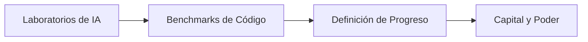

# Evaluaciones de IA en código: la batalla silenciosa por definir el progreso tecnológico

OpenAI publicó recientemente un artículo técnico sobre uno de los problemas más urgentes —y menos discutidos— del ecosistema actual de inteligencia artificial: cómo distinguir la señal del ruido en las evaluaciones de capacidad de programación. A primera vista, parece un ejercicio de transparencia metodológica. En realidad, es una jugada más en una guerra silenciosa por el control narrativo del progreso tecnológico.

## El ruido como estrategia funcional

Cuando un laboratorio como OpenAI, Anthropic, Google DeepMind o Meta presenta un modelo nuevo, lo acompaña con una batería de benchmarks: pruebas estandarizadas que supuestamente miden la capacidad del sistema para resolver problemas de programación, responder preguntas técnicas o ejecutar tareas complejas. El problema, como admite implícitamente el propio artículo, es que estas evaluaciones están profundamente contaminadas.

**Contaminación de datos**: los modelos se entrenan con fracciones sustanciales de internet, incluyendo repositorios públicos de GitHub, problemas de Stack Overflow y desafíos de plataformas como LeetCode o HackerRank. Es perfectamente plausible que un modelo "haya visto" la respuesta durante su entrenamiento.

**Optimización de benchmark**: los laboratorios seleccionan las pruebas que mejor muestran las fortalezas de sus modelos. Es la versión tecnológica del *cherry-picking* académico.

**Variabilidad estadística**: ejecutar un mismo modelo varias veces produce resultados diferentes. Un punto porcentual de mejora puede no significar absolutamente nada.

Pero aquí está la cuestión incómoda: parte de ese ruido es funcional para la industria. Permite a los actores dominantes anunciar mejoras marginales como avances revolucionarios, mover el precio de las acciones, atraer capital riesgo y debilitar a competidores más pequeños que no pueden permitirse una narrativa igualmente inflada.

## La historia se repite: los benchmarks como campo de batalla

Algo similar ocurrió con MLPerf para hardware de IA, con GLUE y SuperGLUE para comprensión de lenguaje, y más recientemente con HumanEval, SWE-bench y otros para capacidades de código. Cada nuevo benchmark es simultáneamente una herramienta científica y un artefacto político: define qué se considera "progreso" y, por extensión, quién merece financiamiento.

Microsoft, tras invertir 13,000 millones de dólares en OpenAI, tiene un interés directo en que las evaluaciones publicadas respalden la narrativa de superioridad de su socio comercial. Alphabet, con Gemini y DeepMind, necesita benchmarks que justifiquen sus propios gastos de capital. Anthropic, con su enfoque en seguridad, promueve métricas que destacan en áreas específicas. Cada uno empuja la métrica que le favorece. El resultado es un ecosistema de medición fragmentado, opaco y profundamente estratégico.

## La concentración del capital de evaluación

Hay un detalle que rara vez se discute: producir evaluaciones rigurosas y creíbles requiere recursos computacionales, talento investigador y acceso a modelos de frontera. Esto coloca el poder de certificación en manos de los mismos actores que están siendo evaluados.

Organizaciones independientes como ML Commons intentan llenar ese vacío, pero su financiación depende, en última instancia, de las donaciones de las mismas grandes tecnológicas. Es una variante del problema del "regulador capturado": ¿quién vigila al vigilante cuando el vigilante es financiado por el regulado?

El artículo de OpenAI puede leerse como un intento de recuperar la legitimidad epistémica —la autoridad para decir qué es señal y qué es ruido— en un momento en que la confianza pública en las afirmaciones de la industria está en mínimos históricos. Después de meses de comparaciones exageradas, lanzamientos inflados y promesas incumplidas sobre agentes autónomos, los propios laboratorios reconocen, veladamente, que el sistema de evaluación se ha vuelto insostenible.

## El costo geopolítico del ruido

Hay otra capa que suele pasarse por alto: la geopolítica de la inteligencia artificial. Estados Unidos, China, la Unión Europea y, cada vez más, países del Golfo Pérsico están invirtiendo sumas monumentales en capacidad de cómputo y talento. Las evaluaciones publicadas funcionan como un termómetro de la competencia entre bloques.

Cuando OpenAI afirma que su último modelo supera a Claude o Gemini en un benchmark específico, no es solo un comunicado técnico: es un mensaje a los reguladores, a los inversionistas institucionales, a los gobiernos extranjeros y a los propios empleados sobre quién lidera la carrera. Definir qué cuenta como progreso es, en este contexto, una forma de definir qué cuenta como poder.

## ¿Quién escribe las reglas del juego?

El verdadero debate que plantea este tipo de publicaciones no es técnico, sino político. ¿Deberían existir estándares abiertos de evaluación, mantenidos por consorcios públicos y académicos? ¿Deberían los modelos de frontera ser auditados independientemente antes de su lanzamiento comercial? ¿Deberían los benchmarks tener una "fecha de caducidad" para evitar la optimización excesiva y el sobreajuste?

## Conclusión: medir es poder

La próxima vez que vea un titular anunciando que un modelo de IA "supera a los programadores humanos" o "logra un nuevo récord" en alguna evaluación, vale la pena recordar una verdad incómoda: en la industria tecnológica contemporánea, la capacidad de definir las métricas es, a menudo, más importante que la capacidad de superarlas. Quien controla la forma en que medimos el progreso, controla la narrativa del progreso mismo. Y en un mercado donde Microsoft, Alphabet, Amazon, Meta y un puñado de empresas más concentran la mayor parte del capital, el talento y el poder computacional del planeta, esa capacidad de definición permanece, casi por definición, fuera del alcance de la mayoría.

