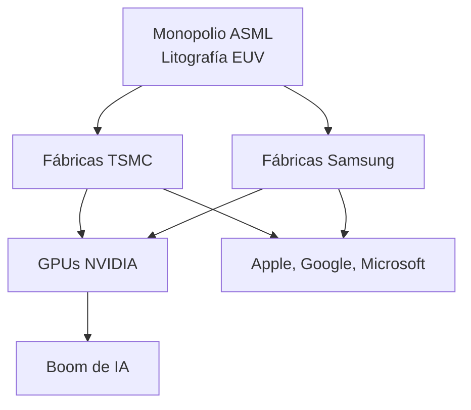

# Colapso de la Edad de Bronce, Riesgos de la Edad del Silicio: Cómo la Tecnología Moderna Refleja los Fracasos Sistémicos Antiguos

El Colapso de la Edad del Bronce Tardía (circa 1200 a.C.) arrasó las grandes civilizaciones del Mediterráneo oriental en el espacio de una sola generación. Micenas, el Imperio hitita, Ugarit, las posesiones asiáticas del Nuevo Reino de Egipto—sistemas que habían comerciado con estaño de Cornualles, cobre de Chipre y grano de allende los mares durante siglos—cayeron en una edad oscura que duró aproximadamente tres siglos. El blog *A Collection of Unmitigated Pedantry* revisó recientemente este evento, y leerlo a través de una lente de la industria tecnológica resulta genuinamente inquietante. Las dinámicas estructurales que destruyeron aquellas civilizaciones están alarmantemente presentes en nuestra propia economía digital.

## Las Rutas del Estaño del Siglo XXI

En la Edad de Bronce, el bronce era el material estratégico. El estaño era escaso, geográficamente concentrado y esencial. Las rutas comerciales que llevaban el estaño desde Afganistán, Iberia y Cornualles hasta el Mediterráneo eran las cadenas de suministro de semiconductores de su época. Quien las controlaba ejercía un enorme poder sobre todo el sistema.

Hoy, ese papel corresponde a un pequeño grupo de empresas que ya conoces: **TSMC** fabrica la gran mayoría de los chips avanzados; **ASML** ostenta un cuasi monopolio de las máquinas de litografía EUV que hacen posibles esos chips; **NVIDIA** controla la arquitectura de GPU que impulsa el auge de la IA; **TSMC** y **Samsung** juntas producen prácticamente toda la lógica de vanguardia en los nodos más avanzados. Esto equivale a tener tres minas suministrando todo el estaño del mundo conocido.

## El Capital Detrás de los Monopolios

La pregunta que enfrentamos es si hemos construido una fragilidad equivalente en nuestro sustrato digital. El control de **Apple** sobre su App Store, el de **Google** sobre Android, el de **Microsoft** sobre el software empresarial, el de **NVIDIA** sobre la computación de IA—no son solo cuotas de mercado. Son dependencias. Cuando un eslabón de esta cadena se rompe, la cascada puede ser rápida y brutal. El ataque NotPetya de 2017, que se originó en un proveedor ucraniano de software contable y terminó costándole a Maersk, Merck y FedEx miles de millones, fue un preludio a pequeña escala de lo que un verdadero fallo sistémico podría parecer.

## Lo que la Edad de Bronce Puede Enseñar a Silicon Valley

El historiador **Eric Cline**, quien popularizó la narrativa del colapso, enfatiza que ninguna causa única explica el fin de la Edad de Bronce. Fue una cascada "multicausal": estrés climático, migraciones, terremotos, disrupción comercial, hambruna y fracaso político se reforzaron mutuamente. Nuestra industria tecnológica es igualmente multicausal en sus riesgos: tensión geopolítica sobre Taiwán, estrés hídrico sobre las fábricas de semiconductores (que consumen volúmenes extraordinarios de agua ultrapura), las demandas energéticas del entrenamiento de IA, la economía política de las tierras raras, el panorama cibernético en evolución.

La historia no se repite, pero rima. Los estados de la Edad de Bronce invirtieron en interconexión y especialización sin invertir en redundancia, resiliencia o sistemas alternativos. Cuando llegó la cascada, no tenían un Plan B. Estamos haciendo lo mismo. Estamos apostando la economía global a unas pocas fábricas en Taiwán, una única empresa holandesa para la litografía, un pequeño número de laboratorios de IA para la tecnología más poderosa de nuestra era, y un puñado de proveedores de nube para todo lo demás.

La pregunta para nuestra generación es si seremos lo suficientemente sabios para construir la resiliencia que ellos no construyeron—o si descubriremos la forma de nuestro propio colapso solo cuando los hornos ya estén ardiendo.

