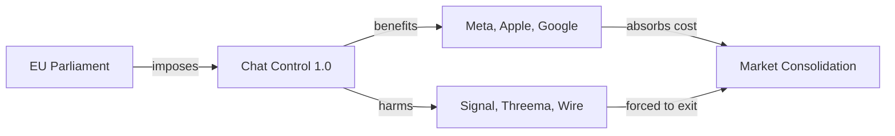

# Chat Control 1.0: La Regulación Europea que Consolida a las Grandes Tecnológicas Disfrazada de Protección Infantil

El Parlamento Europeo ha dado luz verde a lo que el eurodiputado del Partido Pirata Patrick Breyer ha bautizado con ironía devastadora como "Chat Control 1.0". Bautizada oficialmente como *Reglamento para prevenir y combatir el abuso sexual infantil*, la normativa obliga a las plataformas de mensajería a escanear todas las comunicaciones privadas de los 450 millones de ciudadanos europeos en busca de material de abuso sexual infantil. El cifrado de extremo a extremo, tal y como lo conocíamos, deja de ser técnicamente viable.

A primera vista, parece una ley razonable: ¿quién puede estar en contra de proteger a los niños? Pero el diablo —y el capital— está en los detalles técnicos. Y esos detalles revelan una arquitectura de poder que favorece exactamente a las empresas que la legislación dice querer regular.

## Quién gana, quién pierde: la geografía del capital

¿Y qué ocurre con Signal, Threema, Wire, Element, Session y el resto de aplicaciones de mensajería cifrada independientes? Estas empresas, que durante una década han sido la única alternativa real al duopolio WhatsApp-Messenger, se enfrentan a una elección imposible: implementar puertas traseras que destruirían su propuesta de valor, o abandonar el mercado europeo. Meredith Whittaker, presidenta de Signal Foundation, ya ha declarado públicamente que **preferiría cerrar Signal en Europa antes que comprometer el cifrado**. No es una amenaza vacía: es el cálculo racional de una organización sin ánimo de lucro cuya reputación es su único activo.

El resultado es predecible: una consolidación del mercado en favor de las grandes plataformas, que pueden presentar el cumplimiento regulatorio como una "ventaja competitiva" más. Es el viejo truco del *regulatory capture*: una norma escrita en nombre del interés público que, en la práctica, levanta barreras de entrada insalvables para los competidores más pequeños. La UE, en su intento de controlar a Silicon Valley, está a punto de entregarle el mercado europeo en bandeja.

## La industria de la vigilancia como beneficiaria oculta

Hay un segundo actor que rara vez aparece en el debate público: la industria tecnológica de la vigilancia. Empresas como **Cellebrite, Magnet Forensics, MSAB** y un ecosistema creciente de *startups* especializadas en análisis forense e inteligencia artificial para detección de contenido llevan años presionando por regulaciones como Chat Control. Sus juntas directivas incluyen ex funcionarios de inteligencia, fondos de capital riesgo especializados en *defense tech* (con Anduril y Palantir como modelos a emular) y, en ciertos casos, **organizaciones no gubernamentales como Thorn**, fundada por Ashton Kutcher y Demi Moore, que ha financiado investigación en detección de CSAM y ha presionado activamente por su adopción obligatoria.

No es casualidad que la narrativa de la "protección infantil" haya sustituido a la del antiterrorismo como vector principal para justificar la vigilancia masiva. Tras las revelaciones de Snowden y el desgaste del discurso securitario post-11S, las democracias occidentales aprendieron que invocar a Al Qaeda para espiar ya no era políticamente rentable. **Los niños, en cambio, son un escudo discursivo casi impenetrable**. Criticar Chat Control es exponerse al *ad hominem* de estar "a favor del abuso infantil", una táctica que cierra el debate antes de que pueda comenzar. Es el mismo recurso retórico que la industria tabaquera empleó durante décadas con el argumento de los puestos de trabajo: si cuestionas la medida, cuestionas el fin.

El patrón es consistente: **cada intento de debilitar el cifrado ha terminado, eventualmente, beneficiando a los mismos actores que dice combatir**. Las "puertas traseras" creadas para el FBI terminan en manos de hackers (véase el caso de la NSA y EternalBlue). Las herramientas de vigilancia vendidas a democracias terminan exportándose a regímenes autoritarios (véase NSO Group y Pegasus en Arabia Saudí, Marruecos o México). Y las regulaciones "anti-pedofilia" terminan, como ahora, consolidando el poder de mercado de las plataformas más grandes y financiando una nueva industria privada de vigilancia masiva.

## Conclusión: a quién sirve realmente esta ley

El cifrado de extremo a extremo no es un lujo técnico: es la única herramienta que tienen los ciudadanos comunes —periodistas, activistas, disidentes, abogados, médicos, víctimas de violencia doméstica— para comunicarse sin que un Estado o una corporación tenga acceso al contenido de sus mensajes. Renunciar a él, incluso con las mejores intenciones, es abrir una puerta que, históricamente, **nadie ha conseguido mantener cerrada**. Y en la economía política de internet, como en cualquier otra, las leyes no son neutrales: reflejan, y consolidan, relaciones de poder preexistentes. La pregunta que el Parlamento Europeo debería hacerse no es "cómo detectamos mejor el abuso infantil" —para eso ya existen medios proporcionados y efectivos—, sino "a quién estamos beneficiando realmente con esta arquitectura de vigilancia". Porque la respuesta, como siempre, no está en los comunicados de prensa, sino en los flujos de capital.

    EU[EU Parliament] -->|imposes| Law[Chat Control 1.0]
    Law -->|benefits| BigTech[Meta, Apple, Google]
    Law -->|harms| Indie[Signal, Threema, Wire]
    BigTech -->|absorbs cost| Market[Market Consolidation]
    Indie -->|forced to exit| Market

