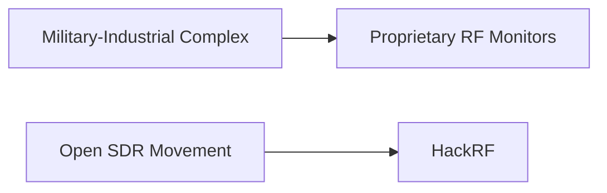

## El dispositivo que cabe en una mano y ve lo que la industria cobra millones

Jeff Geerling, ingeniero conocido por sus análisis rigurosos sobre infraestructura tecnológica, ha presentado QuadRF, un dispositivo compacto capaz de detectar drones y visualizar señales WiFi penetrando muros. Para el lector no especializado, podría parecer un gadget más. Pero detrás de esta aparente simplicidad se esconde una grieta significativa en un mercado históricamente dominado por un puñado de contratistas de defensa y fabricantes de instrumentación de precios prohibitivos.

## El oligopolio silencioso del espectro

El mercado de monitoreo de espectro RF (radiofrecuencia) y detección de drones ha sido durante décadas un coto privado. Empresas como Rohde & Schwarz (alemana, valoración en miles de millones), Keysight Technologies (resultado de la escisión de Agilent desde HP, capitalización bursátil superior a 25,000 millones de dólares), y el gigante estadounidense Tektronix han dominado la instrumentación de laboratorio y campo. Sus dispositivos — analizadores de espectro, receptores de banda ancha — cuestan entre 50,000 y 500,000 dólares.

## La larga historia de la democratización del espectro

QuadRF se inscribe en una tradición que tiene casi dos décadas: la del software defined radio (SDR) accesible. Todo comenzó con el USB dongle RTL-SDR, basado en chips originalmente diseñados para receptores de TDT, que en 2010 un grupo de entusiastas descubrió que podían demodular señales arbitrarias. De pronto, un receptor de radio que costaba 20 dólares hacía lo que equipos de 2,000 dólares ofrecían como mínimo.

Luego llegó HackRF, de Great Scott Gadgets, fundada por Michael Ossmann, quien transfirió tecnología desarrollada originalmente con fondos DARPA al dominio público. Lime Microsystems, empresa británica, fabricó placas SDR que entraron en universidades y laboratorios. Ettus Research, fundada por Matt Ettus, fue adquirida por National Instruments (ahora parte de Emerson Electric tras una adquisición de 8,200 millones en 2023), integrando tecnología SDR abierta en cadenas corporativas más tradicionales.

## ¿Qué significa WiFi sensing y por qué importa a las Big Tech?

La capacidad de "ver" señales WiFi a través de paredes no es nueva en investigación. Empresas como Cognitive Systems (adquirida por la aseguradora Liberty Mutual en 2023, lo que levantó suspicacias sobre la monetización de datos de movimiento en hogares) y Origin Wireless comercializan esta tecnología. La diferencia: QuadRF lo hace con hardware abierto, sin la capa de opacidad algorítmica y comercial que estas startups han construido.

## El poder de lo que cabe en una PCB

Lo que QuadRF realmente expone no es solo una capacidad técnica, sino una verdad incómoda sobre la industria de defensa y seguridad: durante décadas, las barreras de entrada al monitoreo RF fueron artificiales, sostenidas por precios inflados, patentes defensivas y relaciones contractuales con gobiernos. La complejidad técnica existía, sí, pero los márgenes eran descomunales.

Cuando herramientas como QuadRF proliferan, el efecto inmediato no será la desaparición de los grandes fabricantes —los contratos de defensa seguirán fluyendo hacia Lockheed, Raytheon y Anduril—, pero sí una erosión en los segmentos comerciales y de investigación académica. Universidades que antes no podían permitirse un analizador de espectro Rohde & Schwarz ahora tendrán acceso a capacidades similares. Investigadores independientes podrán auditar entornos que antes eran cajas negras. Y periodistas como Geerling podrán demostrar empíricamente qué tan transparentes —o no— son las emisiones de los dispositivos que compramos.

## Conclusión: el espectro como bien común

La pregunta que deja abierta no es técnica, sino política: ¿quién debe controlar la capacidad de ver lo que ocurre en el aire que nos rodea? Si la respuesta sigue siendo "los mismos cinco contratistas de siempre", el ecosistema tecnológico habrá perdido una batalla importante. Si herramientas abiertas como QuadRF continúan su trayectoria, veremos una transferencia de poder que, aunque pequeña, es significativa. En tecnología, como en política, los monopolios rara vez caen de golpe. Se erosionan, nodo por nodo, señal por señal.

