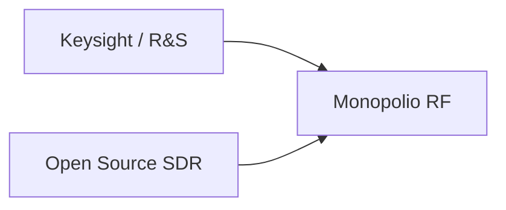

# Ver drones a través de las paredes: QuadRF y la nueva geografía del espectro radioeléctrico

Cuando Jeff Geerling, uno de los divulgadores técnicos más respetados del ecosistema open source, mostró cómo su **QuadRF** puede detectar drones e incluso visualizar señales WiFi a través de las paredes de su casa, no ofreció solo un tutorial ingenioso. Encendió una señal de alerta sobre una transformación silenciosa en la industria tecnológica: la descentralización de capacidades que, hasta hace poco, eran coto exclusivo de agencias de inteligencia y contratistas de defensa.

## El viejo orden: cuando el espectro era un secreto corporativo-estatal

Durante décadas, el **análisis de radiofrecuencia (RF)** fue un mercado opaco y concentrado. Empresas como **Keysight Technologies** (escindida de Agilent y heredera de la tradición de Hewlett-Packard), **Rohde & Schwarz** (firma alemana que aún se resiste a cotizar en bolsa) y **Tektronix** (hoy bajo el paraguas de Fortive) dominaron con equipos que costaban desde decenas hasta cientos de miles de dólares. Sus clientes principales: fabricantes de chips, operadores de telecomunicaciones y, sobre todo, ministerios de defensa y agencias de señales (SIGINT).

## La grieta: software-defined radio y la economía del hack

La primera fractura llegó con el movimiento del **Software-Defined Radio (SDR)**. A finales de la década de 2000, proyectos como el USRP de **Ettus Research** —que terminó siendo adquirida por National Instruments (NI) y, posteriormente, cuando Emerson se hizo con NI por 8.200 millones de dólares en 2023, pasó a formar parte de un conglomerado industrial mucho más grande— democratizaron el acceso al espectro. Luego llegó **HackRF One** de Great Scott Gadgets, una pequeña empresa que ha sobrevivido vendiendo hardware abierto a precio de coste. Y, cómo olvidar, el fenómeno **RTL-SDR**: receptores de televisión digital reconvertidos en herramientas de análisis con un firmware alternativo, disponibles por menos de 30 euros.

## QuadRF: la prosumerización del espionaje

El dispositivo que Geerling está probando se inscribe en esta tendencia, pero lleva la lógica un paso más allá. Al combinar múltiples antenas en una configuración que sugiere **direction-finding** (localización de fuentes), QuadRF permite no solo detectar la presencia de señales, sino triangularlas. Esto es exactamente lo que hacen sistemas como los de **Dedrone**, **DroneShield** o **Fortem Technologies** —compañías cuyas valoraciones bursátiles se han disparado en los últimos años gracias a contratos con el Departamento de Defensa de EE. UU. y la OTAN.

## Las asimetrías de poder en la era post-Snowden

La pregunta incómoda que plantea QuadRF no es técnica, sino política: si la capacidad de "ver a través de las paredes" mediante RF se generaliza, ¿quién la ejercerá? La respuesta histórica es preocupante. Las herramientas de cifrado fueron tildadas de armas durante los años 90 hasta que el libre mercado y la necesidad corporativa forzaron su aceptación. Las herramientas de anonimato —Tor, por ejemplo— siguen siendo sospechosas para los estados. ¿Qué pasará cuando cualquier vecino pueda saber qué dispositivos hay detrás de tu pared?

## El capital siempre encuentra la grieta

Las grandes tecnológicas ya están moviéndose. **Amazon**, con **Ring** y su red de vecindario, ha sentado las bases de una vigilancia doméstica distribuida. **Google**, a través de **Nest**, ha normalizado los sensores ambientales en los hogares. Empresas menos conocidas como **Cognitive Systems** (creadores de la plataforma WiFi Motion) ya venden sistemas que interpretan las perturbaciones del WiFi para detectar movimiento —precisamente, "ver" a través de las paredes, aunque lo vendan como funcionalidad domótica.

La lección para el analista independiente es clara: la democratización tecnológica es, casi siempre, una fase transitoria. Lo que comienza como un proyecto de garaje —y QuadRF, en tanto que dispositivo de prosumer construido sobre hardware accesible, lo es— termina siendo absorbido, regulado o neutralizado por actores con mayor capital y acceso a palancas regulatorias. La industria de las criptomonedas mostró este patrón con una velocidad vertiginosa. La del SDR y la detección de drones lo está recorriendo ahora.

## Reflexión final

Quizás la pregunta más pertinente no sea qué puede hacer QuadRF, sino **para quién trabaja realmente**. Y eso, en 2026, sigue siendo una cuestión decididamente política.

