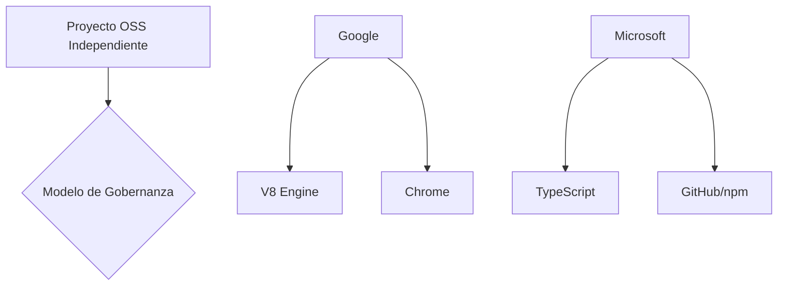

# Ant: el nuevo runtime de JavaScript que desafía el duopolio de Node y Bun

El pasado fin de semana, un proyecto llamado **Ant** apareció en Hacker News con una propuesta ambiciosa: construir un *runtime* y ecosistema de JavaScript completamente desde cero, sin ataduras a las grandes plataformas corporativas. A primera vista parece una rareza técnica; a segunda vista, es un termómetro perfecto para medir las tensiones que recorren el ecosistema JavaScript en 2025: quién controla la infraestructura del lenguaje más popular del planeta, quién financia las alternativas, y qué espacio queda —si es que queda alguno— para los proyectos verdaderamente independientes.

## El mapa de poder del JavaScript moderno

Para entender por qué un nuevo *runtime* merece atención crítica, hay que recordar cómo se distribuye hoy el poder en este ecosistema. **Node.js**, creado por Ryan Dahl en 2009, nunca fue realmente "neutral": tras la fusión con el proyecto io.js en 2015, su gobernanza quedó en manos de la **OpenJS Foundation**, una organización financiada principalmente por Google, Microsoft, IBM, Samsung y Meta. El motor **V8**, que ejecuta JavaScript tanto en Chrome como en Node, es propiedad exclusiva de Google. **TypeScript**, el lenguaje que prácticamente todos los proyectos serios adoptan, es de Microsoft. **npm**, el registro de paquetes por defecto, pasó de ser una startup independiente a ser adquirido por GitHub (Microsoft) en 2020.

La pregunta relevante no es técnica sino estructural: ¿cuántas capas de la pila JavaScript están controladas por un puñado de empresas? Casi todas.

## La contraofensiva del capital riesgo

Ante este escenario, la respuesta ha venido en dos olas. La primera fue **Deno**, lanzado en 2018 por el propio Ryan Dahl como una "versión corregida" de Node, con mejor seguridad, soporte nativo de TypeScript y un sistema de permisos más estricto. Deno obtuvo **$24 millones en una ronda Serie A liderada por Sequoia Capital** en 2021, y desde entonces ha pivotado hacia una estrategia *enterprise* con Deno Deploy, su plataforma de hosting.

La segunda ola fue **Bun**, un *runtime* escrito en Zig que presume de ser drásticamente más rápido. Fundado por Jarred Sumner, Bun recaudó **$26.5 millones en 2023** de una ronda liderada por Kleiner Perkins, con el objetivo declarado de convertirse en "el reemplazo moderno de Node.js". Su modelo de negocio —similar al de Deno— combina un *runtime* de código abierto con servicios en la nube y herramientas para empresas.

Ambas son historias de éxito desde la perspectiva de sus fundadores, pero también ejemplos de un patrón conocido: el capital riesgo entra al ecosistema de código abierto, financia infraestructura, y eventualmente exige retorno. Los *runtimes* dejan de ser proyectos técnicos para convertirse en vehículos de captura de valor.

## ¿Dónde queda Ant en este tablero?

Lo que hace interesante a **Ant** —según lo que se puede leer en [antjs.org](https://antjs.org)— es su declarada intención de mantenerse como un proyecto comunitario, sin una compañía detrás, sin una ronda de inversión, sin una estrategia de monetización evidente. Es, en esencia, un acto de resistencia voluntarista contra la concentración del ecosistema.

## La tendencia histórica: del commons al cercamiento

## ¿Qué puede salir bien —y mal— de aquí?

El escenario optimista es que Ant sirva como un campo de experimentación para ideas que los *runtimes* corporativos no pueden permitirse explorar: arquitecturas radicalmente distintas, modelos de gobernanza participativos, dependencias mínimas. En un ecosistema donde cada decisión de Node.js pasa por comités donde Microsoft, Google e IBM tienen voz y voto, un espacio verdaderamente independiente tiene valor.

## Conclusión: ¿a quién le pertenece el JavaScript?

---

