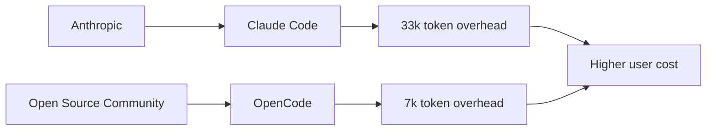

# La factura oculta de Claude Code: 33.000 tokens de sobrecosto frente a alternativas abiertas

Una reciente comparativa técnica publicada en HackerNews ha sacudido a la comunidad de desarrolladores: **Claude Code, la herramienta de programación asistida por IA de Anthropic, envía 33.000 tokens antes de leer el prompt del usuario**, mientras que su contraparte de código abierto, OpenCode, completa la misma operación con apenas 7.000 tokens. La diferencia no es un detalle técnico menor. Es la radiografía de un problema estructural que atraviesa toda la industria de la inteligencia artificial generativa.

## La medición que importa

El análisis, realizado por el equipo de Systima, midió el **token overhead** —la cantidad de tokens que cada herramienta consume en operaciones internas antes de procesar la solicitud real del desarrollador— en escenarios comparables. El resultado: Claude Code multiplica por más de cuatro el consumo de OpenCode en la fase previa a la lectura del prompt. Esto se traduce directamente en costos más altos para el usuario, mayor latencia y un uso ineficiente de los recursos computacionales que, en última instancia, también son costos energéticos y ambientales.

Para una empresa que ejecuta miles de solicitudes diarias, esta diferencia no es trivial. Estamos hablando de márgenes operativos erosionados, presupuestos de infraestructura inflados y una dependencia creciente de APIs cuyos modelos de tarificación opacos benefician siempre al proveedor.

## El elefante en la sala: ¿por qué Anthropic no optimiza?

La respuesta corta es que no tiene incentivos para hacerlo. La historia reciente de la tecnología está llena de ejemplos similares:

- **IBM en los años 80**: dominaba el mercado mainframe no por la eficiencia de su hardware, sino por el lock-in que generaban sus contratos de servicio y la formación especializada.
- **Microsoft en los 90 y 2000**: Internet Explorer era técnicamente inferior a Netscape, pero la integración con Windows creó un monopolio de facto.
- **Oracle**: sus bases de datos son famosas por consumir más recursos de los necesarios, pero la migración hacia alternativas (PostgreSQL, MySQL) implica costos ocultos tan altos que muchos clientes prefieren quedarse.

## La economía política del token

Este modelo tiene varias implicaciones problemáticas:

1. **Asimetría informativa**: el usuario no sabe exactamente qué está pagando en cada interacción. El token overhead está oculto en la interfaz.
2. **Incentivos perversos**: los proveedores se benefician de prompts largos, múltiples llamadas a la API y flujos de trabajo ineficientes.
3. **Concentración de capital**: solo unas pocas empresas (OpenAI, Anthropic, Google DeepMind) tienen los recursos para entrenar y mantener modelos frontier, lo que limita la competencia efectiva.

## El código abierto como contrapoder

La existencia de OpenCode y su eficiencia superior demuestra que **la narrativa de "necesitamos estos gigantes porque solo ellos pueden construir IA" es cada vez más débil**. Proyectos de código abierto como llama.cpp, Ollama, vLLM y, sí, OpenCode, están demostrando que es posible construir infraestructura de IA eficiente y accesible sin los presupuestos de 5.000 millones de dólares en cómputo de los hyperscalers.

## Conclusión: la transparencia como nueva moneda

La próxima vez que tu factura de API de IA te sorprenda, recuerda: a veces, el despilfarro no está en tu código, sino en el código que no ves.