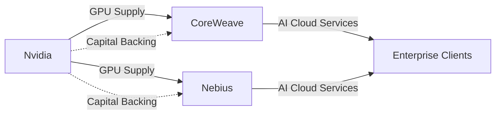

# La Trampa Dorada de la IA: Nvidia, CoreWeave y Nebius en la Rueda del Financiamiento Circular

Hay una frase que los inversionistas veteranos repiten con cierto hastío: *cuando el proveedor financia al cliente, el cliente termina siendo el producto*. Esa advertencia, que nació en los márgenes de los ciclos ferroviarios del siglo XIX y se repitió durante el boom de las puntocom, vuelve a escena con nombres nuevos: **Nvidia, CoreWeave y Nebius**. Tres compañías que, en conjunto, están escribiendo el capítulo más extraño —y más peligroso— de la economía de la inteligencia artificial.

## El escenario: una demanda que no se sostiene por sí sola

Durante los últimos 18 meses, Nvidia ha pasado de ser un fabricante de chips a convertirse en el eje gravitacional de toda la industria tecnológica. Sus GPUs H100 y Blackwell son el insumo crítico de cualquier proyecto de IA generativa, y su valoración bursátil —superando los 3 billones de dólares— la coloca entre las empresas más valiosas del planeta.

Pero detrás de esa demanda aparentemente orgánica, hay una arquitectura financiera que merece un bisturí fino. **CoreWeave**, un proveedor de nube especializado en GPU que pasó de ser un proyecto cripto-minero a cotizar en bolsa, recibió inversiones directas y compromisos de compra de Nvidia. **Nebius**, por su parte, surgió de los restos escindidos de Yandex y se reposicionó como proveedor de infraestructura para IA con el respaldo financiero de Nvidia y otros actores.

El resultado: Nvidia vende chips caros a empresas que ella misma financia o respalda, y esas empresas, a su vez, utilizan esos chips para construir la infraestructura que otros clientes —incluidas las grandes tecnológicas— necesitan desesperadamente. Es un circuito cerrado, elegantemente diseñado y profundamente frágil.

## Anatomía de un círculo virtuoso (¿o vicioso?)

El término técnico es **vendor financing**, y no es nuevo. En los años 2000, fabricantes de equipos de telecomunicaciones como Lucent y Nortel financiaban a operadores que compraban sus productos. Los operadores reportaban ingresos inflados, los fabricantes contaban con demanda garantizada, y los analistas aplaudían el crecimiento hasta que dejaron de hacerlo.

La estructura actual sigue un patrón casi calcado:

1. **Nvidia** aporta capital o compromisos de compra a **CoreWeave** y **Nebius**.
2. **CoreWeave y Nebius** utilizan ese respaldo para levantar deuda y capital en mercados públicos y privados.

Es un mecanismo que **concentra poder en un solo actor** hasta un punto sin precedentes recientes. No estamos hablando de una empresa que domina su mercado: estamos hablando de una empresa que puede influir en la estructura de capital de sus propios clientes, en su capacidad de obtener financiamiento externo, y en la percepción pública de la demanda real de IA.

## El problema de la concentración: cuando el ecosistema depende de un solo proveedor

Históricamente, la concentración de proveedores ha generado consecuencias visibles. **Intel** mantuvo durante dos décadas un monopolio casi total en CPUs para servidores, y la industria tardó una década en desarrollar alternativas (AMD EPYC, ARM en centros de datos). **Microsoft** controla la mayor parte del software empresarial, y cada nueva regulación antimonopolio ha sido seguida de nuevos intentos de evasión.

Con Nvidia, la situación es aún más concentrada porque el software (CUDA) crea un **lock-in** adicional al hardware. Un cliente puede comprar una GPU de otro fabricante, pero el costo de migrar de CUDA a otra plataforma es tan alto que pocos lo consideran seriamente. Nvidia no solo vende el metal: vende el ecosistema.

Esto significa que cuando CoreWeave o Nebius obtienen financiamiento respaldado implícitamente por Nvidia, no están recibiendo una validación neutral: están recibiendo una **dependencia estructurada**. Si mañana Nvidia decide que prefiere construir su propia nube (como ya hace con DGX Cloud), o que quiere adquirir a un competidor, el modelo de negocio de estos intermediarios se evapora.

## Las preguntas que nadie quiere hacer

¿Quién audita la **demanda real** de capacidad de cómputo? ¿Cuántos de los GPUs desplegados por CoreWeave y Nebius están generando ingresos sostenibles versus cuántos están simplemente disponibles para clientes que tal vez no lleguen? ¿Qué pasa cuando los hyperscalers (Microsoft, Google, Amazon, Meta) decidan que pueden construir su propia infraestructura sin pasar por intermediarios?

## El riesgo sistémico que pocos ven

Además, hay un efecto de **crowding out**: cada dólar que fluye hacia esta economía circular es un dólar que no se invierte en investigación fundamental, en modelos alternativos, en empresas que podrían construir competencia real. El capital sigue al momentum, y el momentum está en Nvidia.

## Conclusión: ¿burbuja o nueva arquitectura?

No hay nada inherentemente malo en que un fabricante financie a sus clientes. **Toyota** lo hace con sus concesionarios, **Boeing** lo ha hecho con aerolíneas, y **Apple** mantiene relaciones financieras complejas con sus proveedores clave. La diferencia está en la **escala**, la **opacidad** y la **concentración sistémica**.

Lo que estamos presenciando con Nvidia, CoreWeave y Nebius no es simplemente una estrategia comercial agresiva. Es la construcción de una **arquitectura financiera** que puede sostener el crecimiento de la IA durante años… o puede colapsar con una violencia que arrastre a toda la industria consigo. La verdad, como suele ocurrir, probablemente esté en algún punto intermedio, pero requiere reguladores atentos, periodistas críticos e inversionistas que entiendan que no todo lo que brilla en una hoja de cálculo de Excel es valor real.

