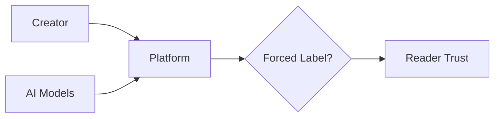

## La etiqueta fantasma: por qué marcar contenido generado por IA revela las grietas del negocio digital

Un hilo reciente en Hacker News pasó relativamente desapercibido, pero plantea una pregunta que incomoda a toda la industria tecnológica: ¿deberían las plataformas permitir —u obligar— a los autores a marcar su contenido como generado por inteligencia artificial? La propuesta parece técnica, casi ingenua. Pero esconde una disputa mucho más grande sobre quién controla la información, cómo se distribuye el valor en la economía digital y qué papel juegan los intermediarios cuando el costo de producir texto, imágenes y audio colapsa a casi cero.

### Una solicitud modesta con implicaciones enormes

El pedido original es simple: agregar una bandera, un campo, una marca visible que identifique los artículos escritos —total o parcialmente— por modelos de lenguaje. Plataformas como Reddit, Medium, Substack o los propios medios de noticias podrían implementarlo en horas. Que ninguna lo haya hecho de forma generalizada no es un descuido: es un indicador preciso de dónde están los incentivos reales.

Cuando el costo marginal de generar contenido tiende a cero, la abundancia se vuelve un problema serio para quien vive de producirlo. Pero también es una oportunidad dorada para las plataformas que viven de la atención.

### La economía política del contenido sintético

Piénselo así: para Google, Meta, X o TikTok, más contenido significa más sesiones, más datos, más inventario publicitario. Que ese contenido provenga de un humano o de un modelo de lenguaje con prompts cada vez más baratos es, desde la perspectiva del negocio, irrelevante. Lo que importa es el clic, la retención, el tiempo en pantalla.

Por eso, pedir una etiqueta obligatoria choca con intereses muy concretos. Si OpenAI, Anthropic, Google DeepMind o Meta firman acuerdos para implementar marcas de agua criptográficas, están reconociendo públicamente que su propio producto puede degradar la confianza en la información. Es una admisión costosa. Si las plataformas la imponen sin cooperación, deben invertir en detección —algo técnicamente difícil y propenso a falsos positivos que rápidamente se convierten en litigios.

Hay un cálculo silencioso: mientras la etiqueta no exista, la confusión beneficia a quien produce contenido barato y a quien lo distribuye. El costo lo pagan los periodistas profesionales, los escritores independientes y los investigadores que ven cómo sus piezas se diluyen en un mar de textos estadísticamente plausibles pero sin verificación humana.

### Un déjà vu con esteroides

La historia se repite, pero más rápido. A finales de los años 2000, empresas como Demand Media, Associated Content y una constelación de granjas de SEO descubrieron que Google pagaba por volumen de palabras clave, no por verdad. El resultado fue una cantidad de artículos sobre "cómo arreglar una persiana" o "los mejores lugares para vacacionar en Idaho" que saturaron los resultados de búsqueda.

Google respondió con Panda (2011), después con Fred, después con BERT, en una sucesión de parches algorítmicos que reconocían implícitamente que la propia empresa había creado el incentivo perverso. Años después, con el auge de los modelos generativos, el problema regresa multiplicado por mil. La diferencia es que esta vez el costo de generar el contenido no es de diez dólares por artículo: son fracciones de centavo por pieza.

### Quién tiene el poder de etiquetar —y quién no quiere

Aquí aparece el nodo crítico: la etiqueta solo funciona si alguien con poder de mercado la impone. Tres actores podrían hacerlo:

1. **Las plataformas de distribución** (Google Search, X, Reddit, Medium). Tienen el poder técnico, pero carecen del incentivo económico si la marca reduce tráfico o genera fricción publicitaria.
2. **Los proveedores de modelos** (OpenAI, Anthropic, Google). Pueden firmar compromisos como los del AI Watermark Consortium, pero su prioridad es minimizar la fricción de adopción, no fomentar la sospecha sobre su propio producto.
3. **Los creadores individuales**. Pueden autodeclararse, como ya hacen algunos periodistas en sus biografías. Pero sin verificación independiente, la marca se vuelve teatro: ¿quién audita que un autor no la use para posicionar mejor su contenido humano, o que un generador no la oculte sistemáticamente?

Sin un actor dominante con interés genuino en imponer la regla, terminamos en el peor escenario posible: cada plataforma implementa su propio sistema, los creadores se declaran cuando les conviene, y la confianza se fragmenta aún más.

### El negocio oculto: la detección como nuevo servicio

Mientras tanto, nace una industria paralela: los detectores de IA. Empresas como Originality.ai, GPTZero o Compilatio venden la promesa de distinguir lo humano de lo sintético. Pero la realidad técnica es incómoda: los falsos positivos afectan desproporcionadamente a hablantes no nativos, a escritores técnicos con estilos sobrios y a periodistas con prosa funcional y libre de ornamentos.

Y aquí aparece la ironía final: el mismo Silicon Valley que celebra la IA generativa como herramienta democratizadora termina creando una nueva clase de gatekeepers que decidirán qué contenido es "suficientemente humano" para circular sin sospecha. El poder se concentra, una vez más, en unas pocas empresas con acceso privilegiado a los datos y a los modelos de detección.

### ¿Y si el problema no es la etiqueta, sino el modelo de negocio?

Quizás la pregunta correcta no sea cómo marcar el contenido de IA, sino por qué nuestras plataformas están diseñadas para que esa pregunta importe tanto. Cuando un motor de búsqueda premia el volumen, cuando una red social paga por tiempo en pantalla, cuando un marketplace de artículos paga por palabra escrita: la IA generativa no es la causa del problema, es el catalizador que acelera una crisis que ya existía.

Mientras la industria no encarezca el contenido sintético —ya sea mediante impuestos, marcas de agua criptográficas verificadas o cambios estructurales en los algoritmos de ranking—, las etiquetas voluntarias serán solo humo. Y el humo, como sabemos, apenas oculta el fuego por un rato.

La próxima vez que vea un artículo perfectamente formateado, sin firma, publicado en un portal desconocido, recuerde que la pregunta ya no es si fue escrito por una máquina. La pregunta de fondo es por qué nuestro ecosistema informativo recompensa tan abundantemente a quien no tiene nada que verificar.

