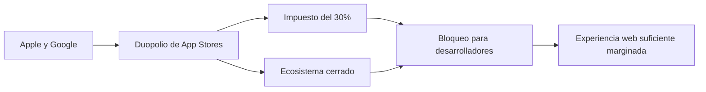

# El Complejo Industrial de las Apps: Cuando una Página Web Habría Sido Suficiente

Cada semana, millones de usuarios descargan aplicaciones que, técnicamente, hacen lo que una pestaña del navegador lleva haciendo tres décadas. El periodista y desarrollador Dan Q ha venido haciendo esta observación con precisión quirúrgica: demasiadas de las apps que abarrotan nuestras pantallas de inicio son, en su esencia, páginas web glorificadas con un icono de lanzador. Pero el hecho de que aceptemos esta situación dice menos sobre ingeniería de software y más sobre quién controla realmente la economía digital.

La premisa del experimento de Dan Q es simple e incómoda. Toma una app que envuelve un sitio web, redúcela a su equivalente web, y obtienes algo que funciona en cualquier dispositivo, no requiere instalación, no pide una docena de permisos y se actualiza al instante. En otras palabras, obtienes la web: el mismo medio que Tim Berners-Lee liberó como código abierto en 1993 y que ha impulsado el intercambio de información desde entonces.

Entonces, ¿por qué más empresas no hacen esto? La respuesta requiere seguir el dinero, no el código.

## El Impuesto del 30% y la Arquitectura del Bloqueo

Cuando Apple lanzó la App Store en 2008 y Google le siguió con Play Store, ambas empresas apostaron por un modelo en el que el software móvil se distribuiría a través de un único guardián. La genialidad — y la brutalidad — de esa apuesta reside en la comisión del 15-30% que Apple y Google cobran por cada transacción digital. Esto no es una tarifa de procesamiento de pagos en ningún sentido significativo. Es renta extraída de toda la economía móvil.

Para que una cadena de cafeterías te permita pedir a través de una app "nativa", la empresa tiene que evaluar si cederá una porción de cada transacción a Apple. Para un banco, lo mismo. Para un medio de comunicación, lo mismo. Las cuentas empujan a todos hacia construir su propia infraestructura de pagos que evite las tiendas (raro y caro) o a aceptar el impuesto. La web, en cambio, no tiene caseta de peaje.

Por eso "tu app podría haber sido una página web" es también una historia sobre la estructura del mercado. Las mismas empresas que defendieron la web abierta en los años 2000 — Google especialmente — pasaron la década siguiente construyendo jardines amurallados alrededor de las experiencias móviles. La contradicción no es accidental: la apertura de la web amenazaba con convertir en mercancía el propio sistema operativo, así que las plataformas empujaron a los desarrolladores hacia tecnologías y canales de distribución que restauraran su influencia.

## Las PWAs: La Amenaza que No Fue (Todavía)

El Safari de Apple ha sido históricamente lento en soportar la especificación completa de PWA, particularmente en iOS, donde la instalación está enterrada bajo menús confusos y las capacidades en segundo plano se limitan de forma agresiva. Google, a pesar de su apoyo público a las PWAs, nunca las ha promocionado de forma significativa dentro de Google Play — porque hacerlo canibalizaría el mismo negocio que financia la distribución gratuita de Android. Microsoft, que alguna vez intentó impulsar su propia plataforma móvil, se rindió; su soporte de PWA dentro de Microsoft Store sigue siendo, en la práctica, una nota a pie de página.

## El Imperativo de los Datos

Hay otra razón más silenciosa por la que las empresas prefieren apps sobre páginas web: los datos. Una visita a un sitio web es una sesión con identidad limitada; una app nativa es un sensor persistente y rico en permisos en el dispositivo del usuario. Ubicación, contactos, micrófono, sensores de movimiento, identificadores publicitarios: las apps acceden a todo esto por defecto y piden perdón en lugar de permiso.

Toda la estrategia móvil de Meta depende del seguimiento de identidad a nivel de aplicación que navegadores como Safari y Firefox llevan años intentando socavar. Por eso el apoyo de la compañía a la "web móvil" siempre ha sido tibio, y por eso Facebook Lite existe como una app simplificada en lugar de una verdadera experiencia web. Cuando una app podría ser una página web, la verdadera pregunta no es técnica sino política: ¿quién tiene permiso para ver al usuario?

## La Respuesta Regulatoria y sus Límites

En Estados Unidos, el mismo debate se desarrolla bajo la bandera antimonopolio, aunque la voluntad política de actuar es más débil. La sentencia Epic v. Apple de 2025 forzó algunas concesiones, pero los incentivos estructurales siguen intactos. Ningún regulador ha formulado aún la única pregunta que importa: ¿por qué pedir un café o leer un artículo de noticias requiere un binario de 200 megabytes que reporta a casa?

## La Web como Proyecto Político

La intervención de Dan Q es pequeña y casi pintoresca: un único desarrollador revirtiendo manualmente apps a su forma web. Pero ilustra una pregunta que la industria preferiría no responder: si la web es lo suficientemente buena, ¿por qué no es lo suficientemente buena? Hasta que Apple, Google y el resto de la economía de plataformas expliquen por qué una app para pedir café necesita tu ubicación, tus contactos y tu ID publicitario para funcionar, la respuesta es obvia. La app no es una mejor experiencia. Es un mejor negocio — para ellos, no para ti.

La próxima vez que toques "Instalar" en un binario de 200 MB para hacer algo que un marcador podría manejar, recuerda: no estás eligiendo software. Estás eligiendo un casero.

