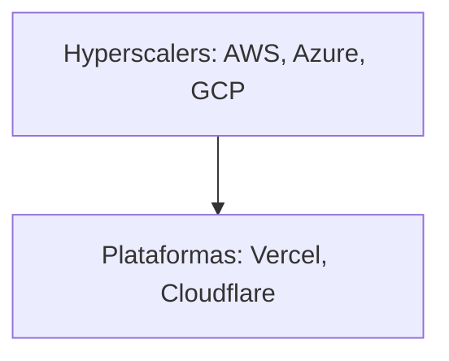

# La torre que nunca deja de crecer: el precio oculto de la complejidad en el software

Hay una imagen que cualquier desarrollador reconoce intuitivamente: la de un proyecto que comenzó siendo un script modesto y terminó convertido en un castillo de naipes de dependencias, frameworks, servicios y capas de abstracción. Armin Ronacher, creador de Flask y figura respetada en el ecosistema Python, vuelve a poner el dedo en la llaga con "The Tower Keeps Rising", una reflexión sobre cómo la pila tecnológica moderna no deja de engordar — y nadie parece tener incentivos para detenerla.

## La metáfora de la torre

Ronacher describe una arquitectura que se levanta capa sobre capa: frameworks sobre frameworks, runtimes sobre runtimes, plataformas que envuelven plataformas. La imagen evoca la Torre de Babel, pero también recuerda a la famosa ley de Wirth invertida, o al "enshittification" descrito por Cory Doctorow. Cada nivel añade funcionalidad, sí, pero también añade deuda cognitiva, costes de mantenimiento y, sobre todo, nuevas dependencias de proveedores con intereses propios.

Lo interesante del ensayo es que no denuncia la complejidad per se — la complejidad es inevitable en sistemas grandes — sino la *dirección* de esa complejidad. No se acumula al servicio de los usuarios, sino al servicio de los intermediarios.

## Los señores de las capas

Si miramos quién se beneficia realmente de esta torre, el mapa se vuelve incómodo. En la base encontramos a los hyperscalers: **Amazon Web Services**, **Microsoft Azure** y **Google Cloud Platform**, que controlan la infraestructura física donde corre casi todo. Encima, plataformas como **Vercel**, **Cloudflare** o **Netlify** empaquetan esa infraestructura en productos "listos para usar", cobrando una prima por abstraer problemas que, en muchos casos, ellos mismos ayudaron a crear.

En el siguiente nivel, frameworks como Next.js (propiedad de **Vercel**), o las herramientas que orbitan alrededor de **Meta**'s React, definen cómo millones de desarrolladores escriben software. Cuando un marco lo controla una sola empresa con fines comerciales, la "elección técnica" deja de ser una decisión técnica y se convierte en una apuesta geopolítica corporativa.

Y en la cúspide, los modelos de inteligencia artificial de **OpenAI**, **Anthropic** o **Google DeepMind** prometen reemplazar capas enteras de esta torre — pero, irónicamente, requieren aún más infraestructura, más cómputo y, por tanto, más dependencia de quienes controlan los chips (**NVIDIA** en primer lugar) y las granjas de servidores.

## La paradoja de Jevons, versión software

Históricamente, cada ola de "simplificación" en la tecnología ha terminado generando más consumo, no menos. La nube no eliminó los centros de datos: los multiplicó y los concentró en manos de tres actores. Los frameworks "amigables" no redujeron la cantidad de código necesario: lo ocultaron bajo más capas. Los lenguajes de "alto nivel" no acabaron con la gestión de memoria: la externalizaron hacia runtimes cada vez más pesados.

Es la paradoja de Jevons aplicada al software: a mayor eficiencia aparente, mayor consumo total. Ronacher lo señala sin necesidad de mencionarla, porque quien ha vivido la evolución de Python, JavaScript o Ruby la ha visto con sus propios ojos.

## Capital, lock-in y la ilusión de elección

Cuando una comunidad entera construye sobre un *tooling* controlado por una sola empresa, la migración deja de ser una decisión técnica para convertirse en una decisión de supervivencia. Y eso, en el lenguaje llano de los negocios, se llama **lock-in**. Lo vimos con las licencias de Oracle, con las reglas cambiantes de Twitter/X, y lo seguimos viendo cada vez que un proveedor decide unilateralmente deprecar una API, subir precios o añadir condiciones.

## Lecciones del pasado que olvidamos

Cada ciclo, los "bárbaros" de turno derribaron una torre y construyeron otra. La pregunta es si esta vez los nuevos bárbaros existen. Y, sobre todo, si tienen acceso a los recursos para construir algo distinto fuera del jardín amurallado de los hyperscalers.

## Reflexión final

Ronacher no pide volver a un pasado idílico — sabe que no existe. Pide, en el fondo, que seamos honestos sobre lo que estamos construyendo y para quién. La torre seguirá creciendo mientras los incentivos la empujen en esa dirección. Y los incentivos actuales — financiar startups con capital de riesgo, capturar mercados, vender abstracciones sobre abstracciones — no tienen un mecanismo interno de frenado.

Quizá la pregunta no es cómo detener la torre, sino quién decide su próximo piso. Y, sobre todo, a quién pertenece el ático.

Porque al final, como decía el arquitecto ficticio de la novela de Umberto Eco, la obra se levanta mirando hacia arriba, pero se sostiene desde los cimientos. Y hoy, esos cimientos tienen nombres, dueños y hojas de cálculo.

