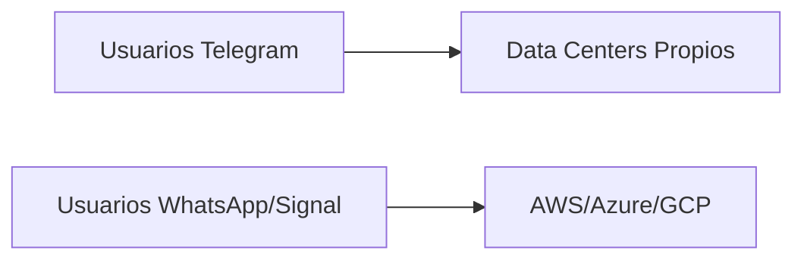

## La anomalía silenciosa de Telegram

En un ecosistema donde la mayoría de aplicaciones de mensajería —de WhatsApp a Signal, de iMessage a Discord— delega su infraestructura a Amazon Web Services, Google Cloud o Microsoft Azure, Telegram ha construido durante más de una década su propio imperio de centros de datos distribuidos por al menos una docena de países. Esta decisión, que en 2022 fue explorada en detalle por un análisis publicado en *dev.moe* y discutido en Hacker News, no es un detalle técnico menor: es una declaración estratégica que redefine la relación entre plataformas de comunicación y los gigantes hyperscaler.

Para entender por qué esto importa, hay que recordar quién está detrás. Pavel Durov, fundador de Telegram, ya había desafiado al Kremlin con VKontakte —la mayor red social rusa que se vio forzado a vender en 2014 bajo presión política. Esa experiencia parece haber moldeado la arquitectura misma de Telegram: una infraestructura diseñada para sobrevivir a la presión de Estados-nación, no solo a fallos técnicos.

## La cartografía opaca

Lo que el artículo de *dev.moe* puso en evidencia es lo poco que se sabe realmente sobre dónde corre Telegram. A diferencia de cualquier startup SaaS convencional —que orgullosamente publica casos de estudio sobre su "arquitectura serverless en AWS"— Telegram opera con una opacidad calculada. Se conocen nodos en Países Bajos, Finlandia, Singapur, Islandia, Miami y otros puntos, pero el mapa completo permanece borroso.

## El problema de los $400 millones y el modelo de capital

Comparar esto con Signal, una organización sin fines de lucro que depende de donaciones y de la infraestructura de AWS (sí, la "app de los espías" corre sobre los servidores de Bezos), revela dos filosofías opuestas. Signal es técnicamente elegante pero políticamente vulnerable: en 2022 experimentó caídas que muchos atribuyeron a cuellos de botella en su dependencia cloud. Telegram es técnicamente más complejo pero políticamente más resiliente.

## El precedente Mailchimp: infraestructura propia como techo de crecimiento

Más relevante es el paralelo con Mailchimp, que durante años rehusó migrar a AWS y mantuvo sus propios servidores hasta su adquisición por Intuit en 2021 por $12 mil millones. La lección: la infraestructura propia puede ser tanto una fortaleza defensiva como un techo de crecimiento.

## Las preguntas de poder que nadie formula

Cuando analizamos críticamente esta decisión, emergen varias tensiones:

**Concentración vs. distribución**: El ecosistema cloud está dominado por tres jugadores —AWS, Azure, Google Cloud— que controlan aproximadamente 65% del mercado global. Cada aplicación que delega en ellos refuerza esa concentración. Telegram representa un contra-modelo, pero a una escala que pocos pueden replicar.

**Soberanía digital vs. realidad económica**: La narrativa de "soberanía" tecnológica seduce a reguladores europeos, gobiernos latinoamericanos, y disidentes autoritarios. Pero construir data centers propios no es lo mismo que controlar el silicio, el código de los chips, o las rutas de fibra óptica submarina. Telegram sigue dependiendo de Intel, AMD, y una cadena de suministro que pasa por Taiwán y Corea del Sur.

**Privacidad como producto premium**: Mientras WhatsApp (Meta) y Messenger (Meta) usan infraestructura cloud para escalar globalmente con modelo gratuito respaldado por publicidad, Telegram vende privacidad implícita a través de su arquitectura. Pero la pregunta incómoda es: ¿es esto accesible solo porque Durov es un oligarca tecnológico con capital propio?

## Reflexión final

El misterio de los centros de datos de Telegram es, en el fondo, un misterio sobre quién puede permitirse la independencia tecnológica. En una industria donde las barreras de entrada en infraestructura se han vuelto casi prohibitivas, Telegram existe como anomalía histórica: un actor con escala masiva que eligió conscientemente el camino más caro y complejo. Su supervivencia no demuestra que este modelo sea replicable; demuestra que sin una fuente de capital extraordinaria —sea riqueza personal, deuda soberana oculta, o respaldo estatal discreto— la autonomía técnica sigue siendo un privilegio de pocos.

Quizás la pregunta más honesta no es cómo Telegram construyó sus data centers, sino cuántos usuarios entienden realmente sobre qué infraestructura corren sus mensajes cada día.

