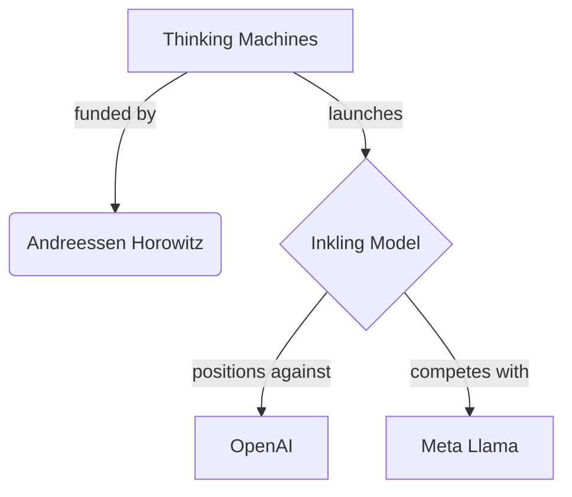

# Inkling y la ilusión del código abierto: cómo los nuevos gigantes de la IA reinventan el "open source" como estrategia de mercado

Cuando una startup valorada en más de 10 mil millones de dólares anuncia un modelo de "pesos abiertos", conviene hacer una pausa antes de celebrar. El lanzamiento de **Inkling** por parte de **Thinking Machines**, la compañía fundada por la ex CTO de OpenAI, Mira Murati, no es simplemente una contribución altruista al ecosistema de la inteligencia artificial. Es un movimiento estratégico que merece ser analizado con lupa.

## El contexto: capital concentrado disfrazado de apertura

Cuando una empresa con este perfil lanza un modelo de "open weights", la pregunta obligada es: ¿a quién beneficia realmente esta apertura?

## La diferencia crucial: pesos abiertos no es lo mismo que código abierto

El término "open weights" (pesos abiertos) se ha convertido en una categoría estratégicamente ambigua. A diferencia del **software de código abierto** tradicional, donde cualquier desarrollador puede inspeccionar, modificar y redistribuir el código, un modelo de pesos abiertos generalmente solo permite:

- Descargar los parámetros entrenados
- Ejecutar inferencias (con condiciones de licencia)
- En algunos casos, hacer fine-tuning

Lo que **no** se incluye típicamente: los datos de entrenamiento, el código de preprocesamiento, los detalles completos de la arquitectura, o el proceso de alineación. Es decir, recibes el producto final, no la receta.

Esta distinción no es nueva. **Meta** popularizó el término con Llama, **Mistral AI** lo emuló en Europa, y ahora **Thinking Machines** se suma al club. La estrategia es comprensible desde una lógica de mercado: abrir parcialmente los modelos mientras se mantiene el control sobre los componentes más valiosos.

## Las dinámicas de poder detrás de cada lanzamiento "abierto"

1. **Generar buena prensa y goodwill** entre desarrolladores e investigadores
2. **Crear un estándar de facto** alrededor del cual se construyen productos comerciales
3. **Dificultar la regulación**, al presentar los modelos como "bienes públicos"
4. **Atraer talento**, que prefiere trabajar en proyectos "abiertos" por razones de currículum e ideales

## La paradoja de la ex CTO de OpenAI

El problema es que esta nueva capa de "apertura selectiva" no resuelve los problemas estructurales de la industria. Sigue habiendo:

- **Concentración de cómputo**: Solo unas pocas empresas tienen acceso a los miles de GPUs H100 y Blackwell necesarios para entrenar modelos frontera
- **Dependencia de proveedores cloud**: AWS, Azure y Google Cloud controlan la infraestructura
- **Captura regulatoria**: Las empresas más grandes pueden permitirse equipos legales que moldeen la regulación a su favor
- **Captura de talento**: Los mejores investigadores migran hacia donde está el capital, no hacia donde está la apertura

## ¿Para quién es realmente Inkling?

Cuando una empresa como Thinking Machines libera un modelo, su público objetivo no es el desarrollador independiente en India o el estudiante en Brasil, aunque el marketing los incluya. El público real son:

- Empresas medianas que necesitan una alternativa "segura" a OpenAI y Anthropic
- Gobiernos que buscan soberanía tecnológica sin invertir en investigación propia
- Inversores que necesitan una narrativa convincente sobre la dirección de la compañía

## Conclusión: la apertura como nuevo campo de batalla

La historia de la tecnología está llena de momentos donde el "open source" se convirtió en herramienta de concentración de poder. Linux fortaleció a Red Hat (que IBM adquirió por 34 mil millones). Android benefició a Google. Kubernetes consolidó el control de la Cloud Native Computing Foundation, dominada por grandes proveedores.

La apertura, como dijo una vez un famoso abogado del software libre, es algo que se demuestra con el modelo de negocio, no con el comunicado de prensa.

## Mapa de actores: dónde se ubica Inkling en el ecosistema

El siguiente diagrama resume las relaciones estratégicas que describe el análisis: la financiación detrás de Thinking Machines, el lanzamiento de Inkling y su posicionamiento frente a los modelos ya consolidados en el mercado.

