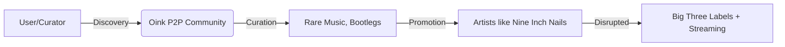

## La alegría perdida de la piratería musical: del trueque P2P al feudalismo del streaming

En 2004, un sitio llamado **Oink** se convirtió en el club más exclusivo de internet. No vendía nada. No tenía suscripción premium. No mostraba publicidad. Era un tracker privado de BitTorrent donde descargar música costaba únicamente una invitación de alguien dentro y el compromiso de mantener un ratio de subida. Quienes lo conocieron lo recuerdan con una devoción casi religiosa: la curaduría era obsesiva, las colecciones estaban meticulosamente etiquetadas, y la calidad del MP3 importaba más que la cantidad.

En 2007, la policía holandesa lo cerró. Su creador, un estudiante de Leeds llamado Alan Ellis, fue condenado. La industria musical festejó. Pero lo que no entendieron —o no quisieron entender— es que al cerrar Oink no estaban eliminando un problema. Estaban eliminando un ecosistema que les resultaba funcional, aunque les doliera admitirlo.

### Cuando la piratería era una meritocracia cultural

Contrario a lo que sugiere la retórica corporativa, la piratería musical de los 2000 no era un simple "robo". Era una infraestructura cultural con lógicas internas sofisticadas. En Oink, los usuarios acumulaban reputación subiendo rarezas, discografías completas, ediciones japonesas, bootlegs, demos filtrados. La lógica era opuesta a la de Spotify: en Oink, **valor era rareza y curaduría**, no popularidad algorítmica.

Trent Reznor de **Nine Inch Nails** entendió esto mejor que nadie. Su álbum "Year Zero" (2007) se filtró completo en internet antes del lanzamiento oficial. La respuesta de Reznor no fue una demanda legal: fue decir, esencialmente, "que así sea". Y lo que ocurrió fue exactamente lo que él predijo: el álbum debutó en el #2 del Billboard. La piratería funcionó como publicidad masiva con costo cero.

### La falsa dicotomía: ¿Napster o iTunes?

La narrativa oficial de la industria es conocida: Napster destruyó la música, iTunes la salvó, Spotify la modernizó. Es un relato conveniente, pero profundamente sesgado. Lo que realmente ocurrió fue una transferencia de poder de los usuarios a las plataformas, mediada por las tres grandes disqueras —**Universal Music Group, Sony Music y Warner Music Group**— que consolidaron un oligopolio que controla aproximadamente el 70% del catálogo musical global.

Napster fue un desastre legal, sí. Pero democratizó el acceso a una escala sin precedentes y demostró algo que las disqueras se negaban a ver: el público quería música sin fricción. En lugar de responder a esa demanda con modelos de negocio innovadores, la industria respondió con **DRM, demandas masivas a usuarios individuales y colapsos de formatos** (¿alguien recuerda PlaysForSure de Microsoft?).

### El streaming: feudalismo digital con rostro amable

Aquí es donde el análisis se vuelve incómodo. **Spotify, Apple Music, Amazon Music y YouTube** resolvieron el problema de la piratería, pero no resolvieron el problema de fondo: ¿quién controla la música? Simplemente lo centralizaron aún más.

Spotify paga a los artistas entre $0.003 y $0.005 por reproducción. Para alcanzar el salario mínimo mensual de un país como Estados Unidos, un artista necesita entre 250,000 y 400,000 streams mensuales. La mayoría de los artistas del mundo no llega a eso. Mientras tanto, las disqueras siguen cobrando entre el 50% y el 80% de los royalties en concepto de "recuperación de gastos", una práctica que data de los contratos firmados cuando los CDs costaban $15 y que se ha mantenido intacta en la era digital.

El **modelo de discovery de Spotify** merece especial atención. Los algoritmos priorizan playlist editoriales controladas por la propia plataforma y acuerdos con las disqueras. El radio de Discover Weekly no es un servicio gratuito: es un mecanismo de extracción de datos que vende atención publicitaria y compromete la autonomía del oyente. La "recomendación algorítmica" es, en la práctica, un intermediario de poder que decide qué se escucha y qué se queda en el olvido.

### Lo que realmente se perdió

La piratería de los 2000, con todas sus contradicciones, ofrecía algo que el streaming actual no replica: la sensación de poseer y construir una colección personal. Los usuarios de Oink no solo descargaban música; la organizaban, la compartían, la discutían en foros. Tenían una relación de propiedad con su biblioteca, por más ilegal que fuera su origen.

Hoy, esa biblioteca "vive" en la nube de alguien más. Si Spotify decide retirar un disco, desaparece de tu colección. Si cambias de plataforma, pierdes años de playlists, algoritmos personalizados y hábitos. **No eres dueño de la música; eres arrendatario perpetuo de un catálogo ajeno.**

### Reflexión final: ¿puede haber algo mejor?

La pregunta no es si la piratería era "buena" o "mala". La pregunta es qué tipo de infraestructura cultural queremos para la música. La piratería mostró que los usuarios estaban dispuestos a organizar sistemas complejos de intercambio si la oferta legítima no respondía a sus necesidades. El streaming respondió a esa demanda, pero con el precio de centralizar el control en pocas manos y convertir la música en datos extractivos.

Mientras la propiedad de los catálogos musicales siga concentrada en oligopolios verticales —disqueras que son dueñas, distribuidoras que son dueñas, plataformas que son dueñas—, el oyente seguirá siendo el eslabón más débil. La alegría perdida de la piratería quizás no era alegría por el "robo", sino alegría por la **autonomía**. Y eso, en la economía digital actual, sigue siendo el recurso más escaso.

