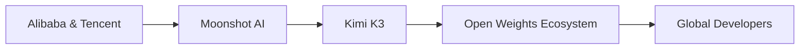

# Kimi K3 y la nueva geopolítica de la inteligencia artificial abierta

Cuando Moonshot AI anunció Kimi K3 bajo el lema "Open Frontier Intelligence", no presentó simplemente un nuevo modelo de lenguaje. Plantó una bandera en un debate que definirá la próxima década de la inteligencia artificial: ¿quién controla el código que reescribirá las reglas de la economía global?

La empresa china, fundada en 2023 y respaldada por Alibaba y Tencent, está ejecutando una estrategia que combina lo mejor de dos mundos: capacidades de frontera con pesos abiertos. Es una movida que incomoda tanto a OpenAI como a Anthropic, y que merece un análisis que vaya más allá del entusiasmo tecnológico y los benchmarks.

## El "momento Linux" de la inteligencia artificial

En los años noventa, Linux emergió como un proyecto colaborativo que rompió el monopolio de Microsoft sobre los sistemas operativos. No ganó inmediatamente en el escritorio, pero transformó para siempre los servidores, los teléfonos móviles (Android) y la infraestructura cloud. Hoy, los pesos abiertos amenazan con hacer lo mismo con la IA.

## La concentración de capital detrás del "open"

Moonshot AI ha recibido cientos de millones de dólares en rondas de financiación lideradas por Alibaba, que también es accionista. Esta estructura plantea preguntas incómodas: ¿qué significa "abierto" cuando los pesos del modelo están moldeados por las prioridades de un gigante del comercio electrónico? ¿Cuánta autonomía real tiene Moonshot frente a Pekín?

## El tablero geopolítico: chips, sanciones y modelos abiertos

Estados Unidos ha intentado contener el avance chino en IA mediante restricciones a la exportación de chips avanzados (H100, A100, y ahora H200) a China. La estrategia asume que sin acceso a GPUs de última generación, los laboratorios chinos no podrán entrenar modelos verdaderamente competitivos.

Kimi K3 es, en parte, una refutación operativa de esa hipótesis. Aunque los detalles técnicos completos aún no se han publicado, la narrativa china de "más con menos", es decir, entrenar modelos competitivos con hardware limitado mediante optimizaciones algorítmicas, ha ganado credibilidad gracias a DeepSeek y al ecosistema chino de optimización de inferencia, que incluye a Huawei con sus chips Ascend.

Para los inversores occidentales, esto crea un dilema estratégico serio. Si los pesos abiertos chinos cierran la brecha técnica, las empresas estadounidenses que han quemado miles de millones en infraestructura de entrenamiento verán erosionada su ventaja competitiva. OpenAI, Anthropic y Google DeepMind han construido sus modelos de negocio sobre la premisa de que el acceso a compute es una barrera de entrada insuperable. Kimi K3 sugiere que esa barrera es más permeable de lo que Wall Street esperaba.

## ¿Revolución democrática o guerra fría tecnológica?

En paralelo, la concentración del lado occidental es igualmente preocupante. OpenAI está estructurada como una entidad con fines de lucro con Microsoft como socio principal, valorada en más de 150 mil millones de dólares. Anthropic tiene a Google y Amazon como inversores mayoritarios. xAI de Elon Musk opera como vehículo de capital privado con un solo financiador. La "frontera" de la IA no la están definiendo comunidades distribuidas, sino un puñado de empresas con acceso a capital ilimitado y relaciones privilegiadas con gobiernos.

## Conclusión: el código abierto como campo de batalla

Para los desarrolladores y empresas que adoptan estos modelos, el consejo es claro: no confundir apertura técnica con apertura política. Los pesos de Kimi K3 pueden ser descargables, pero las decisiones sobre qué se entrena, qué se filtra y qué se censura siguen ocurriendo en consejos de administración y oficinas gubernamentales, no en comunidades de desarrolladores independientes.

La próxima vez que alguien afirme que la IA abierta está democratizando la tecnología, conviene preguntar quién la financia, quién la regula y quién se beneficia realmente. Las respuestas son siempre más reveladoras que los benchmarks.
