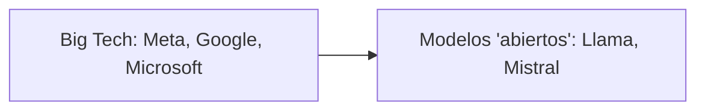

## La gran paradoja del código abierto en la era de la IA

La narrativa del *open source AI* suena democratizadora: modelos potentes, disponibles para todos, capaces de romper el monopolio de OpenAI, Google o Anthropic. Pero si observamos el ecosistema real —el que documenta el reciente informe *The State of Open Source AI*— el panorama es mucho más turbio. Lo que se vende como liberación tecnológica es, en muchos casos, una nueva forma de concentración de poder bajo un lenguaje amable.

## ¿Qué significa realmente "abierto" en 2025?

El término *open source* nació ligado a una ética hacker: software cuyo código podía ser auditado, modificado y redistribuido libremente. Linux, Apache, Mozilla o Wikipedia son herederos directos de esa tradición. Sin embargo, la mayoría de los grandes modelos de IA que se autodenominan abiertos no cumplen con la definición estricta de la [Open Source Initiative](https://opensource.org/).

Tomemos el caso más emblemático: **Meta y su familia Llama**. Los modelos de Mark Zuckerberg son descargables, sí, pero su licencia incluye restricciones de uso comercial para empresas grandes, una cláusula de "uso aceptable" que prohíbe ciertos fines, y reservas explícitas sobre los datos de entrenamiento. No puedes saber realmente con qué fueron entrenados. Esto no es software libre; es *source available* con condiciones, una categoría diferente que conviene no confundir.

**Mistral AI**, la startup francesa que se presenta como la alternativa europea, sigue una lógica similar: pesos abiertos con licencias restrictivas. Su narrativa de soberanía tecnológica europea encaja bien con el discurso político de Macron, pero en la práctica sus modelos siguen dependiendo de infraestructura de NVIDIA y de talento concentrado en Silicon Valley.

## Los verdaderos ganadores: NVIDIA y el extractivismo computacional

Mientras la conversación pública gira en torno a "modelos abiertos", el verdadero poder económico del sector se ha sedimentado en una sola empresa: **NVIDIA**. Su dominio en GPUs para entrenamiento e inferencia la ha convertido en el proveedor inevitable de toda la industria, incluidas las alternativas "abiertas". Sin chips de Jensen Huang, no hay Llama, no hay Mistral, no hay DeepSeek. La promesa de democratización choca con una realidad: la cadena de suministro sigue estando en unas pocas manos y un solo país (Taiwán, vía TSMC).

## El capital detrás del "open"

Otra capa crítica: muchas de las empresas que producen modelos abiertos están profundamente financiadas por el mismo capital concentrado que dicen desafiar. **Meta** financia Llama con los beneficios publicitarios de Facebook e Instagram. **Mistral** ha levantado rondas de cientos de millones de euros de inversores institucionales, incluidos fondos ligados a Microsoft en su primera etapa. **Cohere, AI21 y similares** operan con la lógica típica de las startups de capital riesgo: crecer rápido, dominar un nicho, preparar una salida.

Incluso proyectos más genuinamente comunitarios como **Hugging Face** se han transformado en una empresa con valoración cercana a los 5.000 millones de dólares, con todo lo que eso implica: presión por ingresos, dependencia de proveedores cloud (AWS, Google Cloud) y tensiones entre misión original y retorno para inversores.

## ¿Dónde queda entonces lo comunitario?

Existen excepciones notables: **EleutherAI**, **BigScience** (el proyecto BLOOM), **RedPajama** de Together AI, o los modelos chinos de código verdaderamente abierto como **Qwen** de Alibaba o **DeepSeek**. Estos proyectos publican datos de entrenamiento, papers detallados y permiten auditoría real. Son más pequeños, menos mediáticos, y rara vez generan el hype de un lanzamiento de Meta. Pero representan lo que el *open source* debería ser: conocimiento compartido, no solo pesos descargables con letra pequeña.

## Una elección política, no técnica

La pregunta de fondo no es si la IA debería ser abierta o cerrada —es una falsa dicotomía— sino **qué tipo de apertura estamos dispuestos a defender y bajo qué condiciones de poder**. Un modelo "abierto" controlado por una sola empresa, entrenado con datos opacos, ejecutándose en hardware monopolizado y distribuido bajo licencias con restricciones comerciales, no rompe ningún monopolio: lo refuerza con un barniz ideológico.

Si el movimiento del software libre de los 90 y 2000 nos enseñó algo, es que la apertura sin comunidad, sin financiación sostenible y sin voluntad política se convierte en marketing. La próxima fase del *open source AI* no se medirá por cuántos modelos se publiquen en GitHub, sino por quién controla los datos, la infraestructura y los estándares sobre los que se construye esta tecnología. Y ahí, por ahora, las cosas siguen igual: en pocas manos, con beneficios extraordinarios para pocos, envueltas en un lenguaje de liberación colectiva que ya hemos escuchado antes.

El desafío, como siempre, es no dejarse seducir por la etiqueta y mirar quién firma realmente la licencia.

