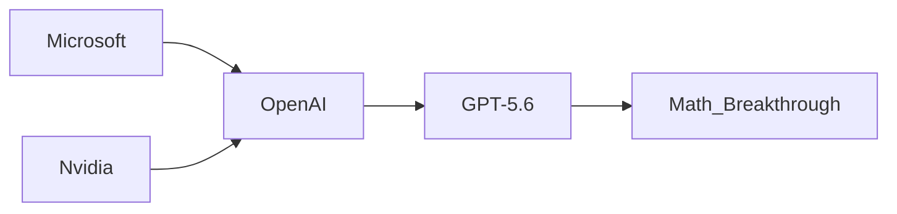

La noticia circuló esta semana en Hacker News y rápidamente se extendió a subreddits especializados en matemáticas: un modelo de lenguaje identificado como **GPT-5.6** (presumiblemente una iteración avanzada de razonamiento de OpenAI) habría utilizado un *prompt* —una simple instrucción en lenguaje natural— para cerrar una brecha de 30 años en el campo de la **optimización convexa**. No es un paper. No es un preprint. Es un prompt. Y eso, más que el hallazgo matemático en sí, es lo que debería preocuparnos.

## El hallazgo y su contexto real

La optimización convexa es la columna vertebral de disciplinas que van desde el aprendizaje automático hasta la logística, las finanzas y la ingeniería de redes. Un "gap" de 30 años significa que, durante tres décadas, ningún matemático humano encontró la solución completa a un problema específico del campo. Ahora, aparentemente, un modelo generativo lo habría resuelto en cuestión de iteraciones, con un usuario proporcionándole instrucciones en lenguaje natural.

## El problema no es el avance, es quién lo controla

Pero aquí está la cuestión que los titulares no mencionan: este avance no ocurrió en una universidad pública, ni en un centro de investigación abierto, ni en un consorcio internacional. Ocurrió dentro de un producto comercial, propiedad de una empresa cuya estructura de capital está profundamente dominada por Microsoft.

La **concentración de capital** en el sector de la inteligencia artificial generativa es histórica sin precedentes. Según reportes financieros recientes, Microsoft ha inyectado más de 13,000 millones de dólares en OpenAI desde 2019, con compromisos que podrían superar los 100,000 millones en los próximos años. Google, a través de DeepMind, invierte más de 50,000 millones anuales en infraestructura de IA. Anthropic, Meta y xAI de Elon Musk representan billeteras corporativas con capacidades de inversión que eclipsan a la mayoría de los sistemas nacionales de ciencia y tecnología del mundo.

El resultado es un nuevo **feudalismo del conocimiento**: las fronteras de la matemática, la física y la ingeniería se están expandiendo dentro de empresas cuyas decisiones de publicación, acceso y comercialización están dictadas por juntas directivas, no por la lógica abierta de la ciencia.

## Paralelismos históricos: de Bell Labs a los modelos cerrados

IBM Research, Xerox PARC, los antiguos laboratorios corporativos, generaron décadas de innovación bajo una lógica similar: capital privado financiando ciencia básica con publicaciones abiertas. Pero su escala nunca alcanzó el ritmo actual, y sus finanzas dependían de unidades de negocio maduras, no de capital de riesgo especulativo.

La diferencia con el presente es **estructural**. OpenAI nació como organización sin fines de lucro en 2015. En 2019, Sam Altman negoció una transición a "capped-profit" que efectivamente privatizó sus ganancias. Microsoft obtuvo acceso preferente a la propiedad intelectual de los modelos más avanzados. Anthropic, su principal competidor, surgió de ex empleados de OpenAI con el respaldo de Google y Amazon. La estructura resultante no es un mercado competitivo: es un oligopolio de tres o cuatro actores con interconexiones financieras cruzadas, acceso exclusivo a GPUs de NVIDIA y dependencia energética de contratos corporativos con utilities cada vez más grandes.

## Lo que está en juego: la producción misma del conocimiento

Cuando un modelo de IA resuelve un problema matemático de 30 años, la pregunta relevante no es "qué nuevo teorema descubrió", sino **qué tipo de conocimiento estamos dispuestos a aceptar como válido cuando el método de producción es opaco**. Los modelos de lenguaje no muestran su trabajo de manera auditable. Operan como cajas negras: la cadena de razonamiento no es verificable independientemente, las "intuiciones" estadísticas no son hipótesis contrastables en el sentido popperiano clásico.

## Hacia una nueva gobernanza del conocimiento algorítmico

El caso de la **optimización convexa** es solo el ejemplo más visible de una tendencia que se acelera. Lo que sigue —descubrimiento de fármacos, modelado climático, ciencia de materiales— operará bajo la misma lógica. Y sin políticas públicas robustas de acceso, transparencia y competencia, el conocimiento científico del siglo XXI se producirá, en gran medida, dentro de las mismas corporaciones que ya concentran la mayor parte del capital tecnológico global.

