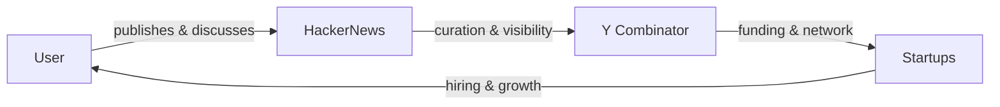

# HackerNews, el guardián silencioso de Silicon Valley: lo que 15 años de gratitud revelan

Una publicación reciente en HackerNews —un post donde un usuario agradece a la comunidad por 15 años de apoyo y por ayudarle a encontrar su propósito profesional— podría parecer una nota sentimental aislada. Pero leído con atención, revela algo más profundo: la arquitectura invisible de poder que estructura el ecosistema tecnológico global.

## El capital de la atención como materia prima

En una industria donde la valoración de empresas se mide en "growth at all costs" y donde el fundraising depende de generar momentum, la atención se ha convertido en la verdadera moneda de cambio. HackerNews es uno de los pocos lugares donde esta atención todavía se distribuye de forma relativamente meritocrática —o al menos eso cree la propia comunidad.

## De los BBS a la plataforma algorítmica: una historia larga

Para entender lo que HN representa, conviene mirar hacia atrás. En los años 90, las comunidades técnicas se distribuían en BBS, listas de correo y Usenet. Eran fragmentadas, difíciles de monetizar, y por eso relativamente libres. Slashdot (1997) fue el primer experimento de agregar señal técnica colectiva con un sistema de moderación distribuido. Reddit (2005) democratizó el modelo con subreddits. HN (2007) lo especializó hacia un público específico: fundadores, inversores y desarrolladores con aspiraciones empresariales.

## El lado humano del mecanismo

Volviendo al post original: detrás de 15 años de gratitud hay una persona que probablemente construyó una carrera, una empresa o ambas cosas apoyada en la visibilidad que HN le dio. Esto no invalida su experiencia —al contrario, la humaniza. Pero también nos obliga a preguntarnos cuántos otros profesionales con talento equivalente no tuvieron acceso a ese circuito, no porque su trabajo fuera peor, sino porque carecían del capital social, la narrativa correcta o el momento algorítmico adecuado.

La meritocracia tecnológica es, en gran medida, una meritocracia de plataformas. Y las plataformas, como bien enseñó Tim Wu en *The Master Switch*, tienden hacia la concentración. HN sigue siendo una de las más benignas —sin la toxicidad explícita de Twitter ni el gamification agresivo de Reddit— pero no es neutral. Ninguna infraestructura con ese nivel de influencia sobre carreras, inversiones y narrativas lo es.

## Conclusión: gratitud con contexto

La próxima vez que veamos un post emocional en HackerNews, recordemos que no estamos ante una simple historia humana. Estamos ante la interfaz pública de una de las máquinas de poder más sofisticadas del siglo XXI. Y como toda máquina de poder, merece ser entendida con la misma rigurosidad con la que celebramos a quienes pasan por ella.

