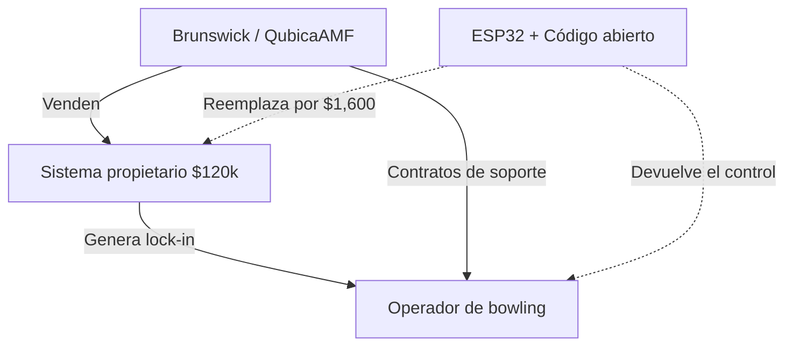

## Un sistema de bolos que cuesta más que un auto

Para dimensionar el disparate, basta comparar: el sistema propietario costaba más de $120,000. Un auto nuevo de gama media en muchos mercados cuesta menos. Y lo más grave: detrás de esa cifra no hay una sola innovación tecnológica que justifique el precio, sino un modelo de negocio diseñado para capturar al cliente y no soltarlo jamás.

## El duopolio silencioso de las bolas y los pines

Para entender la magnitud del disparate, conviene mirar quién controla la industria. **Brunswick Corporation** y **QubicaAMF** dominan prácticamente el mercado global de equipos para bolos. Brunswick, una empresa con más de 175 años de historia que cotiza en NYSE, reportó ingresos superiores a los $5,000 millones en 2023. QubicaAMF, de capital privado, controla la otra mitad del pastel. Entre ambas, definen los estándares, los precios y, lo más importante, los ciclos de reemplazo.

## Anatomía del lock-in industrial

El modelo de negocio de estos proveedores se sostiene sobre tres pilares que la ingeniería del software lleva décadas combatiendo, pero que el hardware industrial ha preservado con disciplina casi religiosa:

**1. Hardware dedicado y patentado.** Las consolas, sensores y controladores usan conectores, protocolos y chips específicos. Reemplazarlos no es trivial: necesitas documentación que el fabricante no comparte, o ingeniería inversa sobre un sistema que cambia con cada versión de firmware.

**2. Software cerrado sin APIs públicas.** El "cerebro" del sistema vive en cajas negras. El operador del bowling no posee el software, lo licencia. Y la licencia incluye, casi siempre, contratos de mantenimiento que cuestan entre $5,000 y $15,000 anuales, más tarifas por "actualización" que parecen diseñadas para exprimir al cliente en lugar de mejorar el producto.

**3. Soporte como cadena dorada.** Cuando algo falla, el operador llama al proveedor. El técnico cobra $200 la hora más viáticos. Y mientras la pista 7 está caída un sábado por la noche —el momento de mayor facturación— el dueño del bowling aprende rápido que "renovar el contrato de soporte" no es opcional.

Este es el mismo esquema que IBM mantuvo con el mainframe durante décadas, que SAP reproduce con su ERP, y que John Deere ha convertido en escándalo global al negarles a los agricultores el derecho a reparar sus propios tractores. La diferencia es que, en bolos, nadie había tenido los incentivos (o la indignación) suficientes para romperlo.

## La revolución silenciosa del ESP32

Lo que el desarrollador de Hacker News hizo fue descomponer el sistema propietario en sus funciones básicas, mapear cada función a un nodo ESP32, y construir una red mesh donde cada componente (sensor de bola, pantalla, iluminación, marcador) es un nodo independiente. El resultado no es un prototipo frágil: es un sistema robusto, modular, y que el operador puede entender, modificar y reparar él mismo. En términos económicos, transfirió el poder del proveedor al usuario. En términos políticos, hizo algo que el mercado llevaba décadas negándole: devolverle el control al dueño del bowling.

## Lo que este caso realmente significa

La historia tiene, además, un ángulo geopolítico que rara vez se discute. La pieza clave de esta rebelión no fue un chip estadounidense, sino un chip chino de código abierto, con herramientas de desarrollo gratuitas, documentación exhaustiva, y una comunidad global de desarrolladores. Mientras Estados Unidos y Europa debaten cómo proteger sus industrias de semiconductores frente a China, casos como este demuestran que la influencia tecnológica china ya está reconfigurando industrias enteras desde abajo, sin aranceles, sin sanciones, sin discursos en el Congreso. Solo con un chip de $4 que funciona.

## El dilema que Brunswick y QubicaAMF no quieren enfrentar

Mientras tanto, en algún bowling center, una red de ESP32 sigue marcando strikes y spares sin pedirle permiso a nadie. Y eso, aunque parezca pequeño, es exactamente el tipo de disruption que los grandes proveedores de hardware industrial no saben cómo detener.

