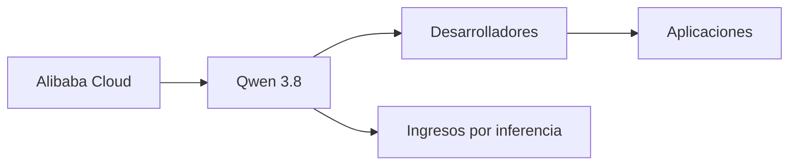

# Qwen 3.8: el movimiento de Alibaba que desnuda las verdaderas reglas del juego en IA

A primera vista, parece un gesto filantrópico. Otra versión más potente, lanzada para que la comunidad de desarrolladores la use, la audite, la mejore. Pero leerlo así es no entender nada de lo que está ocurriendo en la industria tecnológica.

## El contexto: por qué Alibaba abre cuando podría cerrar

Desde el lanzamiento de ChatGPT en noviembre de 2022, el ecosistema de IA se ha bifurcado en dos estrategias opuestas. Por un lado, OpenAI, Google y Anthropic han construido un modelo de negocio basado en APIs cerradas, suscripciones premium y control total sobre el modelo. Por otro, Meta apostó con Llama por una estrategia contraintuitiva: regalar la tecnología para convertirse en el estándar de facto, fragmentar a la competencia y construir una ventaja de plataforma a través de la comunidad.

Alibaba ha elegido la segunda vía, y lo ha hecho con una consistencia notable. Modelos como Qwen 2.5, Qwen 3 y ahora Qwen 3.8 no son experimentos aislados: son piezas de una arquitectura de poder cuidadosamente diseñada. Regalar el modelo atrae desarrolladores, genera dependencia técnica, posiciona a Alibaba como infraestructura crítica y, sobre todo, debilita a los rivales que intentan monetizar exactamente lo mismo que Alibaba puede ofrecer gratis.

## La ilusión del "gratis"

Esto no es distinto a lo que hizo Google con Android, Microsoft con GitHub o Meta con React. El software libre como mecanismo de captura de valor. La historia de la tecnología está llena de estos ciclos, y cada vez que alguien se olvida de cómo funcionan, alguien más termina pagando la factura.

## China vs. Estados Unidos: la IA como campo de batalla

Es una jugada brillante y, a la vez, profundamente reveladora de las restricciones reales del modelo chino. Alibaba no compite con OpenAI en capacidad bruta de cómputo. Compite en alcance, adopción y estandarización. Cada descarga de Qwen es un punto en una partida que no se juega en los titulares, sino en los commits de GitHub y en las decisiones de arquitectura de startups en Lagos, São Paulo, Yakarta o Berlín.

Y aquí conviene recordar quién queda fuera de esta conversación: Baidu con su Ernie, Tencent con Hunyuan, los laboratorios académicos chinos. Alibaba ha tomado la delantera no por capacidad técnica superior necesariamente, sino por una decisión estratégica clara: jugar el juego del código abierto para ganar influencia global en inteligencia artificial.

## Lo que Meta inició y Alibaba está terminando

El resultado es una paradoja: la promesa original de la IA abierta era democratizar el acceso. Lo que hemos obtenido es una concentración de poder en quienes pueden sostener el coste de entrenar y mantener estos modelos. Entrenar un modelo frontera cuesta cientos de millones de dólares. Alibaba, Google, Meta, OpenAI y Microsoft pueden permitírselo. Las startups independientes, los laboratorios universitarios y los países periféricos, no.

## ¿Qué significa esto para el resto del ecosistema?

Para los desarrolladores, la respuesta es pragmática: Qwen 3.8 probablemente sea un modelo excelente para una amplia variedad de casos de uso, y la libertad de elegir entre proveedores es buena para la industria. Pero conviene no confundir abundancia de oferta con independencia real. Si la mitad de las aplicaciones de IA del mundo corren sobre Qwen o Llama, no hemos liberado la tecnología: hemos cambiado quién la controla.

Para los reguladores europeos, es un llamado de atención incómodo. La Ley de IA de la UE se diseñó asumiendo un mundo dominado por OpenAI y Google. El ascenso de Alibaba como proveedor de infraestructura abierta obliga a repensar no solo la regulación de la inteligencia artificial, sino la soberanía tecnológica europea, un concepto que Bruselas ha usado mucho y construido poco.

Y para los inversores, la señal es clara: en IA, el valor no está en el modelo en sí. Está en la infraestructura, los datos, la distribución y la confianza. Alibaba lo sabe desde hace años. Meta lo aprendió con la dolorosa lección de los costes de inferencia. OpenAI, atrapada en su modelo de API cerrada y en su dependencia de Microsoft, lo está aprendiendo más lento de lo que admite.

## Conclusión: el código abierto como declaración de intenciones

La próxima vez que alguien le diga que un modelo de IA es "gratuito y abierto", pregúntele quién paga la inferencia, quién controla los datos de entrenamiento, quién se beneficia cuando millones de desarrolladores construyen su trabajo sobre una pieza de infraestructura que pertenece, en última instancia, a una de las cinco o seis empresas globales que pueden permitirse crear las reglas del juego.