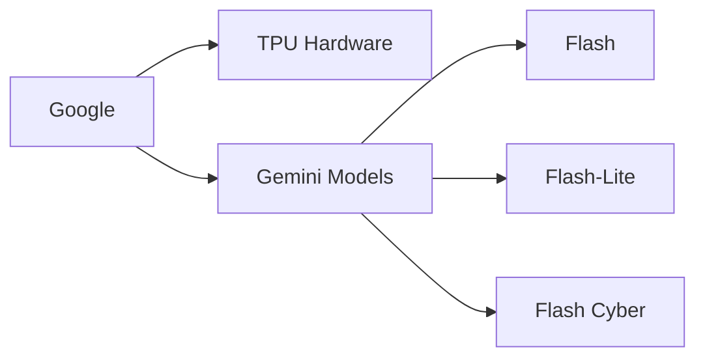

# El Nuevo Trío Gemini de Google Expone el Manual de IA Vertical

Tres modelos nuevos, un anuncio y toda una industria recalibrándose. Google ha lanzado Gemini 3.6 Flash, 3.5 Flash-Lite y 3.5 Flash Cyber, y el observador casual podría encogerse de hombros. Tres variantes más de modelos en un mar de lanzamientos semanales. Pero el analista que hay en mí ve algo más deliberado: una ejecución de manual para la captura vertical del mercado que las grandes tecnológicas han estado perfeccionando durante dos décadas.

## Decodificando la Estrategia de Tres Cabezas

Cada variante cuenta una historia diferente sobre hacia dónde se dirige el mercado. Gemini 3.6 Flash apunta a la corriente principal de los desarrolladores que necesitan velocidad y rentabilidad. Flash-Lite se dirige a aplicaciones de alto volumen y baja latencia donde el costo por inferencia es lo que más importa. Y luego está Flash Cyber, y este es el movimiento más revelador. Un modelo específico para ciberseguridad señala que Google ya no se conforma con competir en benchmarks de capacidad general. Ahora está tallando industrias verticales, construyendo variantes especializadas por dominio que bloquean a los clientes en el ecosistema de Google para cumplimiento, detección de amenazas y operaciones de seguridad.

Este es el mismo manual que Microsoft ejecutó con las ediciones de Windows Server, la misma segmentación que hizo que los niveles de Adobe Creative Cloud fueran despiadadamente efectivos, el mismo corte vertical que IBM perfeccionó con sus líneas de productos de mainframe en las décadas de 1970 y 1980.

## El Problema de la Concentración de Capital

Para entender por qué Google puede lanzar tres modelos especializados simultáneamente mientras que los actores más pequeños luchan por enviar uno, hay que seguir el dinero y la infraestructura.

Google posee sus propias unidades de procesamiento tensorial (TPUs), controla sus propios centros de datos, opera sus propias redes de fibra y obtiene datos de entrenamiento de YouTube, Search, Gmail, Maps y Android. Ninguna otra empresa en la carrera de la IA tiene esta integración vertical. OpenAI depende de la infraestructura Azure de Microsoft y cada vez más del capital de Microsoft. Anthropic confía tanto en Google Cloud como en AWS para cómputo. Meta publica los pesos abiertos de sus modelos, pero los monetiza a través de publicidad en plataformas que ya domina.

## La Cuestión del Lock-In para Desarrolladores

Esta es la misma atracción gravitacional que hizo de AWS el proveedor de nube predeterminado, que hizo de iOS la plataforma móvil predeterminada y que hizo de Google Search el punto de entrada predeterminado a la web. Una vez que estás dentro de la órbita, los costos de cambio se acumulan con cada llamada a la API, cada trabajo de fine-tuning, cada punto de integración.

Para los desarrolladores independientes y las pequeñas empresas, el cálculo es brutal. Usar los modelos de Google significa menores costos hoy y dependencia mañana. Construir sobre alternativas de pesos abiertos de la familia Llama de Meta o Mistral significa mayor complejidad de infraestructura hoy y opcionalidad mañana. El mercado no está eligiendo solo por mérito técnico; está eligiendo por evaluación de riesgo estratégico, y la mayoría de las startups no están equipadas para hacer ese cálculo.

## Ecos Históricos: De los Mainframes a los Modelos Fundacionales

Los mainframes de IBM en los años 70 y 80 no ganaron por ser los más elegantes. Ganaron por ser indispensables. Las empresas construyeron capas enteras de operaciones sobre ellos, y cuando llegó el momento de cambiar, el costo de la transición excedía el costo de quedarse. El software se volvió propietario, la capacitación se volvió propietaria y la salida se volvió prohibitiva.

Lo mismo ocurrió con Windows en los 90, con los servicios web de Amazon en los 2000 y con la búsqueda de Google en la última década. Cada ola tecnológica creó capas de dependencia que parecían opcionales al principio y se volvieron permanentes con el tiempo. La IA no será diferente; solo será más rápida.

## Lo que Nos Dice el Movimiento Flash Cyber

Este es el futuro que Google está construyendo, y el trío Gemini Flash es solo el movimiento de apertura. El verdadero juego no se trata de qué modelo obtiene la puntuación más alta en MMLU. El verdadero juego se trata de qué empresa posee la capa de inteligencia predeterminada de la economía global.

Para los desarrolladores, inversores y responsables políticos que observan cómo esto se desarrolla, la lección es incómoda pero clara: en la era de la IA, el modelo es el producto, pero el ecosistema es el foso. Y los fosos se están ensanchando cada trimestre.

