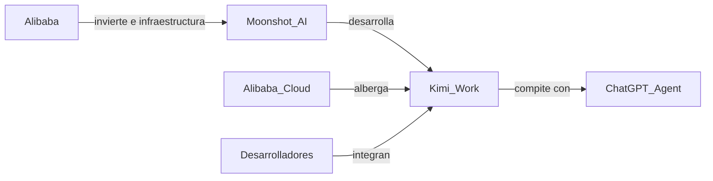

# Kimi Work: la pieza que faltaba en la estrategia de Alibaba para dominar la IA china

Cuando Moonshot AI presentó Kimi Work, la narrativa dominante fue técnica: otro agente de inteligencia artificial capaz de navegar la web, ejecutar código y completar tareas multi-paso de forma autónoma. Pero esa lectura omite lo más interesante. Kimi Work no es solo un producto: es un movimiento estratégico dentro de una partida de ajedrez mucho más grande que enfrenta a los gigantes tecnológicos chinos entre sí, y a China con Silicon Valley.

## El contexto: una startup valorada como un banco regional

Moonshot AI, fundada en 2023 por Yang Zhilin —un ex investigador de Google y Tsinghua—, se convirtió en apenas 18 meses en una de las startups más valiosas de China. Su ronda de financiación más reciente la sitúa por encima de los 3.300 millones de dólares, según reportes de Bloomberg y Caixin. Una cifra obscena para una empresa sin ingresos significativos, que solo es posible en el actual régimen de excepción del capital tecnológico: dinero que se mueve no por retorno esperado, sino por miedo a quedarse fuera.

## Lo que Kimi Work revela sobre la estructura de poder

Kimi Work es, en esencia, un agente de propósito general que combina navegación web, ejecución de código, redacción de documentos y razonamiento prolongado. Funcionalmente, no difiere radicalmente de lo que ofrecen OpenAI con su modo agente de ChatGPT, Anthropic con Claude y su capacidad de "computer use", o Google con Project Mariner. La tecnología convergió: cualquier laboratorio de frontera puede, en teoría, construir algo similar.

Y aquí aparece el ángulo que rara vez se discute: **estos lanzamientos no son competencia "China vs. Estados Unidos" en abstracto, sino la expresión de alianzas internas entre capital chino**. Alibaba no está compitiendo contra OpenAI; está compitiendo contra Tencent, contra Baidu, contra ByteDance. Moonshot es su pieza en ese tablero.

## La guerra de los agentes: un déjà vu histórico

El capital de riesgo entra primero, financia docenas de startups, genera hype mediático, y luego ocurre la consolidación. Las startups que sobreviven lo hacen porque son absorbidas o porque firman acuerdos de infraestructura con uno de los grandes. Moonshot AI, a pesar de su valuación, no es una empresa independiente en el sentido clásico: depende estructuralmente de Alibaba para cómputo, distribución y eventualmente monetización. Es, en la práctica, una extensión de la estrategia de Alibaba disfrazada de startup.

Esto no es un juicio moral; es una descripción de cómo funciona la industria. La pregunta relevante es: ¿qué pasa con las aplicaciones construidas sobre estos agentes? El desarrollador que hoy construye sobre Kimi Work está, sin saberlo, apostando por la permanencia del ecosistema Alibaba. El mismo cálculo que durante una década hicieron los desarrolladores de Android respecto a Google: una apertura inicial que, con el tiempo, se convierte en dependencia.

## Capital concentrado, alternativas estrechas

El dato que mejor resume el momento actual es este: según los registros de financiación de 2024, más del 70% del capital global desplegado en inteligencia artificial de frontera se concentró en menos de diez empresas. En China, la concentración es aún más pronunciada. Esto significa que la conversación sobre "democratización de la IA" —tan frecuente en comunicados de prensa y pitches de inversores— choca con una realidad estructural: pocas manos deciden hacia dónde se curva la tecnología.

Kimi Work es, en este sentido, un caso de estudio. Su lanzamiento no ocurrió en el vacío. Coincidió con movimientos de Alibaba para reposicionarse tras la debacle regulatoria de 2021, con la presión de Estados Unidos sobre los chips NVIDIA H20, y con la necesidad de demostrar que el ecosistema chino puede producir productos de frontera sin depender exclusivamente de OpenAI o Anthropic como referencia. Cada agente que Moonshot lanza es también un mensaje geopolítico.

## ¿Hacia dónde va esto?

El corto plazo es predecible: veremos una proliferación de "Kimi Work killers" en los próximos meses —Manus AI ya circula, otros vendrán—, cada uno promovido por algún gigante u otro. Veremos enormes campañas de adquisición de usuarios subsidiadas. Veremos promesas de productividad que rara vez se materializan en el trabajo real.

Lo interesante ocurrirá en el medio plazo: cuando los desarrolladores y las empresas tengan que elegir sobre qué agente construir, qué infraestructura contratar, qué modelo de IA integrar. Esa elección, aparentemente técnica, es una elección de poder. Y como en cada ciclo anterior, la hará una cantidad mucho menor de actores de lo que sugiere el ruido del lanzamiento.

El resto de nosotros, probablemente, solo seremos usuarios.

