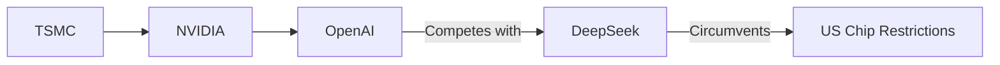

Para responder, hay que mirar más allá de la superficie técnica. Lo que está en juego no es quién tiene el mejor chatbot. Es algo más fundamental: el control del stack tecnológico global, que durante una década fue dominio indiscutido de Estados Unidos.

## La lección que Occidente prefiere olvidar

En los años ochenta, Japón parecía imparable. Sony, Toyota, Mitsubishi: sus productos superaban en calidad a los estadounidenses, su productividad era superior, y la llamada "Ley de Semiconductores" de 1985 fue la respuesta desesperada de Washington para proteger una industria que se desangraba. El resultado fue desigual: Japón no colapsó, pero sí se contuvo su expansión, y Estados Unidos tuvo tiempo para reagruparse y pivotar hacia el software y la era digital.

## El monopolio natural de TSMC

Cuando Washington restringe exportaciones de chips a China, en realidad está racionando el acceso a una capacidad de fabricación que solo existe en una isla a 180 kilómetros de la costa china. Es una geografía del poder que ningún decreto puede cambiar. Y es, además, una geografía vulnerable: cualquier disruption en el estrecho de Taiwán paralizaría la industria global de IA de la noche a la mañana.

## Los ganadores internos en China

Mientras tanto, dentro de China la dinámica es fascinante. Alibaba, Baidu, ByteDance y un puñado de startups como DeepSeek y Moonshot compiten entre sí con una intensidad que recuerda a la guerra de plataformas móviles de 2010-2015. Pero hay un jugador clave que muchos análisis occidentales subestiman: Huawei.

Huawei ha pasado de ser un fabricante de teléfonos a convertirse en el principal desarrollador de chips chinos (la línea Ascend) y en el arquitecto de una alternativa nacional a CUDA, su framework CANN. Si ese ecosistema madura, las restricciones de chips pierden buena parte de su efectividad. La estrategia de "autosuficiencia tecnológica" forzada por las sanciones podría terminar creando una pila tecnológica paralela completa: chips propios, frameworks propios, modelos propios.

## La concentración de capital en Occidente

En Silicon Valley, el capital se concentra como nunca antes. OpenAI, Anthropic, xAI y Mistral han absorbido miles de millones en inversión, pero una proporción creciente de ese capital termina en las arcas de NVIDIA. Cada vez que una startup de IA levanta una ronda, una parte significativa se convierte en pedidos de GPUs. Es una especie de impuesto tecnológico que fluye hacia un solo proveedor con márgenes superiores al 70%.

Microsoft, Google, Meta y Amazon gastan colectivamente más de 300.000 millones de dólares anuales en infraestructura de IA. La pregunta incómoda es: ¿qué pasa si esos modelos no generan los retornos esperados? El gasto actual asume que la inteligencia artificial general transformará toda la economía. Si esa hipótesis falla, veremos una corrección brutal en los mercados. Pero si los modelos chinos —baratos, abiertos, funcionales— capturan mercados emergentes antes de que la IA occidental rentabilice su inversión, el problema será mucho peor.

## El miedo real, el que no se dice en voz alta

Volviendo a la pregunta de Thompson: el miedo no es a los modelos chinos en sí. Es a la evidencia de que el modelo de Silicon Valley —capital abundante, talento escaso, infraestructura limitada por la geografía— tiene una fecha de caducidad más cercana de lo que admiten los informes corporativos. Las empresas chinas han demostrado que se puede competir sin acceso a los chips más avanzados y sin el respaldo del capital riesgo occidental.

El verdadero miedo es que la "ventaja" estadounidense en IA nunca fue estructural, sino coyuntural. Y que las políticas de restricción de chips, lejos de contener a China, han acelerado la construcción de un ecosistema alternativo que algún día podría no necesitar nada de Occidente.

OpenAI -->|Compite con| DeepSeek
DeepSeek -->|Elude| RestriccionesEEUU[Restricciones de Chips de EE.UU.]

