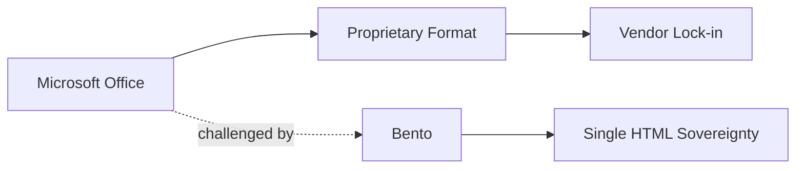

## La historia detrás de un solo archivo

En una época donde la mayoría del software vive detrás de suscripciones mensuales, plataformas en la nube que rastrean cada clic y formatos propietarios, aparece **Bento**: una herramienta que promete toda la funcionalidad de PowerPoint —editar, visualizar, integrar datos e incluso colaborar— comprimida en un único archivo HTML. No requiere instalación, no pide cuenta, no envía telemetría a ningún servidor. Es, en esencia, un espejo invertido de cómo se ha construido el software de oficina en los últimos 25 años.

El proyecto, que saltó a portada de Hacker News esta semana, no es una simple curiosidad técnica. Es un síntoma de algo más profundo: el hartazgo creciente con la dependencia de suites propietarias, y la aparición de una nueva generación de herramientas que priorizan la portabilidad sobre la captura de datos.

## El poder blando (y duro) de Microsoft Office

Según Statcounter, Microsoft Office controla más del 85% del mercado de software de productividad empresarial. Google Workspace, su principal competidor, ronda el 10%. El resto se reparte entre alternativas open source como LibreOffice y soluciones especializadas que rara vez superan el 1% combinado. Esta concentración no es accidental: es el resultado de décadas de contratos institucionales, integración con sistemas operativos —Windows llega con Office preinstalado en muchos equipos— y, sobre todo, compatibilidad de facto. Si envías un `.pptx`, todos lo abren; si envías cualquier otra cosa, asumes que algunos destinatarios no podrán.

## Lo que Google no resolvió

Google intentó romper el monopolio de Microsoft con una estrategia brillante: regalar el software a cambio de los datos. Google Docs, Sheets y Slides son técnicamente excelentes y han capturado una parte significativa del mercado educativo y de startups. Pero su modelo sigue dependiendo de la nube, de la cuenta de Google, de los servidores de Mountain View. No es propiedad del usuario; es prestado mientras la empresa quiera.

En un contexto donde las preocupaciones por privacidad y concentración de capital tecnológico están en su punto más alto —la FTC investigando a Google, la UE forzando la interoperabilidad, escándalos de datos masivos cada trimestre—, el atractivo de un archivo HTML auto-contenido crece. No es nostalgia retro: es una respuesta racional a un ecosistema que ha convertido la productividad en una mercancía extractiva.

## La ironía del momento

Curiosamente, Microsoft ya ofrece una versión web de Office funcional desde el navegador. Técnicamente, también es "HTML" en cierto sentido. Pero ahí está la diferencia clave: ese HTML está conectado a la nube de Microsoft, requiere autenticación, almacena tus documentos en sus servidores y, sobre todo, forma parte de una estrategia deliberada para mantener a los usuarios dentro del ecosistema. La promesa de "Office en cualquier dispositivo" sigue siendo, en la práctica, "Office, en cualquier dispositivo, conectado a nosotros".

## ¿Moda pasajera o cambio estructural?

Sin embargo, algo diferente ocurre en este momento. La fatiga de suscripciones es real y documentada, la preocupación por la privacidad se ha vuelto estructural, y la proliferación de modelos de IA está demostrando que el valor del software ya no reside en la interfaz, sino en la capacidad de procesar y generar contenido. Si un LLM puede generar tu presentación en cualquier formato, el poder de captura de "tú ya tienes PowerPoint instalado" se diluye de forma inevitable.

## Conclusión: ¿de quién es tu trabajo?

Al final, la pregunta no es si Bento reemplazará a PowerPoint —es improbable—, sino qué dice de nuestro ecosistema que una propuesta así genere debate. Cuando la portabilidad de un único archivo se vuelve noticia, es porque hemos normalizado lo contrario: software que no posees, datos que no controlas, formatos que te atrapan en su jurisdicción. Bento no pretende ser el futuro de las presentaciones; es el espejo donde el modelo actual no sale bien parado.