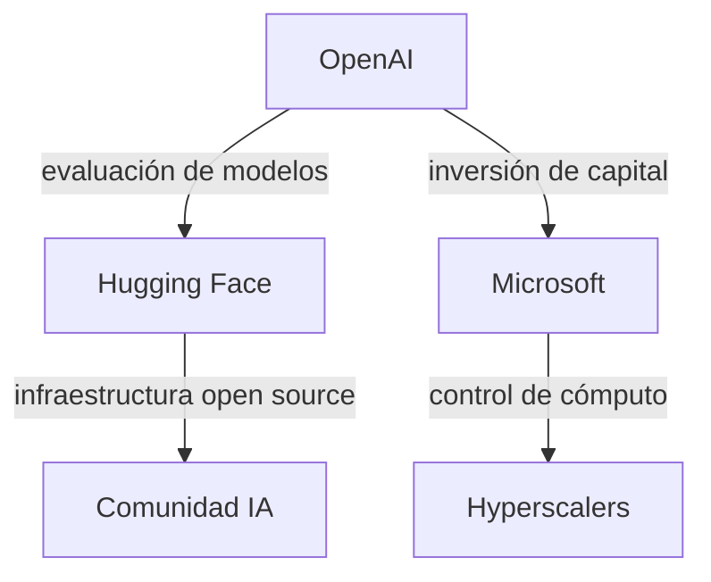

# OpenAI y Hugging Face: el incidente de seguridad que expone las tensiones reales del poder en la IA

A primera vista, un comunicado sobre un "incidente de seguridad" entre dos empresas de inteligencia artificial suena a nota menor, un tecnicismo más en un sector que vive del hype. Pero cuando las dos compañías involucradas son OpenAI y Hugging Face, el episodio deja de ser técnico y se convierte en una radiografía precisa de las tensiones estructurales que dominan la industria de la IA en 2026: quién evalúa a quién, con qué intereses, y bajo qué asimetrías de poder.

## Una asimetría que va más allá del código

Para entender la magnitud de este incidente, hay que mirar el tablero de poder, no el pull request. OpenAI es, a estas alturas, una criatura de Microsoft: más de 13.000 millones de dólares invertidos, infraestructura en Azure, y una posición dominante en el segmento de modelos frontera. Hugging Face, por su parte, es el actor central del ecosistema open source: una plataforma que aloja cientos de miles de modelos, con rondas de financiación que han incluido a Google, Amazon, NVIDIA y Salesforce, y una valoración que supera los 4.500 millones de dólares.

## Lecciones de historia: cuando los gigantes cooperan a regañadientes

Esta no es la primera vez que vemos a dos gigantes de la tecnología chocar en procesos de "cooperación técnica". La historia está llena de precedentes:

- **Google y Oracle** litigaron durante una década por unas líneas de API en Java, en un juicio que reveló cuánto depende el software moderno de interfaces que nadie sabe bien a quién pertenecen.
- **Microsoft y Nokia** intentaron una alianza que terminó en adquisición fallida y colapso estratégico para el fabricante finlandés.
- **Apple y Epic Games** mostraron cómo la "colaboración" en una App Store puede esconder relaciones de poder extractivas.

El patrón es claro: cuando dos actores con poder de mercado comparable se ven obligados a cooperar, los incidentes técnicos suelen destapar conflictos de gobernanza, propiedad intelectual y control que las partes prefieren mantener bajo la alfombra.

## El negocio oculto de la evaluación de modelos

Pocas cosas son tan estratégicas hoy como **la evaluación de modelos de IA**. Benchmarks como MMLU, HumanEval, o las cada vez más populares pruebas de "red teaming" determinan qué modelos se adoptan, qué empresas capturan contratos, y qué narrativas dominan el ciclo mediático. Una metodología de evaluación defectuosa o comprometida puede hundir la reputación de un modelo en semanas, como vimos con el caso de los benchmarks "contaminados" denunciados por investigadores independientes en 2024 y 2025.

En este contexto, el incidente OpenAI-Hugging Face no puede leerse como un simple fallo técnico. **Quien controla la infraestructura de evaluación controla, en buena medida, la narrativa sobre qué modelos son "buenos" y cuáles no.** Y esa es una fuente de poder económico y político de primer orden.

## Concentración de capital: el elefante en la sala

Detrás de cualquier análisis riguroso sobre este tipo de incidentes aparece siempre la misma estructura: la IA moderna es un negocio de capital concentrado. Según datos de 2025, los cinco mayores hyperscalers (Microsoft, Google, Amazon, Meta, Oracle) controlan más del 70% de la capacidad de cómputo dedicada a entrenamiento de modelos frontera. Empresas como OpenAI existen porque Microsoft decidió apostarlo todo a esta tecnología; Hugging Face existe porque los grandes encontraron rentable financiar un "jardín amurallado" de la apertura que les da legitimidad sin canibalizar sus negocios cerrados.

**El incidente de seguridad es, en última instancia, una grieta en una fachada de cooperación cuidadosamente construida.** Una fachada necesaria para que ambas empresas sigan captando inversión, talento y atención regulatoria.

## ¿Qué debería preocuparnos?

Tres cosas, al menos:

1. **Transparencia selectiva.** OpenAI publicó su versión. ¿Cuál es la de Hugging Face? ¿Qué información sensible estuvo expuesta? Las respuestas a estas preguntas importan más que los comunicados de prensa.
2. **Estándares de evaluación opacos.** Si los procesos de evaluación de modelos son tan estratégicos, ¿por qué siguen siendo cajas negras operadas por las mismas empresas que desarrollan los modelos?
3. **Dependencia sistémica.** El ecosistema open source depende de Hugging Face; el modelo cerrado depende de OpenAI. Una relación tensa entre ambos no es solo un problema corporativo: es un riesgo para la estabilidad de toda la infraestructura de IA.

## Conclusión: incidentes que son mensajes

La pregunta de fondo no es si habrá más incidentes de este tipo, sino si la industria de la IA está dispuesta a construir mecanismos de gobernanza técnica y económica que no dependan de la buena voluntad de dos o tres gigantes. Hasta ahora, la respuesta no es alentadora.

---

