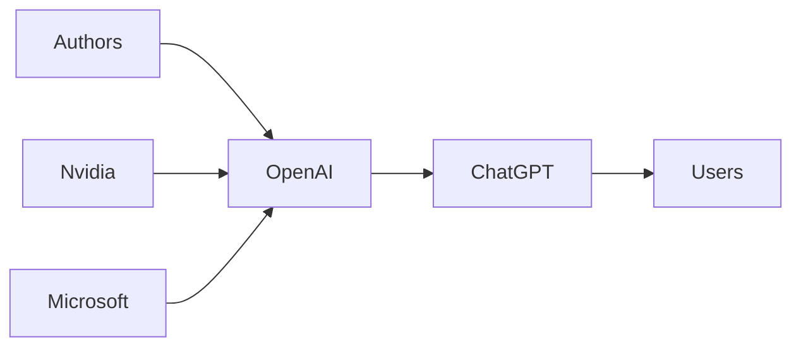

## Tao contra ChatGPT: el experimento matemático que desnuda el poder real de OpenAI

Cuando un Fields Medal se sienta con ChatGPT a discutir un posible contraejemplo de la conjetura del Jacobiano, lo que ocurre trasciende la matemática. Terrence Tao, probablemente el matemático vivo más respetado del planeta, publicó su intercambio con el chatbot de OpenAI. El resultado no es una solución a uno de los problemas más longevos del álgebra, sino una radiografía de quién controla realmente la nueva infraestructura del conocimiento.

### El experimento que no fue

Conviene ser claros: Tao no usó ChatGPT para demostrar ni refutar la conjetura. Lo que hizo fue algo más revelador: empleó un chatbot público para poner a prueba sus propias intuiciones sobre un posible contraejemplo. El modelo falló repetidamente, alucinó estructuras, confundió hipótesis y en un momento llegó a afirmar con absoluta rotundidad algo que no tenía sentido.

Pero más allá de la curiosidad matemática, subyace una pregunta que concierne a toda la industria tecnológica: ¿quién construye, posee y controla los sistemas que ya están transformando cómo pensamos, escribimos y programamos?

### OpenAI y la arquitectura de la concentración

OpenAI se fundó en 2015 como una organización sin ánimo de lucro con una misión que sonaba casi idealista: desarrollar inteligencia artificial general en beneficio de la humanidad. Una década después, esa organización es una entidad con fines de lucro limitada (*capped-profit*), con inversiones multimillonarias de Microsoft, una comercialización que abarca desde productos de consumo hasta APIs empresariales y contratos con el Pentágono.

La charla que Tao mantuvo fue, técnicamente, una conversación con un producto. El modelo que respondió fue entrenado con texto con derechos de autor, artículos académicos, libros y código, la mayor parte sin consentimiento explícito. Se refinó mediante aprendizaje por refuerzo con retroalimentación humana (RLHF) por trabajadores en Kenia pagados a menos de dos dólares la hora. Corre sobre infraestructura propiedad de Microsoft Azure, con chips de Nvidia fabricados en Taiwán.

Tras una simple caja de texto se esconde una cadena de suministro que atraviesa continentes, estructuras de capital que concentran la propiedad en un puñado de actores y prácticas laborales ampliamente documentadas y criticadas.

### La ilusión de la democratización

El relato de marketing de OpenAI —y por extensión, de Microsoft, que ha integrado estos modelos en Bing, Office y Windows— nos vende la idea del acceso democratizado. Cualquier persona con conexión a internet puede usar GPT-4. Cualquiera puede ser "Tao con ChatGPT".

1. **Quién controla el modelo**: el consejo de administración de OpenAI, sus inversores (especialmente Microsoft, con una inversión reportada de 13.000 millones de dólares) y el pequeño grupo de investigadores y ejecutivos que deciden qué puede y qué no puede hacer el sistema.

2. **Quién controla la infraestructura**: sin GPUs de Nvidia y sin capacidad de cómputo en Azure, no existe ChatGPT. El cuello de botella es físico, geográfico y político.

3. **Quién controla los datos**: el modelo se entrenó con el caudal intelectual colectivo de la humanidad, con permiso rara vez solicitado y compensación casi nunca entregada. *The New York Times* está actualmente demandando a OpenAI por este motivo. Millones de autores, programadores y periodistas no han recibido un céntimo.

### Ecos históricos

La burbuja actual de la IA, con valoraciones superiores al billón de dólares en todo el sector, tiene similitudes incómodas con la burbuja puntocom de 2000. Pero hay una diferencia crucial: en 2000, la infraestructura era física (cables de fibra óptica, centros de datos) y podía reutilizarse. En 2024, la infraestructura es intelectual y contractual. Si la burbuja estalla, los modelos permanecen, los contratos permanecen y la concentración de poder permanece.

### El test de Tao como espejo

Lo que el experimento de Tao realmente muestra no es lo que ChatGPT puede o no puede hacer, sino el tipo de relación que estamos estableciendo con estos sistemas. Un matemático de su calibre puede usar la herramienta con espíritu crítico, detectar sus errores y aprovecharla productivamente. La mayoría de los usuarios no puede.

Esto crea una sociedad de dos velocidades: quienes pueden interrogar a la IA y quienes simplemente consumen lo que produce. El primer grupo incluye a investigadores, ingenieros y profesionales con formación técnica. El segundo grupo incluye a la inmensa mayoría de usuarios, que reciben respuestas con apariencia de certeza sin capacidad real de verificación.

### ¿Quién se beneficia de la confusión?

Cuando ChatGPT inventa una estructura matemática o fabrica un precedente legal, ¿quién paga los costes? El usuario que confía en él, el profesional que es reemplazado por él, el estudiante que aprende de él. Los beneficios, en cambio, se concentran: más usuarios, más suscripciones, más datos, más capital.

Este es el modelo de negocio del capitalismo de vigilancia aplicado al conocimiento: externalizar los costes, internalizar los beneficios. Y es la razón por la que, más allá de la fascinación técnica, la conversación sobre IA debe ser una conversación sobre regulación, antimonopolio y control democrático de la tecnología.

La charla de Tao con ChatGPT es, en definitiva, una pequeña ventana a una pregunta mucho más grande: en un mundo donde las herramientas de pensamiento más potentes son propiedad de unas pocas corporaciones, ¿qué significa pensar libremente?

