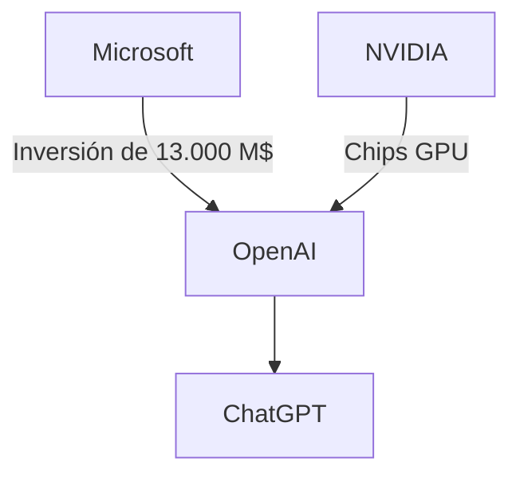

# Terence Tao y ChatGPT: Cuando un Genio Depura Ideas con un Bot

A finales de 2024, Terence Tao —medallista Fields, considerado el matemático vivo más importante del mundo— publicó un enlace a una conversación completa con ChatGPT. El objetivo: explorar un supuesto contraejemplo a la Conjetura del Jacobiano, un problema abierto desde 1939. La conversación, accesible para cualquiera, muestra a Tao usando el chatbot como compañero de razonamiento, identificando errores, refinando argumentos. El resultado fue esclarecedor: la idea original tenía fallos, y la IA ayudó a encontrarlos.

Este episodio, aparentemente menor, condensa varias tensiones que definen la industria tecnológica actual. No se trata solo de si una IA "piensa" bien en matemáticas. Se trata de quién construye estos sistemas, bajo qué estructuras económicas, y cómo están reconfigurando las relaciones entre conocimiento, trabajo y capital.

## El Monopolio del Razonamiento Artificial

Cuando Tao "piensa en voz alta" con ChatGPT, está usando infraestructura propiedad efectiva de un oligopolio tecnológico. La competencia real —Anthropic (respaldada por Amazon y Google), Google DeepMind (con Gemini), Meta (con Llama)— opera bajo lógicas similares: inversiones billonarias, alianzas con hyperscalers, dependencia casi absoluta de los chips de NVIDIA. No hay un mercado fragmentado de IAs avanzadas. Hay tres o cuatro actores, con estructuras de capital entrelazadas, que controlan el acceso a los modelos frontier.

Esto importa porque cuando un matemático de élite, o un programador, o un médico, integra estas herramientas en su flujo de trabajo, está adoptando no solo un software, sino una relación de dependencia con proveedores que definen precios, condiciones de uso, y límites de acceso. Las API cambian. Los modelos se deprecian. Las políticas de uso se modifican unilateralmente.

## La Paradoja del Asistente Gratuito

Tao, según se deduce de su conversación, usa la versión estándar de ChatGPT. No está pagando por acceso premium, ni entrenando un modelo personalizado. Está usando el producto de consumo masivo. Y aquí emerge una dinámica económica peculiar: las IAs más avanzadas del mundo se ofrecen al público general a precios simbólicos o gratuitos, mientras su coste real —entrenamiento, inferencia, infraestructura de GPU— se cuenta en cientos de millones de dólares por modelo.

¿Quién paga la diferencia? Los inversores estratégicos (Microsoft, en el caso de OpenAI), que ven en el chatbot un vector de adopción para productos más rentables: Azure, Copilot, suscripciones empresariales. El modelo de negocio no es vender ChatGPT. Es usar ChatGPT para expandir el ecosistema de Microsoft. Es la estrategia clásica de subsidiar una capa para dominar las adyacentes.

El matemático, el periodista, el abogado que usa ChatGPT a diario está participando, sin saberlo, en una operación de captura de atención y datos a escala planetaria. Cada consulta alimenta sistemas de mejora continua que refuerzan el monopolio del proveedor.

## Contexto Histórico: De las Bibliotecas a los LLMs

Cada una de estas transiciones siguió un patrón: una nueva capa de infraestructura emerge, se vuelve indispensable, y consolida poder económico en quien la controla. Wolfram sigue siendo el actor dominante en software matemático. Google Scholar y Semantic Scholar redefinieron cómo se mide el impacto académico. Stack Overflow, pese a su carácter comunitario, fue adquirido por Prosus en 2022 por 1.800 millones de dólares.

Los modelos de lenguaje representan la siguiente iteración de este ciclo, pero con una diferencia crucial: son opacos, no replicables, y requieren un capital tan monumental que pocas entidades pueden construirlos desde cero. La barrera de entrada no es solo económica. Es computacional, energética, y de acceso a talento (los investigadores de IA top del mundo trabajan para una decena de empresas).

## Implicaciones para el Trabajo Intelectual

La conversación de Tao ilustra una verdad incómoda: la IA no "entiende" matemáticas, pero puede servir como interlocutor que obliga a precisar ideas. Es el "rubber duck debugging" elevado a infraestructura corporativa. Esta utilidad —ser un espejo para el pensamiento humano— es genuina y valiosa.

## Reflexión Final: Quién Posee el Conocimiento que Produce Conocimiento

Cuando un genio como Tao comparte públicamente su conversación con un chatbot, no solo está documentando un experimento intelectual. Está normalizando una relación de dependencia. Y las generaciones que vienen no conocerán otra forma de trabajar. La pregunta no es si la IA cambiará el trabajo intelectual. Ya lo está haciendo. La pregunta es quién se beneficia de ese cambio, y qué pasa cuando los usuarios dejan de tener alternativas reales.

La próxima vez que abras ChatGPT para resolver un problema difícil, recuerda: estás usando infraestructura propiedad de uno de los oligopolios más concentrados de la historia económica moderna. Eso no invalida la herramienta. Pero sí debería cambiar cómo piensas sobre ella.

