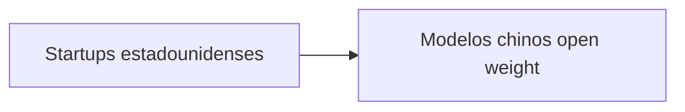

Silicon Valley, la cuna del libre mercado digital, está suplicando a su propio gobierno que no les cierre el grifo de la inteligencia artificial china. La ironía es demasiado perfecta como para ignorarla: las mismas startups que predicaron durante años la apertura, la competencia y el libre flujo del conocimiento ahora descubren que sus modelos de negocio dependen de modelos de pesos abiertos (*open weight*) desarrollados en China.

La noticia, recogida por Politico y ampliamente discutida en Hacker News, revela una carta firmada por fundadores de startups estadounidenses instando a la administración a no imponer restricciones adicionales a los modelos de IA chinos de código abierto. La petición no surge de un idealismo libertario, sino de un cálculo frío de supervivencia económica.

## Las verdaderas estructuras de poder

Conviene identificar a los actores y sus incentivos reales:

- **Microsoft, OpenAI, Google, Amazon y Meta**: han invertido colectivamente más de 300.000 millones de dólares en infraestructura de IA. Su supervivencia financiera depende de que la inteligencia artificial siga siendo intensiva en capital.
- **Nvidia**: controla aproximadamente el 90% del mercado de GPUs de IA. Cualquier modelo eficiente que reduzca la demanda de cómputo es una amenaza existencial para su margen.
- **Las startups de IA estadounidenses**: muchas no entrenan modelos desde cero, sino que construyen productos sobre modelos abiertos chinos. Sin acceso a Qwen o DeepSeek, simplemente no pueden competir contra las grandes tecnológicas.
- **El complejo militar-industrial de IA**: Palantir, Anduril, Scale AI y otros actores del sector defensa se benefician de una narrativa de "amenaza china" que justifica contratos gubernamentales masivos.

## Un patrón histórico que se repite

El patrón es consistente: las restricciones comerciales en tecnología tienden a fortalecer a los rivales a largo plazo, mientras perjudican a corto plazo a las empresas dependientes del acceso. Las startups estadounidenses temen ser las víctimas colaterales de una política industrial disfrazada de seguridad nacional.

## La falacia del "open weight"

Es importante señalar que *open weight* no es lo mismo que *open source*. Los modelos de pesos abiertos como Qwen o DeepSeek publican los parámetros entrenados, pero no necesariamente los datos de entrenamiento, el pipeline completo ni la documentación legal equivalente a la del open source tradicional (como Linux). Es un movimiento táctico: China ha encontrado en el open weight una vía para posicionar sus estándares en el ecosistema global de IA, sin entregar completamente el control sobre los datos, el talento ni la propiedad intelectual subyacente.

Para las startups estadounidenses, usar estos modelos es un compromiso pragmático. Funcionan, son baratos, son buenos. Pero construyen su producto sobre infraestructura cuya gobernanza y continuidad dependen de decisiones políticas de un gobierno rival. Es la misma trampa en la que cayeron muchas empresas europeas con el software estadounidense: eficiencia a corto plazo, dependencia a largo plazo.

## La concentración que nadie quiere ver

Las startups que hoy piden acceso a modelos chinos son las mismas que, en otra mesa, aceptan valuaciones infladas, dependen de la nube de AWS, Azure o GCP y compiten en mercados cada vez más oligopólicos. Su petición es legítima, pero también es reveladora: han construido su ventaja competitiva sobre los hombros de otros, y ahora temen que se los quiten.

## Conclusión: el dilema que no tiene solución limpia

La petición de las startups plantea una pregunta incómoda para Washington: ¿es la política tecnológica una herramienta de seguridad nacional o una forma de protección industrial para gigantes domésticos? Si es lo primero, las restricciones deberían justificarse con evidencias concretas de riesgo. Si es lo segundo, al menos deberíamos ser honestos al respecto.

Quizás la verdadera pregunta no sea si las startups deberían tener acceso a modelos chinos, sino **quién decide qué tecnología puede existir**. Y a quién sirve realmente esa decisión.

