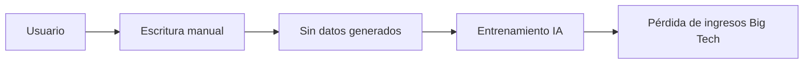

# La pluma contra la plataforma: por qué Silicon Valley no puede monetizar la escritura a mano

Cuando Neal Stephenson —uno de los pocos escritores de tecnología con credibilidad literaria genuina— publica un ensayo defendiendo el acto de escribir a mano, el texto aterriza de manera muy distinta al típico artículo de productividad. Stephenson no vende una aplicación de meditación. No promociona un SaaS de journaling. Simplemente señala el creciente cuerpo de investigación en neurociencia cognitiva que sugiere que el acto lento y analógico de mover un lápiz sobre el papel produce beneficios medibles en memoria, concentración y desarrollo neuronal que ninguna pantalla táctil puede replicar.

La reacción de la industria tecnológica resulta reveladora: no sabe si ignorar la evidencia o intentar cooptarla.

## La cruzada para borrar el lápiz

Durante dos décadas, el sector de **tecnología educativa** ha librado una guerra silenciosa contra la palabra escrita a mano. El premio: un mercado global de ed-tech valuado en 400 mil millones de dólares, dominado por plataformas estadounidenses. Google, a través de sus Chromebooks y Google Workspace for Education, ya está presente en aulas de Estados Unidos, América Latina y, cada vez más, Europa y África. El iPad de Apple, combinado con el Apple Pencil, se ha convertido en el estándar de facto en los distritos escolares acomodados, con la empresa presionando agresivamente para obtener subsidios de dispositivos y programas uno a uno.

Microsoft, tras sus fallidos intentos de adquisición, ha construido su estrategia educativa sobre los dispositivos Surface y Office 365, compitiendo por una tajada cada vez más pequeña del mismo pastel. En conjunto, estas tres empresas —Google, Apple, Microsoft— controlan el entorno operativo en el que una generación entera aprende a leer, escribir y pensar.

La lógica económica es simple: cada minuto que un estudiante pasa con un cuaderno físico es un minuto que no genera datos, no construye lock-in de plataforma y no condiciona al próximo consumidor hacia un ecosistema específico. El lápiz, desde la perspectiva de Wall Street, es una fuga en el embudo de conversión.

## El giro "papel-like"

Cuando la investigación de consumidores comenzó a mostrar que la gente extrañaba la escritura a mano —que la deseaba, incluso—, la respuesta de Silicon Valley fue predecible: simularla. La tableta reMarkable, una empresa noruega valorada actualmente en más de mil millones de dólares, vende un dispositivo de tinta electrónica diseñado explícitamente para sentirse como papel. Boox, un competidor chino, se ha abierto un nicho entre los minimalistas digitales. Incluso Apple, con su Pencil de 129 dólares y la función "scribble" de la app Notas, ha reconocido la demanda.

Pero aquí aparece el problema estructural: estos dispositivos funcionan precisamente porque se rehúsan a hacer lo que **Big Tech** quiere que hagan. reMarkable no ejecuta app stores. No te rastrea. No cosecha datos de escritura a mano para entrenar el próximo modelo de lenguaje grande. Su éxito es, en cierto sentido, una admisión comercial de que el modelo de plataforma se ha pasado de rosca.

## El patrón histórico

Cada uno de estos episodios comparte un patrón común: emerge una contranarrativa, gana tracción cultural y luego es absorbida por los incumbentes (las funciones "Focus" de Apple, los paneles de Digital Wellbeing de Google) o queda languideciendo como mercado boutique. La escritura a mano corre el mismo riesgo: cooptada como feature, pero sin permiso para amenazar el motor económico subyacente.

## Lo que realmente está en juego

¿Por qué importa más allá de la salud cognitiva individual? Porque la consolidación de la atención y del input es el cimiento estructural de la industria tecnológica moderna. Cada consulta de búsqueda tecleada, cada nota garrapateada, cada pulsación de teclado alimenta los pipelines de machine learning que se han convertido en la infraestructura más valiosa del planeta. El entrenamiento de modelos frontera en OpenAI, Anthropic, Google DeepMind y FAIR de Meta depende de un flujo continuo de texto generado por humanos.

La escritura a mano, por su propia naturaleza, queda fuera de este ciclo. Una página en un cuaderno Moleskine es invisible para los crawlers, los scrapers y los entrenadores de modelos. Eso no es una característica menor. En una economía donde los datos son el nuevo petróleo, la página sin escribir es un barril que nadie puede perforar.

Las empresas que lo han notado —reMarkable, Heinen Software, el pequeño ecosistema de herramientas de escritura libres de distracción— representan algo raro en 2026: una categoría donde el foso competitivo se construye sobre lo que el producto *no* hace. Sin API. Sin sincronización en la nube. Sin telemetría. El foso es la contención.

## Lo que la industria no quiere admitir

El ensayo de Stephenson, y la investigación que cita, finalmente aterrizan en una verdad incómoda para el complejo del software de productividad: el cerebro no fue optimizado para las interfaces que hemos construido. El cristal del iPad no es papel. El teclado no es la pluma. La notificación no es la fecha límite.

El mercado de aplicaciones para tomar notas, valuado en 50 mil millones de dólares —dominado por Notion, Evernote (un caso de advertencia de pivote tras pivote bajo diferentes propietarios), Obsidian y OneNote de Microsoft— existe porque la industria ha convencido a los usuarios de que sus pensamientos son un problema de productividad a resolver. La investigación sobre escritura a mano sugiere que el problema fue creado por la solución.

