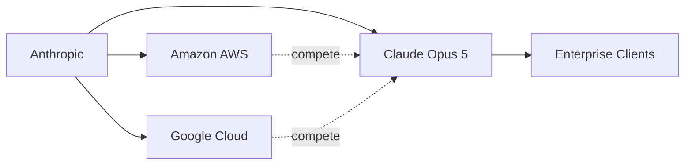

# Claude Opus 5: la nueva pieza de Anthropic en el tablero del capital tecnológico

Cada anuncio de un modelo de inteligencia artificial de frontera viene acompañado de un ritual conocido: benchmarks récords, demostraciones de razonamiento y promesas de transformación. El lanzamiento de Claude Opus 5, el último modelo insignia de Anthropic, no es la excepción. Pero más allá del rendimiento técnico, lo verdaderamente interesante es lo que el movimiento revela sobre la estructura de poder de la industria tecnológica en 2025.

## Anthropic: una empresa con pedigree y con padrinos

El resultado: Anthropic es ahora una de las empresas de inteligencia artificial mejor financiadas del planeta. Amazon ha invertido más de 8.000 millones de dólares y se convirtió en su proveedor principal de infraestructura cloud a través de AWS, además de integrar los modelos Claude en sus productos (Bedrock, Alexa, herramientas empresariales). Google, por su parte, también ha comprometido miles de millones, mantiene un acuerdo de cloud con Anthropic y usa sus modelos en Vertex AI. Esta doble dependencia es a la vez una fortaleza estratégica y un riesgo estructural que pocos comentaristas subrayan.

## La guerra de los tres (o cuatro) gigantes

Claude Opus 5 llega en un momento donde la competencia ya no se mide solo en parámetros, sino en alianzas, contratos empresariales y acceso a chips. El panorama se reduce a un puñado de actores:

- **OpenAI**, ahora con una participación significativa de Microsoft, con acuerdos de exclusividad en cloud y una valoración cercana a los 300.000 millones de dólares.
- **Google DeepMind**, con la ventaja de diseñar sus propios chips (TPU) y controlar toda la cadena, desde el silicio hasta la aplicación.
- **Meta**, que apuesta por el código abierto con Llama como movimiento geopolítico y de influencia.
- **Anthropic**, el competidor independiente en apariencia, aunque profundamente atado a sus dos grandes inversores.

Cuando Anthropic publica un nuevo modelo, no compite solo contra el laboratorio rival: negocia simultáneamente con sus dos principales financiadores, que también son sus competidores. Esta paradoja define la próxima etapa de la industria.

## El precedente histórico: las guerras del cloud

La inteligencia artificial está siguiendo exactamente la misma trayectoria, pero acelerada. En vez de 15 años para consolidarse, el terreno puede definirse en 3 o 4. Claude Opus 5 es un movimiento más en esa consolidación, donde la verdadera competencia no es entre modelos, sino entre ecosistemas integrados.

## Quién paga, quién gana

Mientras tanto, los desarrolladores independientes, las startups y los investigadores académicos ven cómo el acceso a modelos de frontera queda mediado por suscripciones mensuales de cientos de dólares o por APIs con límites restrictivos. La promesa de la IA democratizada se topa con la realidad de una economía de cómputo brutalmente desigual.

## ¿Hacia dónde vamos?

Por ahora, cada nuevo lanzamiento es también un recordatorio: la inteligencia artificial no se está construyendo en garages ni en universidades, sino en las juntas directivas de las cinco o seis corporaciones más grandes del planeta. Y eso, más que cualquier benchmark, es lo que define hacia dónde se dirige la tecnología que está reconfigurando la economía global.

---

*¿Crees que la concentración de capital en la IA es inevitable o hay margen para modelos alternativos? Te leo en los comentarios.*

